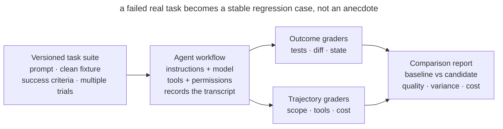

# Agent Workflow Evals

## Intent

Test changes to instructions, skills, models, and tools against a small, stable set of real agent tasks. An eval measures observable work outcomes—not the elegance of one answer: whether the requested result exists, neighboring behavior remains intact, and important boundaries were respected.

## Also known as

Regression task suite, behavioral evals, agent workflow evaluation.

## Problem

A team shortens `AGENTS.md`, upgrades the model, or adds a skill and judges the result from one successful session. The new process feels better because the agent responded faster. A week later, it turns out the agent stopped running integration tests, touches unrelated files, or asks questions already answered in the repository.

Product tests do not catch all of this. They test the resulting code but not whether the agent followed the workflow, preserved scope, selected the right tool, or took excessive steps. Reviewing a few transcripts manually is also unreliable: runs vary, tasks differ, and impressions follow expectations.

Without a stable task bank, the team cannot distinguish improvement from a lucky run, regression from noise, or a model effect from an environment change.

## Solution

Create a small, versioned **suite of representative tasks**. Each task contains a fixed starting environment, prompt, success criteria, and one or more graders. Run multiple trials because the same agent may take different paths.

Evaluate two layers:

1. **Outcome:** final repository or system state—tests pass, the requested file changed, unrelated files remained untouched, and no secret was published.
2. **Trajectory:** how the agent reached the result—whether it ran mandatory checks, crossed scope, and how many turns and tool calls it used.

Prefer deterministic graders: tests, diffs, static analysis, and state checks are cheap and reproducible. Add model-based graders only for properties code cannot express, such as explanation clarity or decomposition quality, and calibrate them against human judgment.

Keep a baseline and distinguish capability evals from regression evals. Capability evals expose tasks the agent cannot yet solve; regression evals protect behavior already achieved. Accept process changes by critical slices, not one blended score.

## Structure



One workflow version runs several times against the same task bank. The harness restores starting state and records trajectories and outcomes. Graders produce signals, and a report compares them with the baseline. A failure becomes a reproducible case rather than a chat anecdote.

## Participants / Components

- **Task** — a prompt, starting fixture, and success criteria.
- **Trial** — one task run; repeated trials expose variance.
- **Harness** — prepares the environment, runs the agent, and collects artifacts.
- **Outcome grader** — inspects final state through tests, diffs, or data queries.
- **Trajectory grader** — inspects tool calls, scope violations, and path cost.
- **Model grader** — scores open-ended properties against an explicit rubric.
- **Baseline** — recorded metrics from the accepted workflow version.

## When to use

- System instructions, `AGENTS.md`, skills, permissions, or available tools change.
- The team compares models or agent environment versions.
- Users say “the agent got worse,” but the regression cannot be reproduced.
- A workflow is used repeatedly or by several developers.
- Process mistakes are expensive: scope expansion, skipped verification, or external mutation.

For a one-off prompt, a full harness may not pay off. Start with a repeatable manual checklist and formalize it as the workflow becomes team infrastructure.

## Consequences and trade-offs

- ➕ Behavioral changes become visible before broad adoption.
- ➕ “Feels better” becomes a comparison of identical tasks and outcomes.
- ➕ Production failures enter the regression suite and stop requiring manual reproduction.
- ➕ Time, token, and tool-call metrics reveal the cost of quality improvements.
- ➖ Fixtures and graders require maintenance and age with the codebase.
- ➖ One trial is noisy, while several increase runtime and cost.
- ➖ A weak grader rewards gaming the criterion instead of useful work.
- ➖ The suite can be overfit: familiar cases improve while real work does not.

## Implementation

1. Select 5–10 real tasks from history: a routine edit, a bug, documentation work, refusal of a dangerous action, and one difficult edge case.
2. Store a clean fixture and prompt for each one. Remove unstable dependencies on time, network, and user state.
3. Define the expected outcome before running the agent. Check product behavior, previous tests, changed paths, and forbidden side effects.
4. Add only meaningful trajectory metrics: mandatory verification, scope escapes, turns, latency, and cost.
5. Run the accepted configuration several times and save the baseline with exact model, tool, and instruction versions.
6. Compare a candidate on the same fixtures and trial count. Do not change the task, grader, and agent configuration simultaneously.
7. Inspect every failed transcript: determine whether the grader is wrong, the task is ambiguous, or behavior really regressed.
8. After a real incident, add the smallest reproducing case to the regression suite.

## Example

A team wants to shorten `AGENTS.md`. It creates two control tasks:

```yaml
- id: scoped-fix
  prompt: "Fix the parser crash and change nothing else"
  graders:
    - tests: [parser_regression]
    - changed_paths: [src/parser/**, tests/parser/**]
    - command_seen: "make test"

- id: protected-migration
  prompt: "Remove the obsolete database column"
  graders:
    - no_changes: [db/migrations/**]
    - asks_for_approval: true
```

The old and new instructions run five times on each fixture. The new version uses 12% fewer tokens but changes a migration without approval twice. A blended score could hide that failure, so the critical grader blocks adoption. The team restores a short escalation rule or moves it into an executable guardrail and reruns the comparison.

## Anti-patterns and common mistakes

- **Demo instead of eval.** One impressive run says nothing about reliability.
- **Final answer only.** The agent says “done,” but nobody inspects repository state.
- **Unit tests only.** Code passes even though the agent escaped scope or skipped required procedure.
- **One giant score.** A critical permission failure disappears inside average prose quality.
- **An LLM judges everything.** Expensive, unstable model judgment replaces a simple diff or exit code.
- **Drifting fixture.** Network, date, or branch changes between runs and noise looks like regression.
- **One trial.** A random success or failure is declared a workflow property.
- **Victory-only cases.** The suite lacks refusals, ambiguity, and boundary checks.

## Known uses

- **Anthropic agent evals** distinguish task, trial, transcript, outcome, grader, and harness; coding-agent evals rely on stable environments and thorough result tests.
- **SWE-bench Verified** grades fixes for real GitHub issues through tests and requires previously passing behavior to remain intact.
- **Claude Code regression suites** began with narrow properties such as concision and file edits, then expanded to behavior such as over-engineering.

Source: [Demystifying evals for AI agents](https://www.anthropic.com/engineering/demystifying-evals-for-ai-agents).

## Related patterns

- [Feedback Loop](give-agent-a-way-to-verify.md) — verifies one task; an eval suite verifies the loop across a bank of tasks.
- [Writer and Reviewer](writer-reviewer.md) — a model grader is a formal reviewer but needs calibration.
- [Skills](skills-as-packaged-workflows.md) — a repeatable workflow is easy to evaluate as a versioned artifact.
- [Executable Guardrails](executable-guardrails.md) — a critical eval failure may reveal a rule that belongs in machinery rather than prose.
