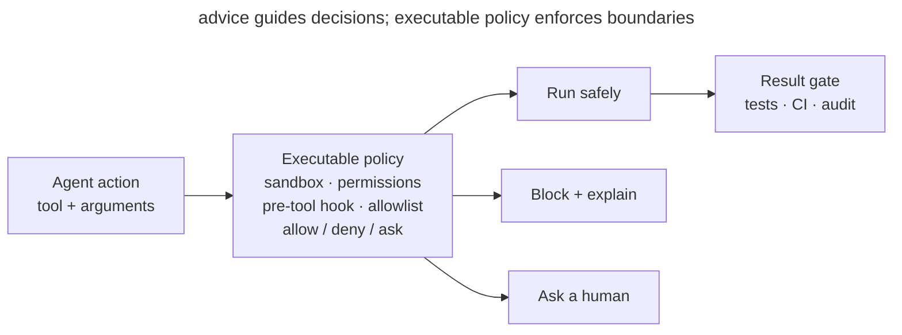

# Executable Guardrails

## Intent

Move critical rules for agent work out of prose and into mechanisms that cannot be accidentally forgotten: permissions, sandboxes, hooks, and deterministic checks. The agent works freely inside an allowed area, while the system—not the model's attention—stops dangerous or invalid actions.

## Also known as

Policy as code, enforced constraints, rails for agents.

## Problem

`AGENTS.md` says “do not change migrations,” “do not expose secrets,” and “run tests before finishing.” The agent usually follows these rules, but prose remains advice. Context fills, wording gets lost among other instructions, or a nested tool launches an unexpected process—and the critical boundary fails precisely when it matters.

Asking before every command is safer but causes approval fatigue: the developer clicks Allow mechanically and becomes a slow, unreliable policy engine. Removing every restriction for autonomy expands the blast radius instead.

Not all rules are equal. “Prefer small functions” requires judgment and belongs in guidance. “Do not write outside the repository” is unambiguous and should be enforced by machinery. Leaving a deterministic rule only in the prompt makes guaranteed behavior probabilistic.

## Solution

Separate rules into **guidance** and **invariants**. Keep guidance in project memory because context matters. Express invariants as executable boundaries:

1. **Sandboxing** restricts directories, network access, and processes.
2. **Permissions** pre-approve a narrow set of safe actions and involve a human outside it.
3. **Pre-action hooks** inspect intent before execution and block forbidden operations.
4. **Post-action or stop hooks** inspect results and prevent completion without required evidence.
5. **CI** repeats critical checks outside the agent session and protects the target branch.

A good guardrail is small, deterministic, and explainable. It returns the reason and a safe next step, not merely a denial. The goal is to define a broad safe area in which the agent needs no constant approvals.

## Structure



Text instructions guide the agent but do not form a barrier. Every action passes through an executable policy: safe actions run automatically, forbidden actions are blocked, and ambiguous actions are escalated. An independent gate verifies the result after changes.

## Participants / Components

- **Policy** — a short rule with an objectively testable boundary.
- **Agent** — proposes an action and receives a structured policy result.
- **Enforcement mechanism** — a sandbox, allowlist, hook, filesystem permission, or CI gate.
- **Safe area** — actions permitted without human involvement.
- **Escalation** — a narrow path for an action that cannot be automatically allowed or denied.
- **Audit** — a record of policy decisions that excludes secrets and unnecessary content.

## When to use

- Breaking the rule could delete data, expose a secret, mutate an external system, or damage a release.
- The agent works unattended or starts subprocesses.
- The same prohibitive rule keeps appearing in prompts.
- The condition can be checked quickly and objectively from a command, path, diff, or exit code.
- The team wants fewer manual approvals without granting uncontrolled access.

Do not turn matters of taste into hooks. “Keep the architecture simple” cannot be calculated reliably in milliseconds; it belongs in guidance or review.

## Consequences and trade-offs

- ➕ Critical invariants hold regardless of context pressure or response quality.
- ➕ Autonomy grows inside the safe area because routine commands do not interrupt the developer.
- ➕ Denials are observable and reproducible: the failed rule and reason are known.
- ➕ Versioned policy receives review and behaves consistently across the team.
- ➖ A faulty guardrail blocks useful work, so boundaries need positive and negative tests.
- ➖ Synchronous hooks add latency; expensive checks belong in a stop hook or CI.
- ➖ Allowlists tend to expand, and a broad exception such as “allow any shell” destroys the boundary.
- ➖ Sandboxing limits impact but does not prove code correctness or replace tests.

## Implementation

1. Collect repeated prohibitions from instructions and incidents. Ask whether each violation can be detected without interpreting intent.
2. Describe each rule as allow, deny, or ask. Start with narrow, high-risk invariants: write paths, network domains, publication commands, and secrets.
3. Enforce at the correct layer. The OS sandbox restricts filesystem and network access; a pre-tool hook checks a command; tests and CI check result quality.
4. Make denial actionable: name the rule, show the safe boundary, and offer an action the user can explicitly approve.
5. Test both sides: the dangerous operation is blocked and the nearest safe operation passes. Test escaping and timeouts too.
6. Record minimal audit data without tokens, secret contents, or complete user data.
7. Adjust boundaries from evidence, fixing frequent false positives narrowly rather than adding universal exceptions.

## Example

An agent may modify `./app`, run tests, and read documentation. It may not write outside the repository or publish without approval. Project memory keeps the human rule:

> Work within the task and prefer reversible changes.

The executable policy is precise:

```text
write path ./app/**          allow
write path ./docs/**         allow
write path ../**             deny: outside workspace
command make test            allow
command git push *           ask: external state change
network registry.npmjs.org   allow
network *                    deny: domain not approved
```

If the agent attempts `git push`, the system does not hope it remembers a paragraph: the action enters explicit escalation. Writing `~/.ssh/config` is blocked. Ordinary `make test` runs without a prompt, so safety does not become meaningless clicking.

## Anti-patterns and common mistakes

- **Everything in the prompt.** Deterministic prohibitions compete with task context and sometimes lose.
- **Block everything.** Every command asks for approval, creating fatigue and mechanical consent.
- **Allow all shell.** A narrow allowlist becomes a universal bypass.
- **An intelligent hook.** A slow LLM hook judges every command's intent, making the boundary costly and unpredictable.
- **Silent denial.** The agent sees only a non-zero exit code and searches for a workaround instead of a safe path.
- **Secrets in audit logs.** The protection itself copies sensitive data into logs.
- **Local-only protection.** Critical invariants should be repeated in CI or branch protection.

## Known uses

- **GitHub Copilot hooks** run commands at key workflow points; a pre-tool hook can allow or deny tool calls, while other hooks validate state and record audit data.
- **Claude Code sandboxing** enforces filesystem and network boundaries at OS level, including subprocesses, while allowing free work inside the boundary.
- **Git hooks and CI** are the pre-agent form of the pattern: commit format, tests, and branch policy are executable rather than advisory.

Sources: [GitHub Copilot hooks](https://docs.github.com/en/copilot/concepts/agents/hooks), [Claude Code sandboxing](https://www.anthropic.com/engineering/claude-code-sandboxing).

## Related patterns

- [Project Memory](claude-md-memory.md) — holds guidance; executable guardrails take over rules that must always fire.
- [Feedback Loop](give-agent-a-way-to-verify.md) — checks result correctness, while guardrails constrain permitted actions.
- [Isolated Parallel Work](isolated-parallel-work.md) — worktrees reduce collisions; sandboxing and permissions enforce their boundaries.
- [Bloated Memory](bloated-claude-md.md) — the attempt to replace mechanisms with an ever-growing list of prohibitions.
