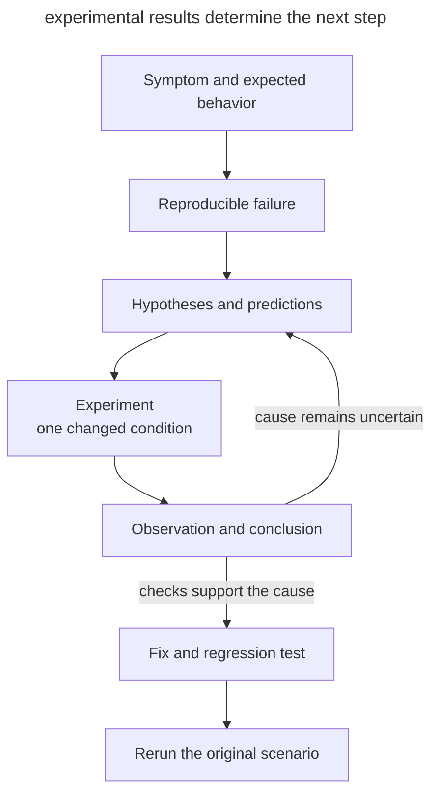

# Hypothesis-Driven Debugging

## Intent

Find the cause of a defect through reproduction and discriminating experiments. The developer defines the observed symptom and scope; the agent tests explanations before changing production code.

## Also known as

Experimental debugging, debugging through falsifiable hypotheses.

## Problem

An agent reads a complaint, finds suspicious code, and immediately patches it. The change looks plausible, but the original defect may remain. After a complaint about an incorrect invoice amount, for example, the agent reduces the cache lifetime. The first request after clearing the cache succeeds; subsequent requests fail again.

Several causes can explain one symptom. Storage, caching, or response transformation could return the wrong amount. A passing test of the chosen patch does not yet establish which explanation matches the original failure.

## Solution

Ask the agent to first produce a check that detects the reported symptom. Then have it list possible causes and, for each, an observation that could disprove it.

> Reproduce the failure with one command. Before fixing it, propose hypotheses and an experiment that distinguishes them. Change one condition at a time; record the prediction and observation. Once the cause is established, apply the fix and rerun the original scenario.

Separate observations from conclusions. “Amounts are correct when bypassing the cache” narrows the investigation to the caching path. Establishing a faulty key requires further checks, such as reversing request order and changing the invoice identifier.

## Structure

Each experiment should reduce the set of possible causes.



If an experiment cannot distinguish the hypotheses, refine the check. When several simultaneous edits remove the symptom, the cause remains uncertain.

## Participants / Components

- **Developer** defines the failure, expected behavior, and permitted experiments.
- **Reproducer** detects the original symptom and returns a check result.
- **Agent** states predictions, runs experiments, and records observations.
- **Regression test** exercises behavior at the boundary where the defect occurred.

## When to use

- Several plausible explanations fit the same symptom.
- Earlier patches temporarily hid the failure.
- The defect depends on request order, state, or interactions between calls.

The full loop is excessive for an obvious typo. For an intermittent defect, first record reproduction conditions and frequency. A few successful runs do not prove that an intermittent failure is fixed.

## Consequences and trade-offs

- ➕ Recorded hypotheses let a new session continue the investigation.
- ➕ A minimal scenario makes the cause and fix easier to check.
- ➖ Preparing a reproducer can take longer than the patch itself.
- ➖ A simplified environment can hide a necessary condition, so rerun the complete scenario.

## Implementation

1. Record the input, expected behavior, and actual result. Agree on available data and the experimental environment.
2. Run the reproducer and confirm that it detects the reported failure. Remove unnecessary conditions one at a time, checking after every reduction.
3. List a small set of hypotheses, each with a prediction and a check.
4. Choose an experiment that distinguishes the remaining causes. Preserve the command, result, and revised conclusion.
5. Fix the established cause. Add a regression test through public behavior and rerun the original case.
6. Remove temporary instrumentation. Preserve the cause and supporting checks in the change description.

If reproduction is unavailable, state what is missing, such as an input request or access to a test environment. Keep assumptions marked as unverified. Use sanitized data in logs and examples.

## Example

In a teaching service, tenant `alpha` requests invoice `42`, whose amount is `100`. Tenant `beta` then requests its own invoice `42`, worth `900`, and receives `100`. The [Python example](../assets/hypothesis-driven-debugging/examples/cache_probe.py) needs no external services. Run commands from the repository root.

```console
$ python3 book/assets/hypothesis-driven-debugging/examples/cache_probe.py shared
shared: expected=[100, 900] actual=[100, 100] FAIL
```

The command exits with code `1`. The agent can now distinguish the original defect from unrelated failures and state predictions.

| Hypothesis | Predicted observation |
| --- | --- |
| Data lookup ignores the tenant | Bypassing the cache will still fail |
| The cache key contains only the invoice number | With equal numbers, the second request gets the first amount; different numbers remove the failure |

Each experiment starts with an empty cache and changes one condition relative to the original scenario.

```console
$ python3 book/assets/hypothesis-driven-debugging/examples/cache_probe.py bypass
bypass: expected=[100, 900] actual=[100, 900] PASS
$ python3 book/assets/hypothesis-driven-debugging/examples/cache_probe.py distinct
distinct: expected=[100, 700] actual=[100, 700] PASS
$ python3 book/assets/hypothesis-driven-debugging/examples/cache_probe.py reverse
reverse: expected=[900, 100] actual=[900, 900] FAIL
```

Bypassing the cache disproves the first hypothesis for these inputs. Different numbers and reversed request order produce the second hypothesis's predictions. Reading the implementation confirms that the key is `invoice`, losing the tenant. The fix includes the tenant in the key.

```python
key = (tenant, invoice)
```

The `fixed` mode uses this key and checks both request orders, different numbers, and repeated reads. Expected amounts are explicit values from the teaching fixture.

```console
$ python3 book/assets/hypothesis-driven-debugging/examples/cache_probe.py fixed
shared: expected=[100, 900] actual=[100, 900] PASS
reverse: expected=[900, 100] actual=[900, 100] PASS
distinct: expected=[100, 700] actual=[100, 700] PASS
repeat: expected=[100, 900, 100, 900] actual=[100, 900, 100, 900] PASS
```

This is a local model of the defect. In the real service, also repeat the original API requests to verify tenant propagation and the actual caching layer.

## Anti-patterns and common mistakes

- **Patching the first explanation.** Ask what observation could disprove it.
- **Several changes per attempt.** Success no longer identifies the change that affected the symptom.
- **Reproducing a nearby defect.** Compare the reproducer with the user's report.
- **Clearing instead of fixing.** Repeat the sequence that fills the cache and causes the failure again.
- **Testing too narrow a boundary.** A single-call test cannot lock down an interaction between calls.

## Known uses

- Matt Pocock's [diagnosing-bugs](https://github.com/mattpocock/skills/blob/main/skills/engineering/diagnosing-bugs/SKILL.md) skill prescribes reproduction, reduction, falsifiable hypotheses, experiments, and regression checks. The number of hypotheses and the instrument depend on the task.

## Related patterns

- [Give the Agent a Way to Verify](give-agent-a-way-to-verify.md) provides an observable result for each experiment.
- [TDD with an Agent](tdd-with-agent.md) captures the defect in a test before the fix.
- [Throwaway Prototype](prototype-to-answer.md) tests a design question with a small experiment.
- [Session Handoff](handoff.md) preserves the reproducer, rejected hypotheses, and next experiment.
