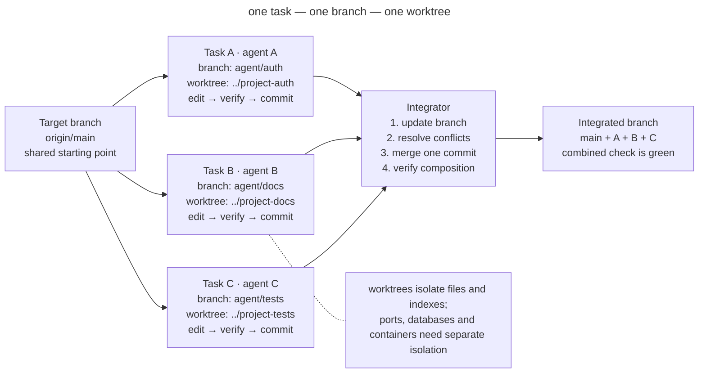

# Isolated Parallel Work

## Intent

Run several agent tasks at the same time while giving each one its own branch and working tree, hiding its neighbors' uncommitted changes, and transferring its result as a verifiable commit. Parallelism becomes a set of independent changes with an explicit integration point instead of a race between processes writing to one directory.

## Also known as

Worktree per task, branch per agent, isolated checkout, parallel worktrees.

## Problem

One agent is already changing authentication when the developer starts a second one to update the documentation. Both processes are open in the same checkout. The second sees the first agent's half-written files, treats them as the baseline, and formats them along the way. The first runs tests against a mixture of both changes. Then one of them commits and captures the other's lines.

The main problem is not a merge conflict. A conflict at least stops integration and reveals the collision. A shared checkout creates **hidden mixing before the commit**:

- `git diff` no longer answers which task produced a line;
- one task is verified against another task's code, producing a false green signal;
- an agent can delete or rewrite an unfamiliar change as “unnecessary”;
- rollback and review become dangerous because the change boundary is gone;
- two processes compete for the Git index, generated files, and local dependencies.

An ordinary branch does not solve this problem. A working directory can have only one branch checked out at a time, while uncommitted files belong to the directory rather than the task. Switching the branch underneath running processes is even more dangerous.

A full clone per task provides isolation, but needlessly duplicates history and makes cleanup harder. Git worktree provides multiple working directories linked to one repository: each has its own `HEAD`, index, and files, while sharing Git objects.

## Solution

Give every parallel task **its own branch and its own worktree**. Assign it an explicit ownership scope and completion criterion. The agent works only inside its directory, verifies the result there, and finishes with a commit. The commit is the handoff boundary: before it, the change belongs to the task; after it, the change is ready for integration.

Integrate finished branches one at a time. Before merging, update the branch from the target, resolve conflicts in the context of its task, and run its checks again. This turns uncontrolled concurrent writes to shared files into ordinary, observable Git integration.

The pattern rests on four boundaries:

1. **Filesystem boundary:** one worktree belongs to one task or session.
2. **Ownership boundary:** what the task may change, and what it must leave alone, is known in advance.
3. **Handoff boundary:** tasks exchange commits, not uncommitted files from a shared directory.
4. **Integration boundary:** only one workflow updates the target branch at a time and confirms the combined green result.

## Structure



One target branch produces independent branches and working trees. In each worktree, an agent completes its task cycle and produces a separate commit. The integrator accepts commits one at a time and checks the assembled state after each one. If tasks overlap, the collision appears at a controlled point—during the update or merge—instead of halfway through someone else's session.

## Participants / Components

- **Target branch** — the state into which the changes will eventually be assembled, usually `main` or a shared feature branch.
- **Task** — an independent piece of work with a file scope and a verifiable result.
- **Task branch** — the history of one change; its name connects commits to the task.
- **Worktree** — a separate directory with its own working files and Git index.
- **Agent** — works only in the assigned worktree and does not integrate neighboring tasks on its own initiative.
- **Integrator** — a developer or dedicated process that chooses merge order, resolves overlaps, and runs the combined check.
- **Environment contract** — rules for resources outside Git: ports, databases, containers, caches, and temporary files.

## When to use

- Two or more independent tasks can genuinely be performed at the same time.
- One agent implements a change while another writes tests, documentation, or investigates the codebase.
- You need to compare several implementations without overwriting the experiments.
- A long-running task must not block an urgent fix in the same repository.
- Parallel sessions run locally or through an automated harness.

Do not apply the pattern automatically to two tightly coupled changes in the same module. If the tasks constantly need each other's uncommitted state, they are not parallel tasks but one task split artificially in half. Run it sequentially or find a real boundary first.

## Consequences and trade-offs

- ➕ Uncommitted changes are physically separated, so an agent cannot accidentally include a neighboring diff in its commit.
- ➕ Verification belongs to a specific change: tests run on the clean task branch and then again on the integrated state.
- ➕ Abandoning work is cheap: a failed experiment can be removed with its branch and worktree without untangling a shared directory.
- ➕ Review is simpler: one commit or PR corresponds to one task and one owner.
- ➖ Parallelism does not eliminate conflicts; it moves them to an explicit integration point. Poor decomposition produces a queue of difficult merges.
- ➖ Every worktree needs dependencies and its own environment configuration; without fast bootstrap, setup consumes the gain.
- ➖ Git isolates files, not external resources. Identical ports, one test database, or a shared cache directory can still race.
- ➖ More active branches mean more coordination cost: integration needs an owner and a clear dependency order.

## Implementation

1. Split work by outcomes, not by agents. Every task needs a name, completion criterion, ownership scope, and known dependencies.
2. Fix the starting point and create separate branches with worktrees:

   ```bash
   git fetch origin
   git worktree add -b agent/auth ../project-auth origin/main
   git worktree add -b agent/docs ../project-docs origin/main
   ```

   `git worktree list` shows every active directory and branch. Git prevents the same branch from being used in two worktrees unless you forcibly bypass the safeguard.
3. Run the project's standard setup in every directory. A command such as `make setup` should bring a fresh worktree to a reproducible green state; manual per-instance setup does not scale.
4. Give the agent both the task and the boundary: “work only in this directory; do not switch branches; do not touch changes outside the listed scope; finish with a verified commit.”
5. Separate external environment resources. Assign different ports, container names, test databases, and temporary directories. Mount secrets read-only or replace them with safe local values.
6. Every agent verifies its change on its own branch and creates one meaningful commit. Unfinished state is not passed to neighboring tasks as a dependency.
7. The integrator chooses an order based on dependencies. Before merging, each branch incorporates the current target branch, resolves conflicts, and repeats its check.
8. Run a combined-state check after every merge. Two green branches do not guarantee a green composition.
9. After integration, remove clean worktrees with the standard command:

   ```bash
   git worktree remove ../project-auth
   git worktree remove ../project-docs
   git worktree prune
   ```

   Do not blindly delete the directory: `git worktree remove` refuses to remove a worktree with uncommitted files, preserving unfinished work.

## Example

A team is preparing an online store release. It needs to add request rate limiting and independently update the operations page. The developer creates two worktrees from the same `origin/main`:

```text
shop/                 main, integration only
shop-rate-limit/      agent/rate-limit, code + tests
shop-runbook/         agent/runbook, docs + link checks
```

The first agent changes middleware and tests; the second changes the runbook. Both run `make setup`, followed by their checks. The documentation agent cannot see half-written middleware, and the first agent's tests do not pick up accidental changes from the second. The result is two commits:

```text
4d23f91 feat: add API rate limiting
8a771bc docs: document rate-limit operations
```

The documentation depends on the final metric names, so the integrator merges the code first. It then updates the runbook branch, notices that the metric is now called `rate_limit_rejected_total`, fixes the reference, and runs the documentation check. The semantic conflict appears where it can be seen and resolved instead of being silently hidden in a shared working directory.

If both instances need a local server, one worktree is not enough: assign `PORT=4101` to the first and `PORT=4102` to the second, and give the test databases different names. Otherwise filesystem isolation will be sound while the processes continue to break each other's state through the environment.

## Anti-patterns and common mistakes

- **Shared checkout.** Several agents write to one directory. This is not parallel development but collaborative editing without a protocol.
- **Branch without a worktree.** Processes take turns switching the branch in one directory, changing files underneath one another.
- **Worktree without an owner.** Several tasks are sent to one isolated directory, merely moving the mixing somewhere else.
- **Splitting by files instead of outcomes.** “You change the controller; you write the tests” creates two halves that cannot be independently verified and completed.
- **Shared infrastructure.** Separate directories start the same Compose project or use one database or port, causing races outside Git.
- **Parallel merging.** Several processes update the target branch at the same time. The serialization point disappears and green checks quickly become stale.
- **Integration without re-verification.** Every branch is green in isolation, but nobody runs their composition.
- **Endless worktrees.** Finished directories are never removed, branches lose their owners, and a week later nobody knows where valuable work remains.

## Known uses

- **Claude Code** recommends separate worktrees for parallel CLI sessions so their edits do not collide, and uses the same technique when fanning work out across files.
- **Anthropic's C compiler experiment** ran every agent in its own container with a separate clone and protected tasks with simple locks. This is a heavier version of the same boundaries: separate working state, task ownership, and serialized Git synchronization.
- **Git worktree** is Git's standard mechanism for multiple working trees attached to one repository, allowing branches to remain checked out at the same time without full clones.

Sources: [Claude Code best practices](https://code.claude.com/docs/en/best-practices), [Building a C compiler with a team of parallel Claudes](https://www.anthropic.com/engineering/building-c-compiler), [Git worktree documentation](https://git-scm.com/docs/git-worktree).

## Related patterns

- [One Feature at a Time](one-feature-at-a-time.md) — defines the task size inside a worktree: parallelism does not justify a broad unfinished front.
- [Writer and Reviewer](writer-reviewer.md) — a useful special case of two isolated sessions: the second gets a clean context and reviews the first one's finished commit.
- [Feedback Loop](give-agent-a-way-to-verify.md) — provides a local readiness signal for every branch and a combined signal after integration.
- [Four Phases](explore-plan-code-commit.md) — the commit finishes work on the branch and becomes a safe handoff boundary.
- **Reproducible Agent Bootstrap** — a future neighboring pattern that turns preparation of a new worktree into one fast, verifiable command.
