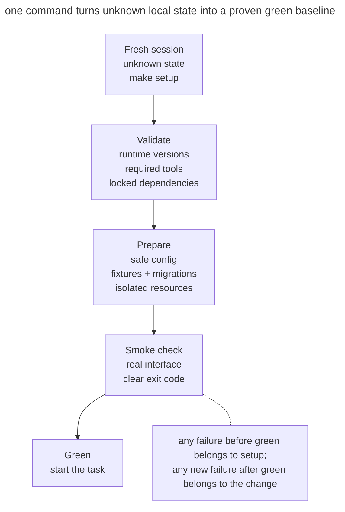

# Reproducible Agent Bootstrap

## Intent

Give every new session or worktree one command that prepares dependencies and safe local configuration, then proves that the starting state works. The agent begins from a known green baseline instead of spending context on startup archaeology.

## Also known as

One-command setup, initializer script, green baseline.

## Problem

A new session opens the repository and does not know how to bring it to life. The README lists five commands, one is stale, `.env` must be reconstructed from chat, the database needs a manual migration, and verification requires another service. The agent tries combinations, changes configuration accidentally, and eventually reaches a failing test.

Now nobody knows whether the task, the agent, or the initial environment caused the failure. Starting implementation on a red baseline mixes product defects with setup defects. Every new worktree repeats the cost, so parallelism multiplies preparation instead of throughput.

“Install dependencies” is not enough. Ready means required tools exist, safe configuration is present, services or fixtures are prepared, and a minimal end-to-end smoke check passes.

## Solution

Provide one idempotent entry point—such as `make setup` or `./scripts/bootstrap`—that turns a supported clean environment into a **verified green baseline**.

Bootstrap has four phases:

1. **Validate prerequisites:** runtime and system tool versions are checked instead of trusting a random PATH.
2. **Prepare local state:** dependencies, safe `.env`, fixtures, migrations, and instance-specific resources.
3. **Start or describe services:** the startup command is known and has no interactive steps.
4. **Prove readiness:** a short smoke check exercises a key user path and returns a clear exit code.

The command must be safe to rerun. It needs no production secrets, does not touch user data, and never hides a red baseline. A missing prerequisite produces a specific remediation command.

Bootstrap owns startup, not the full test matrix, and it must not update dependencies arbitrarily. Reproducibility requires pinned versions and the same outcome today and in the next worktree.

## Structure



A fresh session with unknown state invokes one command. The command validates tools, creates safe local state, and runs a smoke check. Only green opens work on the task; red stops it and separates environment failure from the future diff.

## Participants / Components

- **Supported base** — explicitly listed OS, runtime, and tool versions.
- **Bootstrap command** — the single idempotent entry point.
- **Lockfile** — pins allowed dependency versions.
- **Safe configuration** — local values and fixtures without production secrets.
- **Isolated resources** — ports, databases, and container names for this instance.
- **Smoke check** — a fast test proving minimum operability.
- **Agent** — runs bootstrap before deep implementation work and records its result as baseline.

## When to use

- New developers, agents, CI jobs, or worktrees regularly open the repository.
- Startup requires more than one obvious command or external services.
- Sessions are short and repeated setup consumes meaningful context.
- Parallel tasks require independent local instances.
- Teams often discover tests were already failing before a change.

For a dependency-free library, bootstrap may be one line. The pattern requires one verified entry point, not a large script.

## Consequences and trade-offs

- ➕ A failure before green belongs to setup; a new failure after green belongs to the task change.
- ➕ New sessions orient faster and spend context on product work.
- ➕ Worktrees and CI follow the same setup path, reducing “works on my machine.”
- ➕ Startup documentation is tested through execution rather than hope.
- ➖ Bootstrap becomes a product inside the product and needs maintenance.
- ➖ Full setup can be slow; caching and a focused smoke help without silently skipping phases.
- ➖ Idempotency is difficult for databases and services; careless reruns can destroy data.
- ➖ Local fixtures can diverge from production and create false confidence.

## Implementation

1. Write down the path from clean checkout to the first successful user action. Remove steps that live only in personal notes.
2. Pin runtime and dependency versions with lockfiles. Reject incompatible versions early with a useful error.
3. Create configuration from a safe example. Never copy real tokens or overwrite an existing `.env` implicitly.
4. Make steps idempotent: reruns confirm or safely update state without duplicating data.
5. Isolate the instance: derive its database, port, and Compose project from the worktree name or an explicit parameter.
6. Finish with a short smoke check through the user's interface: HTTP, CLI, or a browser scenario.
7. Return a non-zero status for every incomplete phase and print the next safe action.
8. Run bootstrap in CI from a clean environment so the command cannot decay unnoticed.

## Example

A service exposes one command:

```make
setup:
	pnpm install --frozen-lockfile
	cp -n .env.example .env.local || true
	docker compose up -d db
	pnpm db:migrate
	pnpm smoke
```

This demonstrates the shape but needs hardening in a real project: `cp -n` must not hide invalid configuration, the Compose project and port need parameters for parallel worktrees, and smoke must wait for the database with a bounded timeout.

The agent starts a session like this:

```text
$ make setup
runtime: node 24.8.0 ✓
dependencies: lockfile unchanged ✓
database: agent_auth_42 ready ✓
smoke: create and read note ✓
baseline: green
```

If smoke fails before any edit, the agent does not begin a feature and records the environment problem separately. If the same check turns red after implementation, the causal boundary is known.

## Anti-patterns and common mistakes

- **README instead of a command.** Five manual steps drift and run differently each time.
- **Install only.** Packages exist, but configuration, database, and user path remain unverified.
- **Production secrets.** Local startup requires a broad production token.
- **Non-idempotent setup.** A second run duplicates fixtures, resets data, or breaks the first.
- **Green at any cost.** `|| true` swallows a meaningful error and calls partial startup successful.
- **Floating versions.** The same command installs a different dependency set tomorrow.
- **Shared resources.** Every worktree uses one database and port, so supposedly independent sessions collide.
- **Heavy full suite.** Setup takes an hour although a five-minute smoke proves readiness; developers stop running it.

## Known uses

- **Anthropic's long-running agent harness** uses an initializer agent to create `init.sh`; every later session starts the server and runs a basic end-to-end test before new work.
- **Development containers** encode runtime, system packages, and setup commands in versioned configuration.
- **CI from a clean checkout** continuously proves that the documented installation path works without the author's machine state.

Source: [Effective harnesses for long-running agents](https://www.anthropic.com/engineering/effective-harnesses-for-long-running-agents).

## Related patterns

- [Isolated Parallel Work](isolated-parallel-work.md) — creates worktrees; bootstrap makes each one ready quickly and isolates external resources.
- [Progress Journal](progress-file.md) — tells a new session what happened after the verified baseline.
- [Feedback Loop](give-agent-a-way-to-verify.md) — the smoke check is the first short feedback loop before implementation.
- [One Feature at a Time](one-feature-at-a-time.md) — a green start ensures the pass begins one new feature instead of repairing unknown inherited damage.
