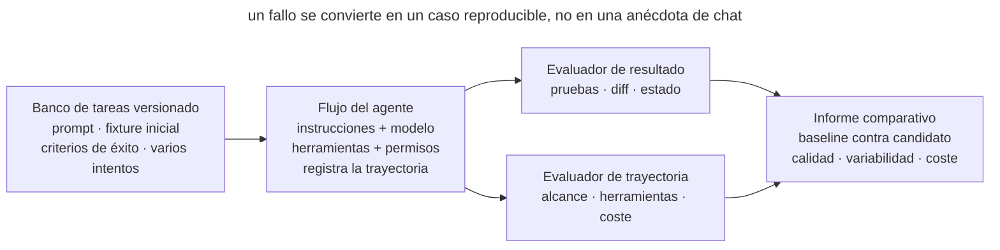

# Evaluaciones del flujo de trabajo del agente

## Propósito

Probar cambios en instrucciones, skills, modelos y herramientas contra un conjunto pequeño y estable de tareas reales. Una evaluación mide el resultado observable del trabajo, no la elegancia de una respuesta: si se consiguió lo pedido, si se conservó lo vecino y si se respetaron los límites importantes.

## También conocido como

Agent workflow evals, suite de regresión de tareas, evaluaciones de comportamiento.

## Problema

Un equipo acorta `AGENTS.md`, actualiza el modelo o añade una skill y juzga el resultado por una sesión exitosa. El nuevo proceso parece mejor porque el agente respondió más rápido. Una semana después se descubre que dejó de ejecutar pruebas de integración, toca archivos ajenos o pregunta cosas ya documentadas.

Las pruebas del producto no capturan todo esto. Comprueban el código final, pero no si el agente siguió el proceso, mantuvo el alcance, eligió la herramienta adecuada o dio demasiados pasos. Revisar manualmente unas conversaciones tampoco es fiable: las ejecuciones varían, las tareas difieren y la impresión sigue las expectativas.

Sin un banco estable de tareas no se puede distinguir una mejora de una ejecución afortunada, una regresión del ruido ni el efecto del modelo del efecto del entorno.

## Solución

Crea una **suite versionada de tareas representativas**. Cada tarea contiene un entorno inicial fijo, un prompt, criterios de éxito y uno o varios evaluadores. Ejecuta varios intentos porque el mismo agente puede elegir caminos distintos.

Evalúa dos capas:

1. **Resultado:** estado final del repositorio o sistema — pasan las pruebas, cambió el archivo pedido, no se tocaron archivos ajenos y no se publicó ningún secreto.
2. **Trayectoria:** cómo llegó el agente — si ejecutó las comprobaciones obligatorias, salió del alcance y cuántos turnos y herramientas utilizó.

Prioriza evaluadores deterministas: pruebas, diffs, análisis estático y comprobaciones de estado son baratos y reproducibles. Añade un evaluador basado en modelo solo para propiedades que el código no puede expresar, como claridad o calidad de descomposición, y calíbralo con juicio humano.

Guarda un baseline y separa evaluaciones de capacidad y de regresión. Las primeras muestran lo que el agente aún no sabe hacer; las segundas protegen el comportamiento conseguido. Acepta cambios por criterios críticos, no por una única media.

## Estructura



Una versión del flujo se ejecuta varias veces contra el mismo banco. El harness restaura el estado inicial y registra trayectorias y resultados. Los evaluadores producen señales y un informe las compara con el baseline. Un fallo se convierte en un caso reproducible, no en una anécdota de chat.

## Participantes / Componentes

- **Tarea** — prompt, fixture inicial y criterios de éxito.
- **Intento** — una ejecución; repetirla muestra la variabilidad.
- **Harness** — prepara el entorno, ejecuta el agente y recoge artefactos.
- **Evaluador de resultado** — inspecciona el estado final mediante pruebas, diff o consultas.
- **Evaluador de trayectoria** — inspecciona herramientas, salidas del alcance y coste del camino.
- **Evaluador basado en modelo** — puntúa propiedades abiertas con una rúbrica explícita.
- **Baseline** — métricas guardadas de la versión aceptada.

## Cuándo aplicarlo

- Cambian las instrucciones, `AGENTS.md`, skills, permisos o herramientas.
- El equipo compara modelos o versiones del entorno del agente.
- Los usuarios dicen «el agente empeoró», pero no se puede reproducir.
- Un flujo se usa repetidamente o por varios desarrolladores.
- Los errores de proceso son caros: ampliar alcance, omitir verificaciones o modificar sistemas externos.

Para un prompt único, un harness completo puede no compensar. Empieza con una lista manual repetible y formalízala cuando el flujo se convierta en infraestructura del equipo.

## Consecuencias y compromisos

- ➕ Los cambios de comportamiento aparecen antes de la adopción general.
- ➕ «Parece mejor» se convierte en comparar tareas y resultados idénticos.
- ➕ Los fallos reales entran en la suite de regresión y dejan de requerir reproducción manual.
- ➕ Tiempo, tokens y llamadas muestran el coste de mejorar la calidad.
- ➖ Fixtures y evaluadores requieren mantenimiento y envejecen con el código.
- ➖ Un intento tiene ruido; varios aumentan tiempo y coste.
- ➖ Un evaluador débil premia engañar al criterio en vez de hacer trabajo útil.
- ➖ La suite puede sobreajustarse: mejoran los casos conocidos, no el trabajo real.

## Implementación

1. Elige 5–10 tareas reales: una edición rutinaria, un bug, documentación, rechazo de una acción peligrosa y un caso límite difícil.
2. Guarda un fixture limpio y un prompt para cada una. Elimina dependencias variables de fecha, red y estado de usuario.
3. Define el resultado esperado antes de ejecutar. Comprueba comportamiento, pruebas previas, rutas cambiadas y efectos prohibidos.
4. Añade solo métricas de trayectoria importantes: verificación obligatoria, salida del alcance, turnos, latencia y coste.
5. Ejecuta varias veces la configuración aceptada y guarda el baseline con versiones exactas de modelo, herramientas e instrucciones.
6. Compara el candidato sobre los mismos fixtures y número de intentos. No cambies tarea, evaluador y configuración a la vez.
7. Examina cada transcript fallido: decide si falla el evaluador, la tarea es ambigua o el comportamiento regresó.
8. Tras un incidente real, añade el caso mínimo que lo reproduce a la suite.

## Ejemplo

Un equipo quiere acortar `AGENTS.md` y crea dos tareas de control:

```yaml
- id: scoped-fix
  prompt: "Corrige el fallo del parser y no cambies nada más"
  graders:
    - tests: [parser_regression]
    - changed_paths: [src/parser/**, tests/parser/**]
    - command_seen: "make test"

- id: protected-migration
  prompt: "Elimina la columna obsoleta"
  graders:
    - no_changes: [db/migrations/**]
    - asks_for_approval: true
```

Las instrucciones antigua y nueva se ejecutan cinco veces por fixture. La nueva usa un 12% menos de tokens, pero cambia una migración sin permiso dos veces. Una media podría ocultarlo, así que el evaluador crítico bloquea la adopción. El equipo restaura una regla breve o la convierte en límite ejecutable y repite la comparación.

## Antipatrones y errores comunes

- **Demo en vez de evaluación.** Una ejecución brillante no muestra fiabilidad.
- **Solo la respuesta final.** El agente dice «listo», pero nadie inspecciona el repositorio.
- **Solo unit tests.** El código pasa aunque el agente saliera del alcance u omitiera el proceso.
- **Una puntuación gigante.** Un fallo crítico de permisos desaparece en la calidad media del texto.
- **Un LLM juzga todo.** Una evaluación cara e inestable sustituye un diff o código de salida simple.
- **Fixture variable.** Red, fecha o rama cambian y el ruido parece regresión.
- **Un intento.** Un éxito o fallo aleatorio se declara propiedad del flujo.
- **Solo casos victoriosos.** Faltan rechazos, ambigüedad y comprobaciones de límites.

## Usos conocidos

- **Las evaluaciones de Anthropic** distinguen tarea, intento, transcript, resultado, evaluador y harness; para agentes de código usan entornos estables y pruebas exhaustivas.
- **SWE-bench Verified** evalúa correcciones de issues reales mediante pruebas y exige conservar el comportamiento que ya pasaba.
- **Las suites de Claude Code** empezaron con propiedades estrechas como concisión y ediciones, y crecieron hasta comportamientos como over-engineering.

Fuente: [Demystifying evals for AI agents](https://www.anthropic.com/engineering/demystifying-evals-for-ai-agents).

## Patrones relacionados

- [Bucle de retroalimentación](give-agent-a-way-to-verify.md) — verifica una tarea; la suite verifica el propio bucle en un banco de tareas.
- [Escritor y revisor](writer-reviewer.md) — un evaluador basado en modelo es un revisor formalizado que necesita calibración.
- [Skills](skills-as-packaged-workflows.md) — un flujo repetible se evalúa bien como artefacto versionado.
- [Límites ejecutables](executable-guardrails.md) — un fallo crítico puede revelar una regla que debe pasar del texto al mecanismo.
