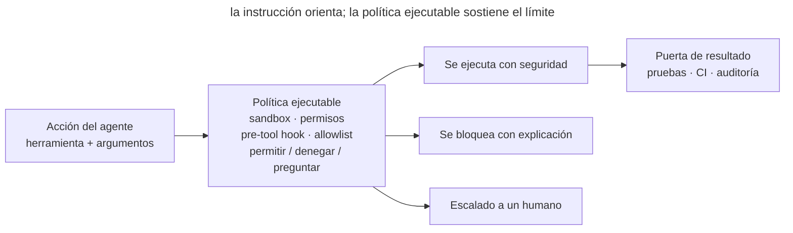

# Límites ejecutables

## Propósito

Trasladar las reglas críticas del trabajo del agente desde el texto a mecanismos que no puedan olvidarse por accidente: permisos, sandboxes, hooks y comprobaciones deterministas. Dentro del área permitida el agente trabaja libremente; fuera de ella, el sistema —no la atención del modelo— detiene las acciones peligrosas o inválidas.

## También conocido como

Executable guardrails, policy as code, restricciones aplicadas, raíles para agentes.

## Problema

`AGENTS.md` dice «no cambies las migraciones», «no expongas secretos» y «ejecuta las pruebas antes de terminar». El agente suele obedecer, pero el texto sigue siendo un consejo. El contexto se llena, la regla se pierde entre otras instrucciones o una herramienta lanza un proceso inesperado, y el límite falla justo cuando hacía falta.

Pedir confirmación antes de cada comando es más seguro, pero causa fatiga de aprobación: el desarrollador pulsa Permitir mecánicamente y se convierte en un motor de políticas lento y poco fiable. El extremo opuesto —quitar toda restricción para ganar autonomía— amplía el radio del error.

No todas las reglas son iguales. «Prefiere funciones pequeñas» requiere juicio y pertenece a la guía. «No escribas fuera del repositorio» es inequívoca y debe aplicarla una máquina. Dejar una regla determinista solo en el prompt vuelve probabilístico un comportamiento que puede garantizarse.

## Solución

Separa las reglas en **recomendaciones** e **invariantes**. Conserva las recomendaciones en la memoria del proyecto; expresa los invariantes como límites ejecutables:

1. **Sandboxing** restringe directorios, red y procesos.
2. **Permisos** aprueban previamente un conjunto estrecho de acciones seguras e implican a una persona fuera de él.
3. **Hooks previos** inspeccionan la intención antes de ejecutar y bloquean operaciones prohibidas.
4. **Hooks posteriores o de parada** inspeccionan el resultado e impiden terminar sin la evidencia obligatoria.
5. **CI** repite comprobaciones críticas fuera de la sesión y protege la rama objetivo.

Un buen límite es pequeño, determinista y explicable. Devuelve la razón y un siguiente paso seguro, no solo una negativa. El objetivo es definir un área segura amplia dentro de la cual no hagan falta aprobaciones constantes.

## Estructura



La instrucción textual orienta al agente, pero no forma una barrera. Cada acción atraviesa una política ejecutable: las acciones seguras se ejecutan, las prohibidas se bloquean y las ambiguas se escalan. Después, una puerta independiente verifica el resultado.

## Participantes / Componentes

- **Política** — una regla breve con un límite comprobable objetivamente.
- **Agente** — propone una acción y recibe un resultado estructurado.
- **Mecanismo de aplicación** — sandbox, allowlist, hook, permiso de archivos o puerta de CI.
- **Área segura** — acciones permitidas sin intervención humana.
- **Escalado** — vía estrecha para una acción que no puede permitirse ni negarse automáticamente.
- **Auditoría** — registro de decisiones sin secretos ni contenido innecesario.

## Cuándo aplicarlo

- Romper la regla podría borrar datos, revelar un secreto, modificar un sistema externo o dañar un lanzamiento.
- El agente trabaja sin supervisión constante o inicia subprocesos.
- La misma prohibición se repite en los prompts.
- La condición se comprueba rápida y objetivamente mediante comando, ruta, diff o código de salida.
- El equipo quiere menos aprobaciones manuales sin conceder acceso sin control.

No conviertas gustos en hooks. «Mantén la arquitectura simple» no puede calcularse de forma fiable en milisegundos; pertenece a una guía o revisión.

## Consecuencias y compromisos

- ➕ Los invariantes críticos se cumplen independientemente de la presión de contexto o la calidad de una respuesta.
- ➕ La autonomía crece dentro del área segura porque los comandos rutinarios no interrumpen al desarrollador.
- ➕ Las negativas son observables y reproducibles: se conocen la regla y la razón.
- ➕ La política versionada se revisa y se comporta igual para todo el equipo.
- ➖ Un límite defectuoso bloquea trabajo útil, por lo que necesita pruebas positivas y negativas.
- ➖ Los hooks síncronos añaden latencia; las comprobaciones pesadas deben ir en un hook de parada o en CI.
- ➖ Las allowlists tienden a crecer; una excepción amplia como «permitir cualquier shell» destruye el límite.
- ➖ El sandbox reduce el impacto, pero no demuestra que el código sea correcto ni sustituye las pruebas.

## Implementación

1. Reúne prohibiciones repetidas de instrucciones e incidentes. Pregunta si cada violación puede detectarse sin interpretar la intención.
2. Describe cada regla como permitir, negar o preguntar. Empieza por invariantes estrechos y arriesgados: rutas de escritura, dominios de red, publicación y secretos.
3. Aplica cada límite en la capa correcta. El sandbox del SO restringe archivos y red; un hook previo comprueba comandos; las pruebas y CI comprueban resultados.
4. Haz útil la negativa: nombra la regla, muestra el área segura y ofrece una acción que el usuario pueda aprobar explícitamente.
5. Prueba ambos lados: la operación peligrosa se bloquea y la segura más cercana pasa. Prueba también el escape de entrada y los timeouts.
6. Registra auditoría mínima sin tokens, secretos ni datos completos de usuarios.
7. Ajusta límites con evidencia, corrigiendo falsos positivos de forma estrecha en vez de añadir excepciones universales.

## Ejemplo

El agente puede modificar `./app`, ejecutar pruebas y leer documentación. No puede escribir fuera del repositorio ni publicar sin aprobación. La memoria conserva la regla humana:

> Trabaja dentro de la tarea y prefiere cambios reversibles.

La política ejecutable es precisa:

```text
write path ./app/**          allow
write path ./docs/**         allow
write path ../**             deny: outside workspace
command make test            allow
command git push *           ask: external state change
network registry.npmjs.org   allow
network *                    deny: domain not approved
```

Si el agente intenta `git push`, el sistema no espera que recuerde un párrafo: la acción entra en escalado explícito. Escribir `~/.ssh/config` se bloquea. `make test` se ejecuta sin preguntar, por lo que la seguridad no se convierte en clics sin sentido.

## Antipatrones y errores comunes

- **Todo en el prompt.** Las prohibiciones deterministas compiten con el contexto de la tarea y a veces pierden.
- **Bloquearlo todo.** Cada comando pide aprobación y genera consentimiento mecánico.
- **Permitir todo el shell.** Una allowlist estrecha se convierte en un bypass universal.
- **Hook inteligente.** Un LLM lento juzga cada comando y vuelve el límite caro e impredecible.
- **Negativa silenciosa.** El agente solo ve un código distinto de cero y busca un rodeo.
- **Secretos en auditoría.** La protección copia datos sensibles en el log.
- **Protección solo local.** Los invariantes críticos deben repetirse en CI o protección de rama.

## Usos conocidos

- **GitHub Copilot hooks** ejecutan comandos en puntos clave; el hook previo puede permitir o negar herramientas, y otros validan estado y registran auditoría.
- **Claude Code sandboxing** aplica límites de archivos y red a nivel del SO, incluidos los subprocesos, y permite libertad dentro de ellos.
- **Git hooks y CI** son la forma preagente del patrón: formato, pruebas y política de rama son ejecutables, no consejos.

Fuentes: [GitHub Copilot hooks](https://docs.github.com/en/copilot/concepts/agents/hooks), [Claude Code sandboxing](https://www.anthropic.com/engineering/claude-code-sandboxing).

## Patrones relacionados

- [Memoria del proyecto](claude-md-memory.md) — guarda recomendaciones; los límites ejecutables toman las reglas que deben activarse siempre.
- [Bucle de retroalimentación](give-agent-a-way-to-verify.md) — comprueba el resultado, mientras los límites restringen las acciones permitidas.
- [Trabajo paralelo aislado](isolated-parallel-work.md) — los worktrees reducen choques; el sandbox y los permisos aplican sus fronteras.
- [Memoria hinchada](bloated-claude-md.md) — intentar sustituir mecanismos por una lista creciente de prohibiciones.
