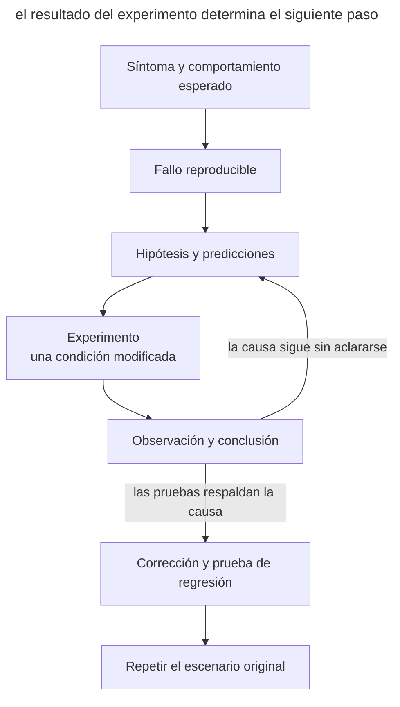

# Diagnóstico mediante hipótesis

## Propósito

Encontrar la causa de un defecto mediante su reproducción y experimentos que distingan las explicaciones posibles. El desarrollador define el síntoma y los límites del trabajo; el agente comprueba las explicaciones antes de modificar el código de producción.

## También conocido como

Hypothesis-driven debugging, depuración experimental.

## Problema

El agente lee una queja, encuentra código sospechoso y lo modifica inmediatamente. El cambio parece razonable, pero el defecto original puede seguir presente. Por ejemplo, ante un importe incorrecto en una factura, reduce la duración de la caché. La primera solicitud tras vaciarla funciona; las siguientes vuelven a fallar.

Un síntoma admite varias causas. El almacenamiento, la caché o la transformación de la respuesta podrían devolver el importe equivocado. Una prueba que pasa con el parche elegido todavía no establece qué explicación corresponde al fallo original.

## Solución

Pide al agente que primero obtenga una comprobación capaz de detectar el síntoma descrito. Después debe formular posibles causas e indicar, para cada una, una observación que podría refutarla.

> Reproduce el fallo con un solo comando. Antes de corregirlo, propone hipótesis y un experimento que las distinga. Cambia una condición cada vez y registra la predicción y el resultado. Cuando hayas establecido la causa, aplica la corrección y repite el escenario original.

Separa las observaciones de las conclusiones. «Los importes son correctos al omitir la caché» acota la investigación a la ruta con caché. Para establecer que la clave es incorrecta hacen falta otras comprobaciones, como invertir las solicitudes y cambiar el identificador de factura.

## Estructura

Cada experimento debe reducir el conjunto de causas posibles.



Si el experimento no distingue las hipótesis, el agente precisa la comprobación. Si varias modificaciones simultáneas eliminan el síntoma, la causa sigue sin establecerse.

## Participantes / Componentes

- **El desarrollador** describe el fallo, el comportamiento esperado y los experimentos permitidos.
- **El escenario de reproducción** detecta el síntoma original y devuelve el resultado de la comprobación.
- **El agente** formula predicciones, realiza experimentos y registra observaciones.
- **La prueba de regresión** comprueba el comportamiento en el límite donde apareció el defecto.

## Cuándo aplicarlo

- Varias explicaciones plausibles encajan con el mismo síntoma.
- Las correcciones anteriores ocultaron el fallo temporalmente.
- El defecto depende del orden de las solicitudes, del estado o de interacciones entre llamadas.

El ciclo completo resulta excesivo para una errata evidente. Para un fallo intermitente, registra primero las condiciones y la frecuencia de reproducción. Unos pocos intentos correctos no demuestran que esté resuelto.

## Consecuencias y compromisos

- ➕ Las hipótesis registradas permiten continuar la investigación en otra sesión.
- ➕ Un escenario mínimo facilita comprobar la causa y la corrección.
- ➖ Preparar la reproducción puede costar más tiempo que el propio cambio.
- ➖ Un entorno simplificado puede ocultar una condición necesaria; hay que repetir el escenario completo.

## Implementación

1. Registra la entrada, el comportamiento esperado y el resultado real. Acuerda los datos disponibles y el entorno de los experimentos.
2. Ejecuta la reproducción y confirma que detecta el fallo descrito. Elimina condiciones innecesarias de una en una y comprueba el resultado después de cada reducción.
3. Prepara un conjunto pequeño de hipótesis, cada una con su predicción y comprobación.
4. Elige un experimento que distinga las causas restantes. Conserva el comando, el resultado y la conclusión revisada.
5. Corrige la causa establecida. Añade una prueba de regresión mediante el comportamiento público y repite el caso original.
6. Retira la instrumentación temporal. Conserva la causa y las comprobaciones que la respaldan en la descripción del cambio.

Si no puedes reproducir el fallo, indica qué falta, por ejemplo una solicitud de entrada o acceso al entorno de pruebas. Mantén los supuestos marcados como no verificados. Usa datos anonimizados en registros y ejemplos.

## Ejemplo

En un servicio didáctico, la organización `alpha` solicita su factura `42`, de importe `100`. Después, `beta` solicita su propia factura `42`, de importe `900`, pero recibe `100`. El [ejemplo en Python](../assets/hypothesis-driven-debugging/examples/cache_probe.py) no necesita servicios externos. Ejecuta los comandos desde la raíz del repositorio.

```console
$ python3 book/assets/hypothesis-driven-debugging/examples/cache_probe.py shared
shared: expected=[100, 900] actual=[100, 100] FAIL
```

El comando termina con código `1`. El agente ya puede distinguir el defecto original de otros errores y formular predicciones.

| Hipótesis | Observación esperada |
| --- | --- |
| La consulta de datos ignora la organización | El fallo continuará al omitir la caché |
| La clave de caché solo contiene el número de factura | Con el mismo número, la segunda solicitud recibirá el primer importe; con números distintos, el fallo desaparecerá |

Cada experimento empieza con la caché vacía y cambia una condición respecto al escenario original.

```console
$ python3 book/assets/hypothesis-driven-debugging/examples/cache_probe.py bypass
bypass: expected=[100, 900] actual=[100, 900] PASS
$ python3 book/assets/hypothesis-driven-debugging/examples/cache_probe.py distinct
distinct: expected=[100, 700] actual=[100, 700] PASS
$ python3 book/assets/hypothesis-driven-debugging/examples/cache_probe.py reverse
reverse: expected=[900, 100] actual=[900, 900] FAIL
```

Omitir la caché refuta la primera hipótesis para estas entradas. Los números distintos y el orden inverso producen los resultados que predice la segunda. Leer la implementación confirma que la clave es `invoice` y pierde la organización. La corrección incluye la organización en la clave.

```python
key = (tenant, invoice)
```

El modo `fixed` usa esta clave y comprueba ambos órdenes, números distintos y lecturas repetidas. Los importes esperados son valores explícitos de los datos didácticos.

```console
$ python3 book/assets/hypothesis-driven-debugging/examples/cache_probe.py fixed
shared: expected=[100, 900] actual=[100, 900] PASS
reverse: expected=[900, 100] actual=[900, 100] PASS
distinct: expected=[100, 700] actual=[100, 700] PASS
repeat: expected=[100, 900, 100, 900] actual=[100, 900, 100, 900] PASS
```

Es un modelo local del mecanismo del defecto. En el servicio real también se repiten las solicitudes originales mediante la API para verificar la transmisión de la organización y la capa real de caché.

## Antipatrones y errores comunes

- **Corregir la primera explicación.** Pide una observación que pudiera refutarla.
- **Varios cambios por intento.** El éxito deja de identificar qué cambio afectó al síntoma.
- **Reproducir un defecto cercano.** Compara el escenario con la queja del usuario.
- **Vaciar en lugar de corregir.** Repite la secuencia que vuelve a llenar la caché y provoca el fallo.
- **Probar un límite demasiado estrecho.** Una prueba de una sola llamada no cubre la interacción entre llamadas.

## Usos conocidos

- El skill [diagnosing-bugs](https://github.com/mattpocock/skills/blob/main/skills/engineering/diagnosing-bugs/SKILL.md) de Matt Pocock prescribe reproducción, reducción, hipótesis refutables, experimentos y comprobación de regresión. El número de hipótesis y el instrumento dependen de la tarea.

## Patrones relacionados

- [Darle al agente una forma de verificar](give-agent-a-way-to-verify.md) proporciona un resultado observable para cada experimento.
- [TDD con un agente](tdd-with-agent.md) registra el defecto en una prueba antes de corregirlo.
- [Prototipo desechable](prototype-to-answer.md) comprueba una pregunta de diseño con un experimento pequeño.
- [Traspaso de sesión](handoff.md) conserva la reproducción, las hipótesis descartadas y el siguiente experimento.
