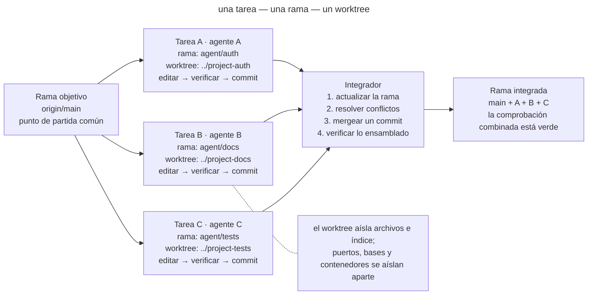
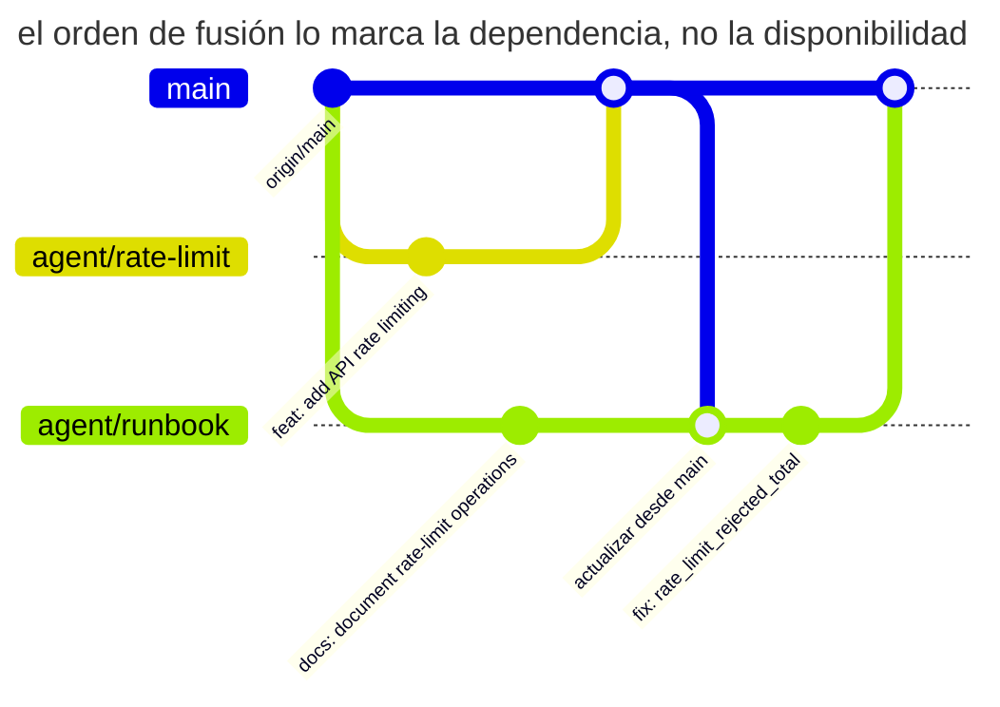

# Trabajo paralelo aislado

## Propósito

Ejecutar varias tareas de agentes al mismo tiempo dando a cada una su propia rama y árbol de trabajo, ocultando los cambios sin commit de las tareas vecinas y transfiriendo el resultado mediante un commit verificable. El paralelismo se convierte en un conjunto de cambios independientes con un punto de integración explícito, no en una carrera entre procesos que escriben en un mismo directorio.

## También conocido como

Worktree per task, branch per agent, checkout aislado, worktrees paralelos.

## Problema

Un agente ya está modificando la autenticación cuando el desarrollador inicia otro para actualizar la documentación. Ambos procesos están abiertos en el mismo checkout. El segundo ve los archivos a medio escribir del primero, los toma como estado inicial y los formatea de paso. El primero ejecuta las pruebas sobre una mezcla de ambos cambios. Después, uno hace commit e incluye líneas del otro.

El problema principal no es un conflicto de merge. Un conflicto al menos detiene la integración y muestra el lugar del choque. Un checkout compartido crea una **mezcla oculta antes del commit**:

- `git diff` deja de responder qué tarea produjo una línea;
- la verificación de una tarea se ejecuta sobre el código de otra y produce una señal verde falsa;
- un agente puede borrar o reescribir un cambio desconocido por considerarlo «innecesario»;
- revertir y revisar se vuelve peligroso porque se ha perdido el límite del cambio;
- dos procesos compiten por el índice de Git, los archivos generados y las dependencias locales.

Una rama normal no resuelve el problema. Un directorio de trabajo solo puede tener una rama activa a la vez, mientras que los archivos sin commit pertenecen al directorio y no a la tarea. Cambiar de rama bajo procesos en ejecución es aún más peligroso.

Un clon completo por tarea ofrece aislamiento, pero duplica el historial innecesariamente y complica la limpieza. Git worktree ofrece varios directorios de trabajo vinculados al mismo repositorio: cada uno tiene su propio `HEAD`, índice y archivos, mientras comparte los objetos de Git.

## Solución

Asigna a cada tarea paralela **su propia rama y su propio worktree**. Dale un ámbito de propiedad y un criterio de finalización explícitos. El agente trabaja solo dentro de su directorio, verifica allí el resultado y termina con un commit. El commit es el límite de traspaso: antes de él, el cambio pertenece a la tarea; después, está listo para integrarse.

Integra las ramas terminadas de una en una. Antes del merge, actualiza la rama desde la rama objetivo, resuelve los conflictos en el contexto de su tarea y repite las comprobaciones. Así, las escrituras concurrentes e incontroladas sobre archivos compartidos se convierten en una integración de Git normal y observable.

El patrón se sostiene sobre cuatro límites:

1. **Límite del sistema de archivos:** un worktree pertenece a una tarea o sesión.
2. **Límite de responsabilidad:** se sabe de antemano qué puede modificar la tarea y qué debe dejar intacto.
3. **Límite de traspaso:** las tareas intercambian commits, no archivos sin commit de un directorio compartido.
4. **Límite de integración:** solo un flujo actualiza la rama objetivo en cada momento y confirma el resultado verde combinado.

## Estructura



Una rama objetivo da origen a ramas y árboles de trabajo independientes. En cada worktree, un agente completa el ciclo de su tarea y produce un commit separado. El integrador acepta los commits de uno en uno y comprueba el estado ensamblado después de cada uno. Si las tareas se solapan, el choque aparece en un punto controlado —durante la actualización o el merge— y no a mitad de la sesión de otro agente.

## Participantes / Componentes

- **Rama objetivo** — el estado en el que finalmente se ensamblan los cambios, normalmente `main` o una rama de funcionalidad compartida.
- **Tarea** — una unidad de trabajo independiente con un ámbito de archivos y un resultado verificable.
- **Rama de la tarea** — el historial de un cambio; su nombre vincula los commits con la tarea.
- **Worktree** — un directorio separado con sus propios archivos de trabajo e índice de Git.
- **Agente** — trabaja solo en el worktree asignado y no integra tareas vecinas por iniciativa propia.
- **Integrador** — un desarrollador o proceso dedicado que decide el orden de merge, resuelve solapamientos y ejecuta la comprobación combinada.
- **Contrato del entorno** — reglas para los recursos que quedan fuera de Git: puertos, bases de datos, contenedores, cachés y archivos temporales.

## Cuándo aplicarlo

- Dos o más tareas independientes se pueden realizar de verdad al mismo tiempo.
- Un agente implementa un cambio mientras otro escribe pruebas o documentación, o investiga el código.
- Hay que comparar varias implementaciones sin sobrescribir los experimentos.
- Una tarea larga no debe bloquear una corrección urgente en el mismo repositorio.
- Las sesiones paralelas se ejecutan localmente o mediante un harness automatizado.

No apliques el patrón automáticamente a dos cambios estrechamente vinculados dentro del mismo módulo. Si las tareas necesitan continuamente el estado sin commit de la otra, no son tareas paralelas, sino una sola tarea dividida artificialmente. Ejecútala de forma secuencial o encuentra primero un límite real.

## Consecuencias y compromisos

- ➕ Los cambios sin commit están separados físicamente, por lo que un agente no puede incluir por accidente el diff vecino en su commit.
- ➕ La verificación pertenece a un cambio concreto: las pruebas se ejecutan en la rama limpia de la tarea y después se repiten sobre el estado integrado.
- ➕ Abandonar trabajo es barato: un experimento fallido se elimina con su rama y worktree sin desenredar un directorio compartido.
- ➕ La revisión es más sencilla: un commit o PR corresponde a una tarea y un propietario.
- ➖ El paralelismo no elimina los conflictos, sino que los traslada a un punto de integración explícito. Una mala división produce una cola de merges difíciles.
- ➖ Cada worktree necesita dependencias y su propia configuración de entorno; sin un bootstrap rápido, la preparación consume la ventaja.
- ➖ Git aísla archivos, no recursos externos. Los mismos puertos, una única base de pruebas o un directorio de caché compartido todavía pueden provocar carreras.
- ➖ Cuantas más ramas estén activas, mayor será el coste de coordinación: la integración necesita un propietario y un orden claro de dependencias.

## Implementación

1. Divide el trabajo por resultados, no por agentes. Cada tarea necesita un nombre, un criterio de finalización, un ámbito de propiedad y dependencias conocidas.
2. Fija el punto de partida y crea ramas separadas con worktrees:

   ```bash
   git fetch origin
   git worktree add -b agent/auth ../project-auth origin/main
   git worktree add -b agent/docs ../project-docs origin/main
   ```

   `git worktree list` muestra todos los directorios y ramas activos. Git impide usar la misma rama en dos worktrees salvo que se fuerce la omisión de esta protección.
3. Ejecuta la preparación estándar del proyecto en cada directorio. Un comando como `make setup` debe llevar un worktree nuevo a un estado verde reproducible; la configuración manual de cada instancia no escala.
4. Entrega al agente tanto la tarea como el límite: «trabaja solo en este directorio; no cambies de rama; no toques cambios fuera del ámbito indicado; termina con un commit verificado».
5. Separa los recursos externos del entorno. Asigna puertos, nombres de contenedores, bases de pruebas y directorios temporales distintos. Monta los secretos como solo lectura o sustitúyelos por valores locales seguros.
6. Cada agente verifica su cambio dentro de su propia rama y crea un commit con sentido. El estado inacabado no se entrega como dependencia a las tareas vecinas.
7. El integrador elige el orden según las dependencias. Antes del merge, cada rama incorpora la rama objetivo actual, resuelve los conflictos y repite su comprobación.
8. Ejecuta una comprobación del estado combinado después de cada merge. Dos ramas verdes no garantizan una composición verde.
9. Tras la integración, elimina los worktrees limpios con el comando estándar:

   ```bash
   git worktree remove ../project-auth
   git worktree remove ../project-docs
   git worktree prune
   ```

   No borres el directorio a ciegas: `git worktree remove` se niega a eliminar un worktree con archivos sin commit y así conserva el trabajo inacabado.

## Ejemplo

Un equipo prepara el lanzamiento de una tienda en línea. Necesita añadir un límite de frecuencia de peticiones y actualizar de forma independiente la página de operaciones. El desarrollador crea dos worktrees desde el mismo `origin/main`:

```text
shop/                 main, solo integración
shop-rate-limit/      agent/rate-limit, código + pruebas
shop-runbook/         agent/runbook, documentación + comprobación de enlaces
```

El primer agente cambia el middleware y las pruebas; el segundo, el runbook. Ambos ejecutan `make setup` y luego sus comprobaciones. El agente de documentación no ve un middleware a medio escribir y las pruebas del primero no reciben cambios accidentales del segundo. El resultado son dos commits:

```text
4d23f91 feat: add API rate limiting
8a771bc docs: document rate-limit operations
```

La documentación depende de los nombres definitivos de las métricas, así que el integrador incorpora primero el código. Después actualiza la rama del runbook, descubre que la métrica ahora se llama `rate_limit_rejected_total`, corrige la referencia y ejecuta la comprobación de documentación. El conflicto semántico aparece donde se puede ver y resolver, en lugar de quedar oculto dentro de un directorio de trabajo compartido.



Ambas ramas parten del mismo punto y hacen commits de forma independiente. El orden de fusión lo marca la dependencia, no quién terminó antes: `agent/runbook` primero incorpora el código ya fusionado y solo después corrige el nombre de la métrica, de modo que la discrepancia aparece como un commit propio en su rama y no como una edición en mitad de la sesión ajena.

Si ambas instancias necesitan un servidor local, un worktree no basta: asigna `PORT=4101` a la primera y `PORT=4102` a la segunda, y da nombres distintos a las bases de pruebas. De lo contrario, el aislamiento del sistema de archivos será correcto mientras los procesos siguen rompiendo el estado del otro a través del entorno.

## Antipatrones y errores comunes

- **Checkout compartido.** Varios agentes escriben en un mismo directorio. Esto no es desarrollo paralelo, sino edición colaborativa sin protocolo.
- **Rama sin worktree.** Los procesos se turnan para cambiar de rama en un directorio y se modifican los archivos bajo sus pies.
- **Worktree sin propietario.** Se envían varias tareas a un único directorio aislado; la mezcla simplemente se traslada a otro lugar.
- **División por archivos en vez de resultados.** «Tú cambias el controlador; tú escribes las pruebas» crea dos mitades que no se pueden verificar ni terminar de forma independiente.
- **Infraestructura compartida.** Directorios separados inician el mismo proyecto de Compose o usan una base o un puerto común, provocando carreras fuera de Git.
- **Merge en paralelo.** Varios procesos actualizan la rama objetivo a la vez. El punto de serialización desaparece y las comprobaciones verdes quedan obsoletas rápidamente.
- **Integración sin volver a verificar.** Cada rama está verde por separado, pero nadie ejecuta su composición.
- **Worktrees eternos.** Los directorios terminados no se eliminan, las ramas pierden sus propietarios y una semana después nadie sabe dónde queda trabajo valioso.

## Usos conocidos

- **Claude Code** recomienda worktrees separados para sesiones CLI paralelas, de modo que sus cambios no choquen, y usa la misma técnica al distribuir trabajo entre muchos archivos.
- **El experimento de Anthropic con un compilador de C** ejecutó cada agente en su propio contenedor con un clon separado y protegió las tareas con bloqueos simples. Es una versión más pesada de los mismos límites: estado de trabajo separado, propiedad de la tarea y sincronización serializada mediante Git.
- **Git worktree** es el mecanismo estándar de Git para mantener varios árboles de trabajo vinculados a un repositorio, lo que permite tener varias ramas abiertas al mismo tiempo sin clones completos.

Fuentes: [Buenas prácticas de Claude Code](https://code.claude.com/docs/en/best-practices), [Building a C compiler with a team of parallel Claudes](https://www.anthropic.com/engineering/building-c-compiler), [documentación de Git worktree](https://git-scm.com/docs/git-worktree).

## Patrones relacionados

- [Una funcionalidad a la vez](one-feature-at-a-time.md) — define el tamaño de la tarea dentro de un worktree: el paralelismo no justifica un frente amplio e inacabado.
- [Escritor y revisor](writer-reviewer.md) — un caso particular útil de dos sesiones aisladas: la segunda recibe un contexto limpio y revisa el commit terminado de la primera.
- [Bucle de retroalimentación](give-agent-a-way-to-verify.md) — proporciona una señal local de preparación para cada rama y una señal combinada tras la integración.
- [Cuatro fases](explore-plan-code-commit.md) — el commit termina el trabajo en la rama y se convierte en un límite seguro de traspaso.
- **Inicio reproducible del agente** — un futuro patrón vecino que convierte la preparación de un worktree nuevo en un comando rápido y verificable.
