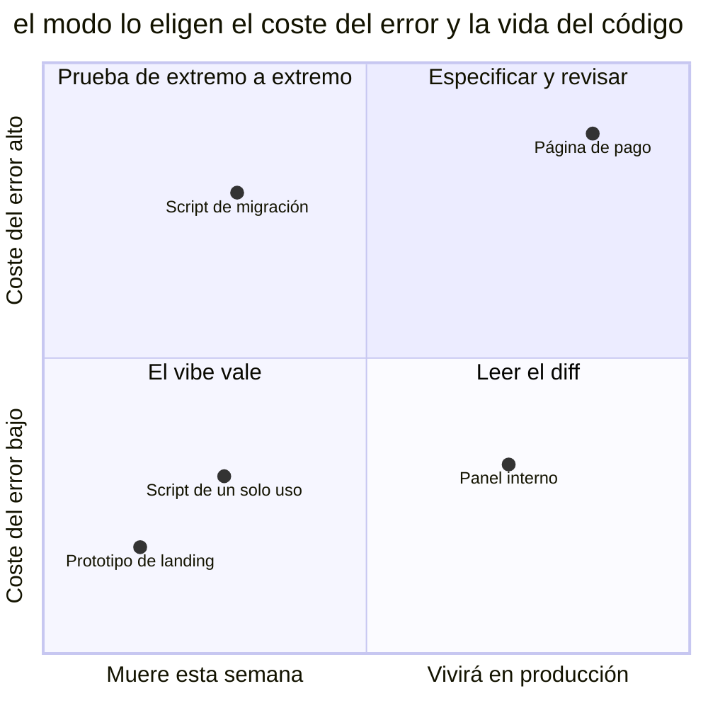

# Vibe coding

## También conocido como

Vibe coding — el término de Andrej Karpathy: «entregarse del todo a las
vibraciones... y olvidar que el código siquiera existe».

## Contexto

El desarrollador describe el objetivo en una frase, el agente genera, el
desarrollador acepta todo lo que arranca y parece funcionar. El diff no se
lee; los errores se curan pegando el mensaje de vuelta al chat. En un
prototipo de fin de semana esto es embriagadoramente productivo — y el
hábito se muda al proyecto real.

## Problema

El producto de la conversación se acepta sin comprensión y sin
verificación: el código no se leyó, los requisitos no están anotados en
ninguna parte, el criterio de aceptación es «parece que funciona». En una
base de código viva crece una capa de la que nadie sabe decir qué *debe*
hacer.

## Por qué se hace

- La velocidad embriaga: una funcionalidad en una tarde contra una semana —
  cuesta obligarse a frenar para leer un diff.
- En los prototipos funciona de verdad: ahí el precio del error es cero, y
  el hábito se fija como «la manera normal de trabajar».
- Leer código ajeno aburre, y el del agente además es largo.
- «El agente conoce este framework mejor que yo» — cierto, y de ahí no se
  sigue que el resultado sea correcto.

## Consecuencias

- ➖ Código sin dueño: nadie entiende cómo está hecha la funcionalidad — no
  hay quien la revise, la arregle o la haga crecer.
- ➖ La intención se pierde: al mes no se distingue «así se diseñó» de «así
  salió» — los requisitos existían solo en una cabeza y un chat.
- ➖ Los casos límite y la seguridad son desconocidos: nadie los comprobó,
  porque el criterio era «parece que funciona».
- ➖ Cada cambio siguiente cuesta más: la capa de código no comprendido
  crece, y el agente construye lo nuevo sobre lo viejo sin verificar.

## Señales

- El diff se fusionó sin leer.
- A «¿cómo funciona esto?» la respuesta es «ni idea, lo escribió el
  agente».
- Los requisitos se reconstruyen leyendo el código, porque no existen en
  ningún otro sitio.
- El argumento de calidad es «pero funciona».

## Cómo hacerlo mejor

Separar los modos por el precio del error. Al vibe, su zona legítima: los
[prototipos desechables](prototype-to-answer.md), los scripts de un solo
uso, los experimentos — todo lo que muere antes de necesitar ser
comprendido. Al código real, el proceso real: la intención se anota (una
[especificación](spec-driven-development.md) o al menos el plan de las
[cuatro fases](explore-plan-code-commit.md)), el resultado se verifica (el
[bucle de retroalimentación](give-agent-a-way-to-verify.md)) y el diff se
lee — tú mismo o un [revisor con contexto fresco](writer-reviewer.md). La
línea es simple: el código que va a vivir debe ser comprendido por alguien.

Ambos ejes se necesitan a la vez. Un prototipo de landing y un script de un solo uso están en la esquina inferior izquierda, donde el vibe es honesto y no cuesta nada. Una página de pago exige el proceso completo. La esquina peligrosa es la superior izquierda: un script de migración morirá en una hora, pero un error en él puede dejar ya nada que reparar; una vida corta no elimina la prueba de extremo a extremo.

## Ejemplo

**Antes:**

> — Haz la página de pago de la suscripción. — … — Funciona, fusiónalo.

**Después:**

> Para el prototipo del landing — vibe sin leer: muere esta semana. Para el
> pago — especificación con criterios, implementación por plan, recorrido
> completo del escenario de pago y revisión del diff con un subagente
> fresco: este código manejará dinero más tiempo del que recordaremos esta
> conversación.

## Patrones y antipatrones relacionados

- [Prototipo desechable](prototype-to-answer.md) — la forma legal del
  vibe: código desechable con pregunta y veredicto, en vez de código sin
  dueño.
- [Desarrollo orientado a especificaciones](spec-driven-development.md) —
  el polo opuesto: la intención queda escrita y sobrevive a la
  conversación.
- [Éxito prematuro](premature-success.md) — el compañero fiel: el código
  sin leer *y* el comportamiento sin comprobar.
- [One-shotting](one-shotting.md) — el hermano de la misma cultura de
  demos: allí se espera todo de un prompt, aquí se acepta todo lo que salió
  de él.
