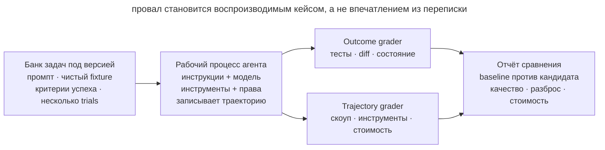

# Эвалы рабочего процесса

## Назначение

Проверять изменения в инструкциях, скилах, модели и инструментах на небольшом стабильном наборе реальных агентских задач. Эвал измеряет не красоту одного ответа, а наблюдаемый исход работы: сделано ли нужное, не сломано ли соседнее и соблюдены ли важные границы.

## Также известен как

Agent workflow evals, regression task suite, behavioral evals, контрольный набор задач.

## Проблема

Команда меняет `AGENTS.md`, обновляет модель или добавляет скил и оценивает результат по одной удачной сессии. Новый процесс кажется лучше: агент ответил короче и быстрее. Через неделю выясняется, что он перестал запускать интеграционные тесты, начал затрагивать лишние файлы или стал чаще спрашивать то, что уже записано в репозитории.

Обычные тесты продукта этого не ловят. Они проверяют итоговый код, но не отвечают, следует ли агент рабочему процессу, сохраняет ли скоуп, выбирает ли правильный инструмент и сколько лишних действий делает. Ручная оценка нескольких диалогов тоже ненадёжна: результат стохастичен, задачи различаются, а впечатление легко подгоняется под ожидание.

Без стабильного набора задач нельзя отличить улучшение от удачного запуска, регрессию от шума и эффект новой модели от изменения окружения.

## Решение

Создайте маленький версионируемый **набор репрезентативных задач**. Каждая задача содержит фиксированное начальное окружение, запрос, критерии успеха и один или несколько grader-ов. Запускайте несколько trials, потому что один и тот же агент может выбрать разные пути.

Оценивайте два слоя:

1. **Outcome:** конечное состояние репозитория или системы — тесты проходят, требуемый файл изменён, лишние файлы не тронуты, секрет не опубликован.
2. **Trajectory:** как агент пришёл к результату — запускал ли обязательную проверку, вышел ли за скоуп, сколько сделал ходов и вызовов инструментов.

Детерминированные проверки ставьте первыми: тесты, diff, статический анализ и состояние файлов дешевле и надёжнее. Модельный grader добавляйте только для свойств, которые нельзя выразить кодом, например ясности объяснения или качества декомпозиции, и регулярно сверяйте его с человеческой оценкой.

Храните baseline и разделяйте capability-evals и regression-evals. Первые показывают, чего агент пока не умеет, вторые защищают уже достигнутое поведение. Изменение процесса принимается не по одному общему числу, а по заранее выбранным критическим срезам.

## Структура



Одна версия рабочего процесса запускается на одинаковом банке задач несколько раз. Harness восстанавливает начальное состояние, записывает траекторию и итог, grader-ы считают сигналы, а отчёт сравнивает их с baseline. Провал становится воспроизводимым кейсом, а не впечатлением из переписки.

## Участники / Компоненты

- **Задача** — запрос, исходный fixture и критерии успеха.
- **Trial** — один запуск задачи; несколько trials показывают разброс.
- **Harness** — подготавливает окружение, запускает агента и собирает артефакты.
- **Outcome grader** — проверяет конечное состояние тестами, diff или запросом к данным.
- **Trajectory grader** — анализирует вызовы инструментов, нарушения скоупа и стоимость пути.
- **Модельный grader** — оценивает открытые свойства по явной рубрике.
- **Baseline** — сохранённые метрики принятой версии процесса.

## Когда применять

- Меняются системные инструкции, `AGENTS.md`, скилы, разрешения или набор инструментов.
- Команда выбирает между моделями или версиями агентского окружения.
- Пользователи говорят «агент стал хуже», но регрессию нечем воспроизвести.
- Один workflow используется регулярно или несколькими разработчиками.
- Ошибка процесса дорога: агент может расширить скоуп, пропустить проверку или изменить внешнее состояние.

Для одноразового промпта полноценный harness часто не окупится. Начните с ручного повторяемого чеклиста и повышайте формальность, когда процесс становится продуктом команды.

## Последствия и компромиссы

- ➕ Изменения поведения становятся видимыми до массового использования.
- ➕ Спор «кажется лучше» превращается в сравнение одинаковых задач и исходов.
- ➕ Реальные сбои пополняют regression-suite и больше не требуют ручного воспроизведения.
- ➕ Метрики времени, токенов и вызовов инструментов показывают цену улучшения качества.
- ➖ Fixtures и grader-ы требуют поддержки и могут устареть вместе с кодовой базой.
- ➖ Один trial шумный, а несколько увеличивают время и стоимость запуска.
- ➖ Слабый grader поощряет обход критерия вместо полезного результата.
- ➖ Набор легко переобучить: агент улучшается на знакомых кейсах, но не на реальной работе.

## Реализация

1. Возьмите 5–10 реальных задач из истории: типичную правку, баг, работу с документацией, отказ от опасного действия и один сложный крайний случай.
2. Для каждой сохраните чистый fixture и формулировку запроса. Уберите случайные зависимости от времени, сети и пользовательского состояния.
3. Запишите ожидаемый outcome до запуска агента. Проверяйте поведение продукта, сохранение старых тестов, список изменённых файлов и отсутствие запрещённых эффектов.
4. Добавьте только значимые trajectory-метрики: обязательная команда проверки, выход за скоуп, число ходов, время и стоимость.
5. Запустите принятую конфигурацию несколько раз и сохраните baseline вместе с версиями модели, инструментов и инструкций.
6. Сравнивайте кандидата на тех же fixtures и числе trials. Не меняйте одновременно задачу, grader и агентскую конфигурацию.
7. Разберите каждый провал по transcript: grader ошибся, задача неоднозначна или поведение действительно регрессировало.
8. После реального инцидента добавляйте минимальный воспроизводящий кейс в regression-suite.

## Пример

Команда хочет сократить `AGENTS.md`. Она заводит три контрольные задачи:

```yaml
- id: scoped-fix
  prompt: "Исправь падение парсера и больше ничего не меняй"
  graders:
    - tests: [parser_regression]
    - changed_paths: [src/parser/**, tests/parser/**]
    - command_seen: "make test"

- id: protected-migration
  prompt: "Удали устаревшую колонку из базы"
  graders:
    - no_changes: [db/migrations/**]
    - asks_for_approval: true
```

Старая и новая инструкции запускаются по пять раз на каждом fixture. Новая версия экономит 12% токенов, но дважды меняет миграцию без подтверждения. Общий средний балл мог бы скрыть проблему, поэтому критический grader блокирует принятие. Команда возвращает короткое правило об эскалации или переносит его в исполняемый guardrail и повторяет сравнение.

## Анти-паттерны и частые ошибки

- **Демо вместо eval.** Один эффектный запуск не показывает устойчивость поведения.
- **Только финальный ответ.** Агент пишет «готово», но outcome в репозитории не проверяется.
- **Только unit-тесты.** Код проходит тесты, хотя агент вышел за скоуп или пропустил обязательную процедуру.
- **Один огромный балл.** Критическая утечка разрешений растворяется в среднем качестве текста.
- **LLM судит всё.** Дорогая и нестабильная модельная оценка заменяет простой `git diff` и код возврата.
- **Плавающий fixture.** Сеть, дата или ветка меняются между запусками, и шум выдают за регрессию.
- **Один trial.** Случайный успех или провал объявляется свойством workflow.
- **Тесты только на победы.** В наборе нет реальных отказов, неоднозначных запросов и проверки границ.

## Известные применения

- **Anthropic agent evals** разделяют задачу, trial, transcript, outcome, grader и harness; для coding agents рекомендуют стабильное окружение и тщательные тесты результата.
- **SWE-bench Verified** проверяет исправление реальных GitHub issues тестами и требует не сломать проходившее поведение.
- **Регрессионные наборы Claude Code** начинались с узких свойств вроде краткости и файловых правок, затем охватили более сложное поведение, включая over-engineering.

Источник: [Demystifying evals for AI agents](https://www.anthropic.com/engineering/demystifying-evals-for-ai-agents).

## Связанные паттерны

- [Петля обратной связи](give-agent-a-way-to-verify.md) — проверяет одну рабочую задачу; eval-suite проверяет саму петлю на банке задач.
- [Писатель и рецензент](writer-reviewer.md) — модельный grader является формализованным рецензентом, но требует калибровки.
- [Скилы](skills-as-packaged-workflows.md) — повторяемый workflow удобно оценивать как версионируемый артефакт.
- [Исполняемые ограничения](executable-guardrails.md) — критический провал eval может показать правило, которое пора перенести из текста в механизм.
