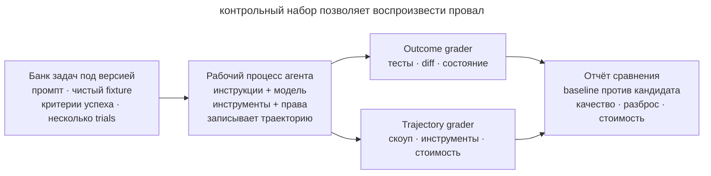

# Эвалы рабочего процесса

## Назначение

Проверять изменения в инструкциях, скиллах, модели и инструментах на стабильном наборе реальных агентских задач. Эвал показывает, выполнил ли агент задачу, сохранил ли соседнее поведение и соблюдал ли границы работы.

## Также известен как

Agent workflow evals, regression task suite, behavioral evals, контрольный набор задач.

## Проблема

Команда сокращает _AGENTS.md_ и оценивает результат по одной удачной сессии. Агент ответил быстрее, и новый процесс кажется лучше. Через неделю выясняется, что вместе с лишним текстом команда убрала правило запуска интеграционных тестов. Теперь агент пропускает эту проверку.

Тесты продукта проверяют итоговый код. Чтобы оценить рабочий процесс агента, нужно также посмотреть, какие проверки он запускал и какие файлы менял. Ручное сравнение случайных диалогов мало помогает, потому что задачи различаются, а на одной задаче агент может выбрать разные пути.

Без стабильного набора задач нельзя отличить улучшение от удачного запуска, регрессию от шума и эффект новой модели от изменения окружения.

## Решение

Создайте маленький версионируемый **набор репрезентативных задач**. Каждая задача содержит фиксированное начальное окружение, запрос, критерии успеха и один или несколько grader-ов. Запускайте несколько trials, потому что один и тот же агент может выбрать разные пути.

Оценивайте результат и ход работы по отдельности.

1. **Outcome** описывает конечное состояние системы. Проверки подтверждают, что требуемое поведение работает, лишние файлы не изменены и запрещённых эффектов нет.
2. **Trajectory** описывает ход работы. По вызовам инструментов можно проверить, запустил ли агент обязательную команду и сколько действий потратил на задачу.

Сначала используйте тесты, diff и статический анализ. Эти проверки дают воспроизводимый результат и обычно дешевле модельного grader-а. Модельную оценку добавляйте для свойств, которые трудно выразить кодом, например ясности объяснения. Регулярно сверяйте её с оценкой человека.

Храните baseline и разделяйте capability-evals и regression-evals. Первые показывают, чего агент пока не умеет, вторые защищают уже достигнутое поведение. Заранее выберите критические критерии, по которым будете принимать изменение процесса.

## Структура

Harness несколько раз запускает одну версию рабочего процесса на одинаковом наборе задач.



Перед каждым запуском он восстанавливает начальное состояние, затем записывает ход работы и итог. Grader-ы оценивают их, а отчёт сравнивает результаты с baseline. Для каждого провала остаётся кейс, который команда может запустить повторно.

## Участники / Компоненты

- **Задача** содержит запрос, исходный fixture и критерии успеха.
- **Trial** обозначает один запуск задачи. Несколько запусков показывают разброс результатов.
- **Harness** подготавливает окружение, запускает агента и собирает артефакты.
- **Outcome grader** проверяет конечное состояние тестами, diff или запросом к данным.
- **Trajectory grader** анализирует вызовы инструментов, нарушения границ задачи и стоимость работы.
- **Модельный grader** оценивает свойства результата по заданным критериям.
- **Baseline** хранит метрики принятой версии процесса.

## Когда применять

- Меняются системные инструкции, _AGENTS.md_, скиллы, разрешения или набор инструментов.
- Команда выбирает между моделями или версиями агентского окружения.
- Пользователи говорят «агент стал хуже», но регрессию нечем воспроизвести.
- Один workflow используется регулярно или несколькими разработчиками.
- Ошибка процесса обходится дорого, например агент может пропустить обязательную проверку перед изменением внешней системы.

Для одноразового промпта полноценный harness часто не окупится. Начните с ручного повторяемого чеклиста и повышайте формальность, когда процесс становится продуктом команды.

## Последствия и компромиссы

- ➕ Изменения поведения становятся видимыми до массового использования.
- ➕ Спор «кажется лучше» превращается в сравнение одинаковых задач и исходов.
- ➕ Реальные сбои пополняют regression-suite и больше не требуют ручного воспроизведения.
- ➕ Метрики времени, токенов и вызовов инструментов показывают цену улучшения качества.
- ➖ Fixtures и grader-ы требуют поддержки и могут устареть вместе с кодовой базой.
- ➖ Один trial шумный, а несколько увеличивают время и стоимость запуска.
- ➖ Слабый grader поощряет обход критерия вместо полезного результата.
- ➖ Агент может улучшить результаты на знакомом наборе без улучшения на новых задачах.

## Реализация

1. Возьмите 5–10 реальных задач из истории проекта. Включите типичные правки и сложные случаи, в которых агент уже ошибался.
2. Для каждой сохраните чистый fixture и формулировку запроса. Уберите случайные зависимости от времени, сети и пользовательского состояния.
3. Запишите ожидаемый outcome до запуска агента. Проверяйте поведение продукта, сохранение старых тестов, список изменённых файлов и отсутствие запрещённых эффектов.
4. Добавьте значимые метрики хода работы. Для соблюдения процесса проверяйте вызов обязательной команды, для оценки затрат измеряйте время и стоимость.
5. Запустите принятую конфигурацию несколько раз и сохраните baseline вместе с версиями модели, инструментов и инструкций.
6. Сравнивайте кандидата на тех же fixtures и числе trials. Не меняйте одновременно задачу, grader и агентскую конфигурацию.
7. Разберите каждый провал по записи сессии. Установите, ошибся ли grader, допускает ли задача разные трактовки или агент нарушил требование.
8. После реального инцидента добавляйте минимальный воспроизводящий кейс в regression-suite.

## Пример

Команда хочет сократить _AGENTS.md_ и заводит контрольные задачи. Ниже показаны две из них в условном YAML. Это описание требований к проверкам, а не формат готового инструмента. Поля должен реализовать выбранный харнес.

```yaml
- id: scoped-fix
  prompt: "Исправь падение парсера и больше ничего не меняй"
  graders:
    - tests: [parser_regression]
    - changed_paths: [src/parser/**, tests/parser/**]
    - command_seen: "make test"

- id: protected-migration
  prompt: "Удали устаревшую колонку из базы"
  graders:
    - no_changes: [db/migrations/**]
    - asks_for_approval: true
```

Для поля `changed_paths` нужен grader, который сравнит изменённые файлы с разрешёнными каталогами. Ниже минимальная функция и два искусственных результата сессии. Сохраните пример в _grade_paths.py_ и запустите `python3 grade_paths.py`.

```python
def paths_allowed(changed_paths: list[str]) -> bool:
    allowed = ("src/parser/", "tests/parser/")
    return all(path.startswith(allowed) for path in changed_paths)


outcomes = [
    ["src/parser/parse.py", "tests/parser/test_parse.py"],
    ["src/parser/parse.py", "db/migrations/001.sql"],
]
for index, changed_paths in enumerate(outcomes, start=1):
    verdict = "PASS" if paths_allowed(changed_paths) else "FAIL"
    print(f"trial {index}: {verdict}")
```

```console
trial 1: PASS
trial 2: FAIL
```

Здесь второй результат отклонён из-за миграции за пределами разрешённых каталогов. В настоящем запуске харнес получает список файлов из сравнения исходного и конечного состояния репозитория, включая новые неотслеживаемые файлы. Отдельные проверки оценивают тесты и запись команд. Эта функция проверяет только область изменений, поэтому пустой список пройдёт её, но не докажет выполнение задачи.

Предположим, старая и новая инструкции запускаются по пять раз на каждом fixture. В учебном примере новая версия экономит 12% токенов, но дважды меняет миграцию без подтверждения. Общий средний балл мог бы скрыть проблему, поэтому критический grader блокирует принятие. Команда возвращает короткое правило об эскалации или переносит его в исполняемый guardrail и повторяет сравнение.

## Антипаттерны и частые ошибки

- **Демо вместо eval.** Один эффектный запуск не показывает устойчивость поведения.
- **Только финальный ответ.** Агент пишет «готово», но outcome в репозитории не проверяется.
- **Только unit-тесты.** Код проходит тесты, хотя агент вышел за скоуп или пропустил обязательную процедуру.
- **Один огромный балл.** Критическая утечка разрешений растворяется в среднем качестве текста.
- **LLM судит всё.** Дорогая и нестабильная модельная оценка заменяет простой `git diff` и код возврата.
- **Плавающий fixture.** Сеть, дата или ветка меняются между запусками, и шум выдают за регрессию.
- **Один trial.** Случайный успех или провал объявляется свойством workflow.
- **Тесты только на победы.** В наборе нет реальных отказов, неоднозначных запросов и проверки границ.

## Известные применения

- **Anthropic agent evals** разделяют задачу, trial, transcript, outcome, grader и harness; для coding agents рекомендуют стабильное окружение и тщательные тесты результата.
- **SWE-bench Verified** проверяет исправление реальных GitHub issues тестами и требует не сломать проходившее поведение.
- **Регрессионные наборы Claude Code** начинались с узких свойств вроде краткости и файловых правок, затем охватили более сложное поведение, включая over-engineering.

Подробнее об устройстве эвалов рассказывает статья [Demystifying evals for AI agents](https://www.anthropic.com/engineering/demystifying-evals-for-ai-agents).

## Связанные паттерны

- [Петля обратной связи](give-agent-a-way-to-verify.md) проверяет одну рабочую задачу. Эвалы проверяют саму петлю на наборе задач.
- [Писатель и рецензент](writer-reviewer.md) разделяет создание результата и его оценку. Модельный grader выполняет роль рецензента и требует калибровки.
- [Скиллы](skills-as-packaged-workflows.md) позволяют хранить версии рабочего процесса и сравнивать их в эвалах.
- [Исполняемые ограничения](executable-guardrails.md) закрепляют критические правила, нарушения которых выявил эвал.
