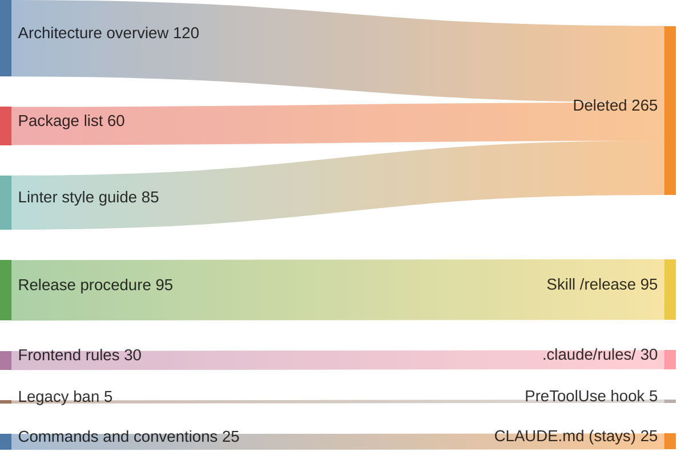

# Раздутая память

## Также известен как

Bloated CLAUDE.md, over-specified memory file, память-свалка.

## Контекст

Команда месяцами пополняет файл памяти проекта. После каждого происшествия с агентом разработчики добавляют правило, но редко проверяют, осталось ли оно нужным. Файл растёт и никогда не сокращается.

## Проблема

В файле памяти накапливаются сотни строк с дублями, противоречиями и пересказом кода. Агенту труднее выделить применимые инструкции среди остальных, поэтому даже записанное правило может остаться без внимания.

## Почему так делают

- Каждое правило когда-то было нужно, и разработчики боятся удалить его без знания исходной причины.
- Команда рассчитывает, что дополнительные инструкции сделают поведение агента предсказуемее, и не проверяет эффект от их накопления.
- Разработчики помещают в память описание архитектуры и длинные процедуры, которым удобнее выделить отдельные документы.
- Файл пополняет вся команда, но за его пересмотр никто не отвечает.

## Последствия

- ➖ Агент пропускает нужную инструкцию среди множества остальных.
- ➖ Каждая лишняя строка расходует токены во всех сессиях, которые загружают файл.
- ➖ При противоречии инструкций агент может выбирать разные правила в разных сессиях.
- ➖ Новым коллегам приходится разбирать длинный файл, чтобы найти нужное соглашение.

## Признаки

- Файл содержит сотни строк и продолжает расти.
- Агент делает то, что памятью прямо запрещено.
- Файл пересказывает структуру каталогов и зависимости, которые агент может прочитать в репозитории.
- Есть правила, которые агент выполняет и без инструкции.
- Никто не может сказать, зачем нужна половина строк.

## Как лучше

Пересматривайте память по правилу из [одноимённого паттерна](claude-md-memory.md). Для каждой строки выясняйте, какую ошибку она предотвращает. Если агент получает те же сведения из кода или выполняет правило без напоминания, строку можно удалить. Длинные процедуры вынесите в [скиллы](skills-as-packaged-workflows.md), которые загружаются по требованию. После сокращения файла проверьте на реальных задачах, сохранилось ли нужное поведение.

## Пример

**Было**

> В CLAUDE.md накопилось 420 строк. Большую часть занимают обзор архитектуры, список пакетов и скопированные правила линтера. Среди них на строке 287 стоит запрет менять legacy, который агент вчера нарушил.

На схеме разработчик удаляет 265 строк, которые повторяют сведения из кода и настроек линтера. Процедуру релиза из 95 строк он переносит в скилл, правила фронтенда из 30 строк помещает в _.claude/rules/_, а запрет на legacy из пяти строк закрепляет хуком. В памяти остаются 25 строк команд и соглашений. Каждое правило теперь хранится там, где применяется.

**Стало**

> В CLAUDE.md осталось 25 строк с командами и соглашениями. Процедуру релиза агент получает из скилла `/release`, а правила фронтенда загружает из _.claude/rules/_ при работе с нужными файлами. PreToolUse-хук блокирует запись в legacy.

## Связанные паттерны и антипаттерны

- [Память проекта](claude-md-memory.md) задаёт правила отбора и пересмотра постоянных инструкций.
- [Скиллы](skills-as-packaged-workflows.md) позволяют загружать процедуры по требованию.
- [Инженерия контекста](context-engineering.md) объясняет, как лишний текст мешает использовать нужные сведения.
- [Преждевременная спецификация](premature-specification.md) описывает сходную попытку получить контроль через избыточные инструкции.
