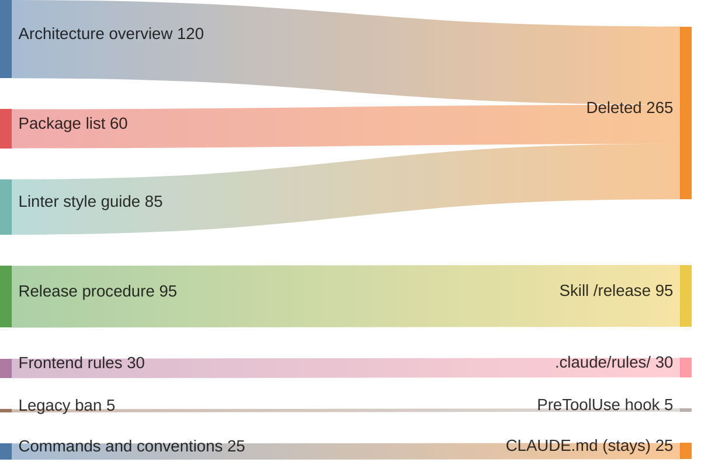

# Раздутая память

## Также известен как

Bloated CLAUDE.md, over-specified memory file, память-свалка.

## Контекст

Команда месяцами пополняет файл памяти проекта: каждое происшествие с
агентом рождает новое правило, каждый онбординг — новый раздел. Файл растёт
и никогда не сокращается.

## Проблема

Файл памяти перегружен: сотни строк, дубли, противоречия, пересказ того, что
агент и так видит в коде. Перегруженная память не усиливает контроль — она
его отключает: важные правила тонут в шуме, и агент игнорирует половину
написанного.

## Почему так делают

- Добавить безопасно, удалить страшно: каждое правило когда-то было нужно,
  и никто не помнит, можно ли его трогать.
- Иллюзия управления: кажется, что больше правил — послушнее агент. На деле
  наоборот: раздутые файлы памяти заставляют агента игнорировать сами
  инструкции.
- Память используется как склад: туда сваливают описание архитектуры,
  списки зависимостей и многошаговые процедуры — всё, чему там не место.
- Файл никому не принадлежит: пополняют все, чистит никто.

## Последствия

- ➖ Агент нарушает записанные правила: правило есть, но оно потерялось в
  шуме — самый частый симптом.
- ➖ Каждая строка оплачивается токенами в каждой сессии каждого
  разработчика — раздутая память дорожает пропорционально команде.
- ➖ Противоречивые правила разрешаются произвольно: сегодня агент выбрал
  одно, завтра другое.
- ➖ Файл перестают читать и люди: новый коллега, открыв четыреста строк,
  закрывает их.

## Признаки

- Файл памяти — сотни строк, и он только растёт.
- Агент делает то, что памятью прямо запрещено.
- В файле есть структура каталогов, список зависимостей, обзор
  архитектуры — то, что агент видит в коде сам.
- Есть правила, которые агент выполняет и без инструкции.
- Никто не может сказать, зачем нужна половина строк.

## Как лучше

Вернуть памяти дисциплину из [одноимённого паттерна](claude-md-memory.md):
к каждой строке — вопрос «если удалить, начнёт ли агент ошибаться?», и если
нет — удалить. Производное из кода — вон целиком. Многошаговые процедуры —
в [скилы](skills-as-packaged-workflows.md): они грузятся по требованию и не
стоят ничего, пока не вызваны. Правила, нужные только части кодовой базы, —
в модульные файлы с привязкой к путям. Жёсткие запреты — в хуки: механика
надёжнее пожеланий. И чистка по расписанию — как обновление зависимостей.

## Пример

**Было:**

> CLAUDE.md на 420 строк: обзор архитектуры на три экрана, список всех
> пакетов, стайлгайд, скопированный из документации линтера, процедура
> релиза на 30 шагов и правило «не трогать папку legacy» на строке 287 —
> которое агент вчера нарушил.

Из 420 строк 265 просто удаляются: их агент и так видит в коде. Ещё 95 — процедура, которой место в скиле. До памяти доходят 25 строк команд и соглашений; правила фронтенда уезжают в `.claude/rules/`, а запрет на legacy становится хуком. Файл худеет не потому, что правила выбросили, а потому, что каждое уехало туда, где оно работает.

**Стало:**

> CLAUDE.md на 60 строк: команды, которых нет в Makefile, соглашения,
> расходящиеся с дефолтами, и жёсткие границы. Процедура релиза — скил
> `/release`. Правила фронтенда — в `.claude/rules/` с привязкой к путям.
> «Не трогать legacy» — PreToolUse-хук, который просто не даёт писать в
> папку.

## Связанные паттерны и анти-паттерны

- [Память проекта](claude-md-memory.md) — паттерн, вырождением которого
  является раздутая память; там же — дисциплина, которая её лечит.
- [Скилы](skills-as-packaged-workflows.md) — главный разгрузочный клапан:
  процедуры уходят из памяти в файлы по требованию.
- [Инженерия контекста](context-engineering.md) — объясняет механизм вреда:
  бюджет внимания конечен, и каждая лишняя строка платит из него.
- [Преждевременная спецификация](premature-specification.md) — родственная
  иллюзия контроля: там детализируют задачу, здесь — правила.
