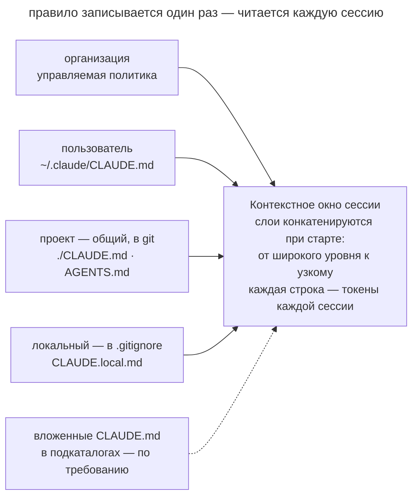

# Память проекта

## Назначение

Завести в репозитории постоянный файл с командами, соглашениями и ограничениями проекта, который агент читает в начале каждой сессии. Разработчик записывает правило один раз, и следующие сессии получают его из файла.

## Также известен как

CLAUDE.md, AGENTS.md, memory file, файл памяти, project rules, custom instructions.

## Проблема

Новая сессия может не знать, как команда собирает проект и запускает тесты. Разработчик объясняет правила в переписке, но следующая сессия требует тех же уточнений. Особенно заметно это на нестандартной команде проверки.

Например, агент запускает обычный тестовый скрипт, хотя проект требует `make test` с подготовкой fixtures. Разработчик исправляет команду в чате. Если сохранить это правило только в переписке, коллега в новой сессии столкнётся с тем же сбоем.


Правила проекта нужны при выполнении разных задач. Их удобнее хранить отдельно от спецификации конкретной фичи.

## Решение

Создайте в репозитории файл, который агент загружает при старте. Запишите в нём команды и неочевидные соглашения, которые иначе пришлось бы объяснять в каждой сессии. Укажите границы модулей, если агент не может надёжно восстановить их по коду.

Пополняйте файл, когда видите повторяющуюся потребность в контексте.

- агент совершил одну и ту же ошибку второй раз;
- ревью поймало то, что агент обязан был знать об этой кодовой базе;
- вы печатаете уточнение, которое уже печатали в прошлой сессии;
- новому коллеге для продуктивной работы понадобился бы тот же контекст.

Храните файл в системе контроля версий. Тогда команда сможет обсуждать правки на ревью, а новые сессии получат согласованную версию правил.

Файл памяти направляет поведение агента, но не гарантирует соблюдения правил. Критические запреты, например запрет записи в защищённую ветку, закрепляйте правами доступа и хуками.

## Структура



На схеме показаны уровни памяти Claude Code. Организация задаёт управляемую политику, пользователь хранит личные предпочтения, а команда записывает правила проекта в git. Локальный файл дополняет их настройками разработчика для конкретного репозитория. Вложенные файлы дают инструкции для отдельных каталогов, когда агент работает с ними. Паттерн посвящён командному файлу, который проходит ревью вместе с кодом.

## Участники / Компоненты

- **Файл памяти проекта** (`./CLAUDE.md`, `./AGENTS.md`) хранит командные правила в git и проходит ревью.
- **Личный файл пользователя** (`~/.claude/CLAUDE.md`) хранит предпочтения разработчика для его проектов.
- **Локальный файл** (`CLAUDE.local.md` в `.gitignore`) содержит настройки разработчика для этого проекта.
- **Разработчик и команда** добавляют правила по наблюдаемым сбоям и регулярно пересматривают файл.
- **Агент** читает инструкции и по просьбе дописывает новые правила.

## Когда применять

- Агент регулярно работает в репозитории.
- Соглашения проекта расходятся со стандартными настройками инструментов.
- Нескольким разработчикам и агентам нужны общие правила работы.

## Последствия и компромиссы

- ➕ Новые сессии получают сохранённые правила без повторных объяснений.
- ➕ Команда хранит общую версию правил в git и обсуждает изменения на ревью.
- ➕ Для уточнения правила достаточно небольшой правки Markdown.
- ➖ Каждая строка занимает место в контексте каждой сессии, которая читает файл (см. [инженерию контекста](context-engineering.md)).
- ➖ Без пересмотра в файле накапливаются дубли и противоречия.
- ➖ Текстовые инструкции не гарантируют соблюдения критических запретов.

## Реализация

1. Сгенерируйте стартовый файл командой `/init` в Claude Code. Проверьте найденные команды и соглашения, затем удалите пересказ структуры каталогов и зависимостей. Оставьте сведения, которые агенту трудно получить из кода.
2. Формулируйте действия так, чтобы их можно было проверить. Например, «перед коммитом запусти `make test`» задаёт конкретную команду проверки.
3. Держите файл коротким. Ориентир в двести строк помогает заметить рост, но каждое правило всё равно должно решать наблюдаемую проблему.
4. Правила для отдельных частей проекта вынесите в файлы с привязкой к путям. В Claude Code для этого служит `.claude/rules/` с полем `paths`.
5. Храните командные правила в git, личные предпочтения на уровне пользователя, а локальные настройки репозитория в файле под `.gitignore`.
6. Если объясняете одно правило повторно, попросите агента добавить его в файл памяти. Регулярно удаляйте устаревшие инструкции.

### Общая память через AGENTS.md

Конвенция [AGENTS.md](https://agents.md/) задаёт общее имя файла инструкций для агентских инструментов, включая Codex, Cursor, Copilot и Gemini CLI. В монорепозитории вложенные файлы позволяют уточнять правила для отдельных каталогов.

Для команды с AGENTS.md файл `CLAUDE.md` может ссылаться на него через `ln -s AGENTS.md CLAUDE.md`. Другой вариант использует импорт `@AGENTS.md` в начале `CLAUDE.md` и позволяет добавить отдельные инструкции для Claude.

### В тулкитах спеко-ориентированной разработки

SDD-фреймворки тоже сохраняют правила проекта в постоянных документах, которые агент использует на разных фазах работы.

- **GitHub Spec Kit** хранит принципы проекта в конституции, которую создают через `/speckit.constitution` и сверяют со спецификацией и планом.
- **OpenSpec** хранит общий контекст проекта в своих конфигурационных документах.
- **Kiro** подключает steering-файлы с описанием продукта, технологий и структуры проекта.
- **Скилы Мэтта Покока** выносят процедуры в скилы, чтобы в AGENTS.md оставались короткие правила проекта.

## Пример

Ниже показан фрагмент памяти небольшого сервиса с командами и соглашениями, которые трудно вывести из кода.

```markdown
# Проект: billing-service

## Команды
- Сборка и тесты: `make test` (не `npm test` — нужны контейнеры)
- Локальный запуск: `make up`, стенд на :8080

## Соглашения
- Пакетный менеджер — pnpm; lock-файл коммитим
- Коммиты — Conventional Commits, на английском
- Миграции не редактируются задним числом — только новая миграция

## Границы
- Домены общаются только через события; прямые импорты между
  `src/domains/*` запрещены
- В тестах запрещён sleep — только явные ожидания
```

Агент получает задачу добавить в биллинг уведомление о неудачном списании. В памяти записано, что домены взаимодействуют через события, поэтому агент использует событие для вызова уведомления. Разработчику не приходится повторять это правило в задаче.

Через неделю ревью обнаруживает, что агент выполнил `npm install` в проекте с pnpm. Разработчик дополняет память.

> Добавь в CLAUDE.md правило установки зависимостей только через pnpm. Укажи, что package-lock.json в репозитории появляться не должен.

Следующая сессия получит это правило при чтении памяти проекта.

## Анти-паттерны и частые ошибки

- **Раздутая память.** Дубли и противоречия затрудняют поиск применимых правил. Эта ошибка разобрана в отдельной главе.
- **Свалка производного.** Пересказ структуры каталогов и зависимостей занимает контекст, хотя агент может получить эти сведения из файлов проекта.
- **Ожидание принуждения.** Текстовый запрет пушить в main не блокирует команду. Закрепите границу правами доступа.
- **Личное в командном файле.** Адреса личных стендов и предпочтения разработчика храните на пользовательском или локальном уровне.
- **Написал и забыл.** Устаревшие инструкции могут направлять агента к неверному решению. Пересматривайте их вместе с изменениями проекта.

## Известные применения

- **Claude Code** использует `CLAUDE.md`, генерацию через `/init` и модульные правила `.claude/rules/`. Auto memory дополняет их заметками агента.
- **AGENTS.md** задаёт общий формат инструкций для нескольких агентских инструментов.
- **Правила редакторов** реализуют ту же идею через `.cursor/rules` в Cursor и custom instructions в GitHub Copilot.
- **SDD-тулкиты** сохраняют общие принципы в конституции GitHub Spec Kit, steering-файлах Kiro и документах контекста OpenSpec.

## Связанные паттерны

- [Инженерия контекста](context-engineering.md) помогает отбирать сведения для постоянного файла памяти.
- [Словарь домена](domain-context-file.md) дополняет рабочие инструкции определениями терминов проекта.
- [Спеко-ориентированная разработка](spec-driven-development.md) использует соглашения проекта при подготовке спецификации и плана.
