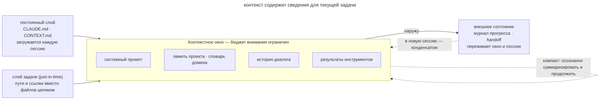

# Инженерия контекста

## Назначение

Подбирать контекст под текущую задачу и учитывать ограниченный объём окна агента. Глава объясняет, как отбирать сведения, загружать их по мере необходимости и сохранять состояние работы между сессиями.

## Также известен как

Context engineering, контекст-инжиниринг.

## Проблема

Разработчик может вставить в промпт весь лог CI, рассчитывая дать агенту больше сведений. Но нужная ошибка занимает в нём несколько строк. Остальной вывод занимает окно и затрудняет поиск причины сбоя. Управление контекстом начинается с отбора данных для конкретного шага работы.

**Деградация контекста (context rot)** проявляется, когда модель хуже использует сведения в длинном окне. Величина эффекта зависит от модели и задачи, поэтому вместимость окна сама по себе не гарантирует точность ответа. У окна есть **бюджет внимания**. Этот термин описывает практическую проблему отбора сведений, которые модель должна учесть одновременно. Например, правило запуска тестов может потеряться среди уже отработанных логов. Агент пополняет контекст при каждом вызове инструмента. Если сохранять все листинги и результаты проверок, к концу сессии они займут место, нужное для следующего решения.

Формулировка промпта решает только часть задачи. Разработчику также нужно определить, какие сведения агент увидит на каждом шаге и что сохранит после завершения шага.

## Решение

Перед очередным действием выясните, что агенту нужно знать для его выполнения. В статье Anthropic этот подход описан как поиск минимального набора значимых сведений, достаточного для нужного результата.

Способ управления контекстом зависит от срока жизни сведений.

1. **Постоянный слой** содержит правила проекта и язык домена. Храните их в файлах репозитория и подключайте к новым сессиям.
2. **Слой задачи** содержит нужный код и данные. Дайте агенту пути и ссылки, чтобы он прочитал их по мере необходимости (just-in-time).
3. **Слой состояния** сохраняет принятые решения, прогресс и проверенные гипотезы. Записывайте их в журнал и передаточный документ, чтобы следующая сессия могла продолжить работу.
4. **Инструкции и примеры** помогают выбирать действия. Формулируйте проверяемые правила и показывайте примеры их применения к типичным случаям.

Сокращение полезно, пока агент сохраняет сведения, от которых зависит решение. Если для устойчивого поведения нужна страница правил, оставьте её. Удаляйте текст, который занимает контекст и не помогает выполнить задачу.

## Структура

В центре схемы показано контекстное окно.

Агент получает постоянные инструкции при старте и читает файлы задачи по мере необходимости. Решения и прогресс он сохраняет вне окна, чтобы вернуть их в следующую сессию. Пунктирная петля показывает сжатие контекста, при котором отработанные результаты инструментов уступают место краткой сводке.

## Участники / Компоненты

- **Разработчик** решает, какие сведения нужны постоянно и какие можно читать по требованию.
- **Агент** читает файлы, делает заметки и обновляет состояние работы.
- **Контекстное окно** вмещает ограниченный объём сведений, доступных модели на текущем шаге.
- **Постоянные файлы контекста** хранят правила проекта и словарь домена.
- **Внешнее состояние** в журнале и передаточных документах позволяет продолжать работу после завершения сессии.

## Когда применять

- Затраты на чтение контекста заметны относительно объёма задачи.
- К концу длинной сессии агент забывает правила или повторяет уже отвергнутые предложения.
- Когда работа больше одного контекстного окна и состояние приходится передавать между сессиями.
- Разработчик повторяет команды и соглашения в каждой сессии.

## Последствия и компромиссы

- ➕ Агенту легче найти сведения, нужные для текущего решения.
- ➕ Меньший объём контекста сокращает затраты на вызовы модели.
- ➕ Новая сессия и новый коллега получают одинаковую версию знаний проекта.
- ➖ Разработчику нужно регулярно пополнять и пересматривать файлы контекста.
- ➖ Устаревшие инструкции могут направить агента к неверному решению.
- ➖ При чрезмерном сокращении агент восполнит недостающие сведения предположениями.

## Реализация

1. Начните с коротких инструкций и добавляйте правила по наблюдаемым сбоям.
2. Вынесите постоянные команды и соглашения проекта в файл памяти.
3. Запишите термины домена и причины архитектурных решений в отдельные документы.
4. Давайте пути к файлам и логам. Агент сможет прочитать нужный фрагмент перед решением.
5. По ходу долгой работы обновляйте журнал прогресса, а перед сменой сессии готовьте передаточный документ.
6. При сжатии контекста сохраняйте решения, текущее состояние и открытые вопросы. Удаляйте результаты инструментов, которые уже не влияют на работу.

Следующие главы подробно разбирают эти приёмы.

- [Память проекта](claude-md-memory.md) хранит постоянные команды и соглашения.
- [Словарь домена](domain-context-file.md) задаёт термины проекта и сохраняет причины архитектурных решений.
- [Журнал прогресса](progress-file.md) помогает восстановить состояние долгой работы.
- [Передача сессии](handoff.md) сохраняет контекст в документе перед переходом в новое окно.

## Пример

Разработчику нужно выяснить, почему интеграционный тест платёжного шлюза иногда падает.

**Наивный заход.** Разработчик вставляет три тысячи строк лога CI и три файла теста. По ходу он добавляет правило «у нас запрещены sleep в тестах». После нескольких обменов агент предлагает `sleep(5)`, хотя такая задержка лишь скрывает нестабильность. В заполненном логе контексте правило не повлияло на выбор решения.

**Инженерный заход.** Правило про sleep лежит в памяти проекта. В запросе разработчик указывает расположение теста и неудачных прогонов.

> Разберись, почему нестабильно проходит _tests/integration/payment_gateway_test.py_. Посмотри последние три упавших прогона в джобе integration-tests.

Агент читает упавшие фрагменты логов, тест и связанный код. Он находит гонку между вебхуком и опросом статуса, но сессию нужно закончить до исправления. Разработчик просит сохранить результат исследования.

> Собери handoff с причиной сбоя, проверенными гипотезами и первым действием для следующей сессии.

Следующая сессия получает краткую сводку и пути к доказательствам. Агент может начать с исправления найденной гонки.

## Антипаттерны и частые ошибки

- **Раздутый файл памяти.** Среди сотен правил агенту труднее выделить применимые инструкции. Эта ошибка разобрана отдельной главой.
- **«Вставлю целиком, чтобы точно хватило».** Полные логи занимают окно до начала исследования. Передавайте пути и уточняйте, какой фрагмент нужен.
- **Молчаливый автокомпакт.** При автоматическом сжатии могут потеряться решения. Проверяйте сводку и готовьте handoff перед сменой сессии.
- **Экономия на необходимом.** Если удалить сведения, от которых зависит решение, агент начнёт строить предположения.

## Известные применения

- **Claude Code** поддерживает постоянные инструкции в _CLAUDE.md_, сжатие через `/compact` и отдельные контексты сабагентов.
- **Memory tool Anthropic** позволяет агенту хранить структурированные заметки вне текущего окна.
- **Мультиагентная исследовательская система Anthropic** использует сабагентов для отдельных направлений исследования. Координатор получает краткие сводки их результатов.
- **AGENTS.md и правила редакторов** хранят постоянные инструкции в форматах разных инструментов.
- Статья Anthropic [Effective context engineering for AI agents](https://www.anthropic.com/engineering/effective-context-engineering-for-ai-agents) служит источником принципов этой главы.

## Связанные паттерны

- [Память проекта](claude-md-memory.md), [словарь домена](domain-context-file.md), [журнал прогресса](progress-file.md) и [передача сессии](handoff.md) реализуют отдельные способы управления контекстом.
- [Спеко-ориентированная разработка](spec-driven-development.md) сохраняет отобранный контекст задачи в спецификации и плане.
- [Четыре фазы](explore-plan-code-commit.md) отводит исследованию отдельный этап, на котором агент собирает контекст перед планированием.
