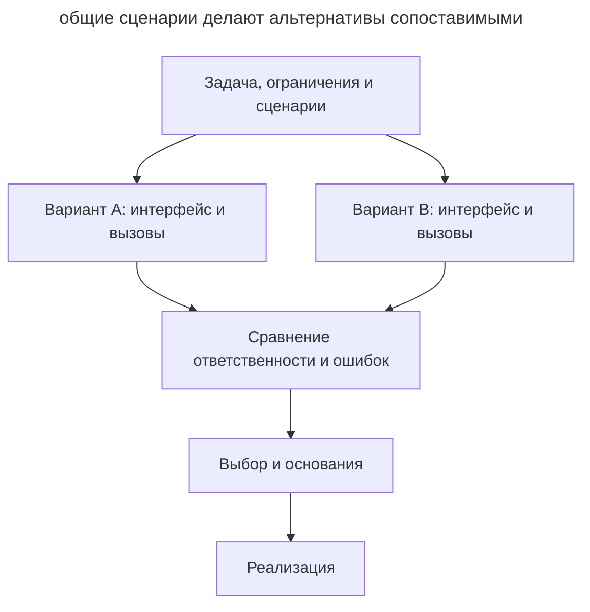

# Спроектируй дважды

## Назначение

Сравнить несколько существенно разных решений до реализации. Разработчик задаёт общие требования, агент готовит альтернативы и показывает их использование, после чего разработчик выбирает подход по конкретным последствиям для проекта.

## Также известен как

Design It Twice, принцип «спроектируй дважды» Джона Аустерхаута.

## Проблема

Агент предлагает правдоподобный план, и разработчик сразу просит его реализовать. Дальнейшее обсуждение уточняет выбранную конструкцию: какие методы добавить, где обработать ошибку, какие тесты написать. При этом само распределение ответственности между модулями остаётся без сравнения с альтернативами.

Например, агент разбивает импорт CSV на чтение, проверку и сохранение строк. Вызывающий код связывает эти шаги и решает, что делать с ошибками. Такой вариант может подходить проекту, но без альтернативы трудно заметить его цену: каждый новый потребитель будет знать порядок действий и правила частичного сохранения.

Когда реализация уже написана, смена конструкции требует переделки кода и тестов. Сравнение небольших эскизов позволяет принять это решение раньше.

## Решение

Попросите агента спроектировать минимум два варианта для одной задачи. Задайте обоим одинаковые требования, ограничения и сценарии. Различие должно затрагивать устройство решения: кто управляет процессом, где хранится состояние, что знает вызывающий код.

Для каждого варианта нужны небольшой интерфейс, пример вызова и описание поведения при ошибках. По ним можно увидеть, какие знания остаются у потребителя и какие изменения затронут несколько мест. Общих оценок вроде «гибкий» или «простой» для выбора недостаточно.

Сравните варианты на обычном сценарии и одном-двух трудных случаях. Попросите агента рекомендовать решение и назвать условия, при которых предпочтительнее альтернатива. Зафиксируйте выбор и его основания перед реализацией. Если ключевой вопрос требует наблюдений, выделите для него [одноразовый прототип](prototype-to-answer.md).

## Структура

Общие требования расходятся в два эскиза, которые затем сравниваются на одних сценариях.



Варианты могут появиться последовательно в одной сессии. Важна разница в конструкции и общая основа сравнения; число агентов само по себе её не обеспечивает.

## Участники / Компоненты

- **Разработчик** задаёт ограничения и принимает решение с учётом потребностей проекта.
- **Агент** предлагает альтернативы, показывает вызовы и разбирает компромиссы.
- **Общие сценарии** позволяют сравнить поведение решений в одинаковых условиях.
- **Эскизы** описывают интерфейсы, ответственность и ошибки до полной реализации.
- **Запись решения** сохраняет выбор, причины и условия его пересмотра.

## Когда применять

- Проектируется API, которым будут пользоваться несколько модулей.
- При рефакторинге нужно решить, куда перенести ответственность или состояние.
- Первое предложение выглядит убедительно, но его преимущества пока не с чем сравнить.
- Изменение выбранной конструкции позднее затронет много вызывающего кода.

Для локального исправления с однозначным решением сравнение может стоить дороже самой работы. Ограничивайте его конкретным решением, которое влияет на дальнейшую разработку.

## Последствия и компромиссы

- ➕ Код использования помогает заметить сложность, которую интерфейс перекладывает на потребителя.
- ➕ Выбор опирается на сценарии и ограничения проекта.
- ➕ Отвергнутый вариант оставляет полезные основания для будущего пересмотра.
- ➖ Подготовка и чтение альтернатив требуют времени.
- ➖ Агент может предложить поверхностные различия или сделать один вариант заведомо слабее.
- ➖ Эскиз не подтверждает производительность и корректность будущей реализации.

## Реализация

1. Выберите одно решение для сравнения: например, границу модуля импорта.
2. Поручите агенту прочитать существующий код и назвать ограничения со ссылками на места в проекте.
3. Зафиксируйте общие сценарии и приоритеты выбора.
4. Запросите два разных распределения ответственности. Ограничьте результат интерфейсами, кодом вызова и описанием ошибок.
5. Проверьте, что каждый вариант выполняет все обязательные требования. Если один пропустил требование, верните его на доработку.
6. Сопоставьте варианты по коду использования и местам, которые придётся менять. Разберите рекомендацию агента.
7. Запишите решение в задаче или ADR и передайте выбранный контракт в реализацию.

Если один агент воспроизводит первый вариант под другими именами, задайте второму подходу явное направление: например, перенесите управление процессом от вызывающего кода внутрь модуля. Можно поручить эскизы отдельным агентам, дав каждому одинаковый исходный контекст и своё направление поиска. Все обязательные требования при этом сохраняются. Для сравнения интерфейсов отдельные ветки с полноценными реализациями обычно не нужны.

## Пример

Нужно импортировать пользователей из CSV. Импорт запускают HTTP-обработчик и команда CLI. Файл ограничен 10 000 строками. Корректные строки сохраняются, а для некорректных возвращаются номер строки и причина. Если хранилище недоступно, импорт останавливается; уже сохранённые строки остаются, отчёт содержит их число. Повторный запуск и устранение дублей требуют отдельного решения и в этот пример не входят.

Разработчик задаёт агенту рамку сравнения:

> Предложи два существенно разных API импорта пользователей из CSV. В первом вызывающий код управляет шагами, во втором модуль импорта управляет всем процессом. Оба должны выполнять описанные требования. Покажи интерфейсы, код вызова и поведение при ошибке строки и сбое хранилища. Сравни, что придётся знать HTTP-обработчику и CLI. Дай рекомендацию с учётом двух потребителей. Полную реализацию пока не пиши.

Ниже — учебные эскизы на JavaScript. Имена функций обозначают предлагаемый контракт; код показывает распределение ответственности и не является готовой реализацией импорта. Для обоих вариантов синтаксическая ошибка CSV останавливает импорт с кодом `invalid_csv`; ошибка содержимого отдельной строки попадает в отчёт и не мешает остальным строкам.

**Вариант A: потребитель управляет шагами.** `readCsv` выдаёт строки с номерами, `validateUser` возвращает пользователя или список ошибок, `users.save` сохраняет одного пользователя. При недоступности хранилища `save` выбрасывает `StorageUnavailable`.

```js
const report = { saved: 0, rejected: [], stopped: null };

try {
  for await (const { line, fields } of readCsv(source)) {
    const result = validateUser(fields);
    if (!result.ok) {
      report.rejected.push({ line, errors: result.errors });
      continue;
    }

    await users.save(result.user);
    report.saved += 1;
  }
} catch (error) {
  if (error instanceof StorageUnavailable) {
    report.stopped = "storage_unavailable";
  } else if (error instanceof InvalidCsv) {
    report.stopped = "invalid_csv";
  } else {
    throw error;
  }
}
```

Вызывающий код контролирует каждый шаг. Он же знает, когда продолжать обработку, когда останавливаться и как считать сохранённые строки. HTTP-обработчику и CLI понадобятся эти правила. Если вынести весь показанный процесс в общую операцию, граница ответственности приблизится ко второму варианту.

**Вариант B: модуль управляет импортом.** При создании модуль получает хранилище. Метод `run` читает CSV, проверяет и сохраняет строки, формирует такой же отчёт. Ожидаемые причины остановки возвращаются в `stopped`; неожиданные ошибки выбрасываются наружу.

```js
// При сборке приложения:
const userImport = createUserImport({ users });

// В HTTP-обработчике или CLI:
const report = await userImport.run(source);
```

В обоих вариантах два корректных пользователя и одна некорректная строка дают одинаковый результат:

```json
{
  "saved": 2,
  "rejected": [{ "line": 3, "errors": ["Некорректный email"] }],
  "stopped": null
}
```

Если первая строка сохранена, а при сохранении второй хранилище стало недоступно, ожидаемый отчёт — `saved: 1`, `rejected: []`, `stopped: "storage_unavailable"`. Эти примеры задают контракт обоим вариантам; при реализации их нужно проверить тестами.

| Сценарий или изменение | Вариант A | Вариант B |
|---|---|---|
| Некорректная строка | Потребитель добавляет ошибку в отчёт и продолжает цикл | Модуль возвращает ошибку строки в готовом отчёте |
| Хранилище недоступно | Потребитель останавливает цикл и сохраняет счётчик | Модуль останавливает импорт и возвращает счётчик |
| Добавление второго потребителя | Нужно повторить или вынести правила обработки | Новый потребитель вызывает `run` |
| Особое действие перед сохранением строки | Потребитель добавляет его в свой цикл | Нужно изменить модуль или расширить его контракт |

Для заявленной задачи выбираем B: HTTP и CLI используют одинаковые правила импорта, поэтому полезно держать их в одном месте. Вариант A имеет смысл, если потребителям нужны разные последовательности обработки. Короткая запись решения сохраняет это условие:

> Выбрали модуль с операцией run: он владеет обработкой строк и формированием отчёта для HTTP и CLI. Корректные строки сохраняются независимо; ожидаемый сбой останавливает импорт с отчётом о частичном результате. Пересмотрим границу, если потребителям понадобятся разные процессы обработки.

## Антипаттерны и частые ошибки

- **Два названия одного решения.** Классы и функции переименованы, но ответственность осталась прежней. Попросите показать, какое знание о процессе переехало в другой модуль.
- **Неравные условия.** Один вариант решает только успешный сценарий, а другой обрабатывает ошибки. Сначала доведите оба до общих требований.
- **Сравнение по числу методов.** Один метод может скрывать десятки обязательных настроек и сложный порядок подготовки. Рассматривайте весь код использования.
- **Полная реализация каждого варианта.** Объём работы растёт до того, как сформулирован вопрос, требующий запуска. Начните с эскизов и выделяйте эксперименты отдельно.
- **Бесконечный перебор.** Новые варианты появляются без нового критерия выбора. Завершайте сравнение, когда требования покрыты, а существенные компромиссы понятны.
- **Автоматическое принятие рекомендации.** Агент может неверно оценить будущие потребности проекта. Проверьте допущения, на которых держится выбор.

## Известные применения

- **Джон Аустерхаут** рассматривает Design It Twice в книге [A Philosophy of Software Design](https://web.stanford.edu/~ouster/cgi-bin/aposd.php); принцип также включён в [материалы его курса CS 190](https://web.stanford.edu/~ouster/cs190-winter24/lectures/aposd/). Здесь он адаптирован к работе разработчика с агентом.
- **Скиллы Мэтта Покока** содержат [Design It Twice внутри codebase-design](https://github.com/mattpocock/skills/blob/main/skills/engineering/codebase-design/DESIGN-IT-TWICE.md): несколько агентов проектируют разные интерфейсы, показывают их использование и сравнивают, какую сложность скрывает модуль и где будут сосредоточены изменения. Это вариант организации работы; описанный в главе процесс можно выполнить и в одной сессии.

## Связанные паттерны

- [Гриллинг](grilling.md) проверяет допущения готового плана; сравнение альтернатив помогает выбрать саму конструкцию.
- [Одноразовый прототип](prototype-to-answer.md) даёт наблюдения для вопросов, которые остались после сравнения эскизов.
- [Четыре фазы](explore-plan-code-commit.md) отводит место для сравнения перед реализацией, на этапе планирования.
- [Словарь домена](domain-context-file.md) помогает использовать общие термины в вариантах и сохранить принятое решение в ADR.
