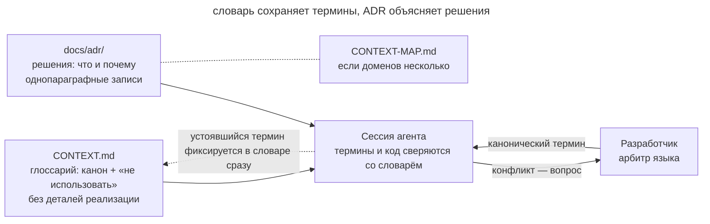

# Словарь домена

## Назначение

Записать термины проекта и причины архитектурных решений в репозитории. Агент сможет сверять с ними имена в коде и предложения по изменению системы. Для каждого понятия команда выбирает одно имя, а для неочевидного решения сохраняет обоснование.

## Также известен как

CONTEXT.md, доменный глоссарий, единый язык (ubiquitous language) из DDD; architecture decision records (ADR).

## Проблема

У проекта есть собственный язык, который новый участник не всегда может восстановить по коду. Например, в образовательной платформе зачисление на курс и платная подписка могут давать похожий доступ, но иметь разные основания.

Если агент сочтёт их синонимами, он переименует `Enrollment` в `Subscription` и свяжет доступ с оплатой. Корпоративные студенты при этом могут потерять доступ, хотя их зачисления оплачены другим способом.

Причина исходного разделения могла остаться только в старой переписке. Без записи команда вынуждена заново объяснять её при каждом предложении «упростить» модель.

[Память проекта](claude-md-memory.md) хранит рабочие инструкции. Определения предметных понятий удобнее вынести в отдельный словарь и подключить его к сессии через файл памяти.

## Решение

Сохраните в репозитории глоссарий и журнал решений, которые агент сможет использовать при работе над задачей.

**Глоссарий** в `CONTEXT.md` задаёт термины домена. Для него достаточно короткого формата.

- Каждому понятию соответствует одно принятое имя. Остальные варианты перечислены с пометкой «не использовать».
- Определение объясняет смысл понятия в одном-двух предложениях.
- В словарь входят только понятия, которым проект придаёт особый смысл.
- Детали реализации остаются в коде и технических планах.

**Журнал решений** в `docs/adr/` сохраняет принятое решение и его причину в отдельном файле. В этом варианте паттерна ADR нужен для выбора, который трудно обратить и трудно понять без контекста. Запись должна объяснять, какие альтернативы команда рассматривала и почему выбрала одну из них. Для простого случая достаточно абзаца.

Агент сверяет термины со словарём и уточняет расхождения до изменения кода. Например, если cancellation означает отмену всего заказа, просьба о частичной отмене требует уточнения. Когда команда согласовала новое понятие, агент сразу записывает его определение.

## Структура



На схеме глоссарий и журнал решений поступают в контекст агента. Если термин задачи расходится со словарём, агент запрашивает уточнение у разработчика и сохраняет принятое определение. Пунктирная стрелка показывает это обновление. Для проекта с несколькими доменами `CONTEXT-MAP.md` указывает, где находятся словари и как связаны их контексты.

## Участники / Компоненты

- **Глоссарий** (`CONTEXT.md`) хранит определения и нежелательные синонимы.
- **Журнал решений** (`docs/adr/`) объясняет неочевидные архитектурные выборы.
- **Карта контекстов** (`CONTEXT-MAP.md`) связывает словари нескольких доменов.
- **Разработчик** утверждает термины и разрешает противоречия.
- **Агент** сверяет текст и код со словарём и записывает согласованные определения.

## Когда применять

- Домен использует термины, смысл которых важно сохранять, например в биллинге или образовании.
- Над проектом работают разные люди и агенты, которым нужен общий словарь.
- Агент уже путает термины, называет одно понятие по-разному или предлагает переименовать то, что называется так намеренно.
- В разных доменах одно слово имеет разный смысл.

Для небольшой одноразовой утилиты отдельный словарь обычно не окупается.

## Последствия и компромиссы

- ➕ Новые имена в коде согласуются с языком команды.
- ➕ Перед переименованием агент должен объяснить расхождение со словарём.
- ➕ ADR помогает оценить предложение переделки с учётом исходных причин.
- ➕ Новый разработчик изучает термины по тому же документу, который читает агент.
- ➖ Команде нужно поддерживать определения в актуальном состоянии.
- ➖ Если отложить запись согласованного термина, следующая сессия может выбрать другое имя.
- ➖ Лишние определения и записи тривиальных решений затрудняют поиск нужного контекста.

## Реализация

1. Создайте `CONTEXT.md`, когда согласован первый термин, и `docs/adr/`, когда появилось решение, которое нужно объяснить будущему читателю.
2. Для термина запишите короткое определение и нежелательные синонимы. Выберите одно имя для использования в проекте.
3. Добавляйте только понятия, смысл которых зависит от домена.
4. Записывайте в ADR контекст, принятое решение и причину выбора. Нумеруйте файлы последовательно (`0001-...`, `0002-...`).
5. Подключите словарь через [память проекта](claude-md-memory.md). В Claude Code для этого можно использовать строку `@CONTEXT.md` в CLAUDE.md.
6. Попросите агента замечать противоречия в терминах и записывать согласованные определения сразу после обсуждения.
7. В проекте с несколькими доменами разместите словари рядом с модулями и свяжите их через `CONTEXT-MAP.md`.

В [скилах Мэтта Покока](matt-pocock-skills.md) скил `domain-modeling` ведёт CONTEXT.md и ADR. Остальные скилы используют эти документы при интервью, подготовке спецификации и реализации.

## Пример

Ниже показан глоссарий образовательной платформы.

```markdown
# Обучение

Контекст прохождения курсов: от записи до сертификата.

## Язык

**Зачисление (Enrollment)**:
Факт доступа студента к курсу. Создаётся при записи, живёт до отзыва.
_Не использовать_: подписка, покупка, доступ

**Поток (Cohort)**:
Группа студентов, проходящих курс по общему расписанию.
_Не использовать_: группа, класс, набор

**Выпуск (Completion)**:
Зачисление, по которому выполнены все обязательные модули.
_Не использовать_: окончание, закрытие курса
```

Причину выбора имени сохраняет ADR `docs/adr/0003-enrollment-not-subscription.md`.

```markdown
# Зачисление не привязано к оплате

Доступ к курсу и биллинг разведены намеренно: зачисление создаётся и
корпоративными договорами, и грантами, где подписки нет вообще. Поэтому
Enrollment существует как отдельная сущность.
```

Разработчик просит лишать студента доступа к курсу при отмене подписки. Агент читает словарь и уточняет задачу.

> В словаре для доступа к курсу принято имя Enrollment. Согласно ADR-0003, зачисление не обязательно связано с оплатой. Нужно отзывать только зачисления, созданные через биллинг, или все зачисления пользователя?

Уточнение позволяет сохранить доступ корпоративных студентов, чьи зачисления не связаны с личной подпиской. Разработчик замечает неоднозначность до того, как она превращается в условие удаления доступа.

## Анти-паттерны и частые ошибки

- **Словарь-спецификация.** Имена таблиц и порядок вызовов быстро устаревают. Оставляйте в словаре смысл понятий, а реализацию описывайте в коде и технических планах.
- **Словарь-энциклопедия.** Общие программные термины затрудняют поиск понятий проекта и занимают контекст (см. [инженерию контекста](context-engineering.md)).
- **Синонимы без арбитра.** Список всех вариантов без выбора основного имени сохраняет неоднозначность.
- **Мёртвый словарь.** Документ, который не читают и не обновляют, постепенно расходится с языком проекта.
- **ADR на каждый чих.** Среди записей о тривиальных решениях труднее найти причины архитектурного выбора.

## Известные применения

- **Скилы Мэтта Покока** реализуют паттерн через `domain-modeling`, который ведёт словарь, ADR и карту контекстов.
- **Domain-Driven Design** Эрика Эванса вводит единый язык и ограниченные контексты, на которые опирается этот паттерн.
- **ADR-конвенция** Майкла Найгарда и инструменты вроде adr-tools помогают сохранять причины архитектурных решений.
- **Kiro** подключает продуктовый контекст через steering-файл product.md.

## Связанные паттерны

- [Память проекта](claude-md-memory.md) подключает словарь к агентской сессии.
- [Инженерия контекста](context-engineering.md) помогает отбирать сведения для словаря и ADR.
- [Спеко-ориентированная разработка](spec-driven-development.md) использует общий словарь при написании спецификаций.
