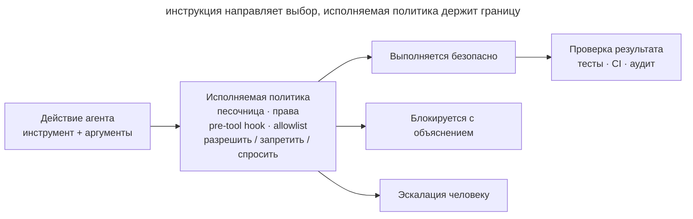

# Исполняемые ограничения

## Назначение

Перенести критические правила работы агента из текста в механизмы, которые невозможно случайно забыть: права доступа, песочницу, хуки и детерминированные проверки. Внутри разрешённой области агент действует свободно, а опасное или некорректное действие останавливает система, а не внимательность модели.

## Также известен как

Executable guardrails, policy as code, enforced constraints, rails for agents.

## Проблема

В `AGENTS.md` написано: «не меняй миграции», «не отправляй секреты», «перед завершением запусти тесты». Обычно агент следует этим правилам, но текст остаётся советом. Контекст переполняется, формулировка теряется среди других инструкций, вложенный инструмент запускает неожиданный процесс — и критическая граница нарушается ровно в тот раз, когда она была нужна.

Просить подтверждение перед каждой командой безопаснее, но быстро возникает усталость от разрешений: разработчик нажимает «разрешить» машинально и превращается в медленный, ненадёжный policy engine. Противоположная крайность — снять все ограничения ради автономности — увеличивает радиус ошибки.

Не все правила одинаковы. «Предпочитай небольшие функции» требует суждения и принадлежит руководству. «Нельзя писать вне репозитория» проверяется однозначно и должно исполняться машиной. Если детерминированное правило остаётся только в промпте, проект полагается на вероятностное соблюдение того, что можно гарантировать.

## Решение

Разделите правила на **рекомендации** и **инварианты**. Рекомендации оставьте в памяти проекта: они направляют решение, но допускают контекст. Инварианты выразите исполняемыми границами:

1. **Песочница** ограничивает доступные каталоги, сеть и процессы.
2. **Разрешения** заранее допускают узкий набор безопасных действий и требуют решения человека при выходе за него.
3. **Pre-action hook** проверяет намерение до выполнения и блокирует запрещённое.
4. **Post-action или stop hook** проверяет результат и не даёт объявить работу законченной без обязательного сигнала.
5. **CI** повторяет критические проверки вне агентской сессии и защищает целевую ветку.

Хорошее ограничение маленькое, детерминированное и объяснимое. Оно возвращает не просто отказ, а причину и безопасный следующий шаг. Цель — не запретить агенту работать, а очертить достаточно широкую безопасную область, внутри которой ему не нужны постоянные подтверждения.

## Структура



Текстовая инструкция направляет выбор агента, но не является барьером. Каждое действие проходит через исполняемую границу: безопасное выполняется автоматически, запрещённое блокируется, пограничное эскалируется человеку. После изменения независимая проверка подтверждает инварианты результата.

## Участники / Компоненты

- **Политика** — короткое правило с однозначно проверяемой границей.
- **Агент** — предлагает действие и получает структурированный результат проверки.
- **Принудительный механизм** — песочница, allowlist, hook, файловые права или CI-gate.
- **Безопасная область** — действия, разрешённые без участия человека.
- **Эскалация** — узкий путь для действия, которое нельзя автоматически разрешить или запретить.
- **Аудит** — запись сработавшего правила без секретов и лишнего содержимого.

## Когда применять

- Нарушение правила может удалить данные, раскрыть секрет, изменить внешнюю систему или испортить релиз.
- Агент работает без постоянного наблюдения или запускает дочерние процессы.
- Одно и то же запретительное правило приходится повторять в промптах.
- Условия можно проверить быстро и однозначно по команде, пути, diff или коду возврата.
- Команда хочет уменьшить число ручных подтверждений, не расширяя доступ агента бесконтрольно.

Не превращайте в hook правило вкуса: «архитектура должна быть простой» невозможно надёжно вычислить за миллисекунды. Такое ограничение даст ложные блокировки или фиктивную проверку и должно остаться руководством либо ревью.

## Последствия и компромиссы

- ➕ Критические инварианты соблюдаются независимо от заполненности контекста и качества конкретного ответа.
- ➕ Автономность растёт внутри безопасной области: разработчика не дёргают за каждую знакомую команду.
- ➕ Отказ наблюдаем и воспроизводим: понятно, какое правило сработало и почему.
- ➕ Политика хранится в git, проходит ревью и одинаково действует для всей команды.
- ➖ Ошибка в guardrail блокирует полезную работу; для границ нужен набор позитивных и негативных тестов.
- ➖ Синхронные хуки добавляют задержку, поэтому тяжёлые проверки следует переносить в stop-hook или CI.
- ➖ Allowlist постепенно разрастается; широкое правило вроде «разрешить любой shell» уничтожает смысл границы.
- ➖ Песочница уменьшает радиус воздействия, но не доказывает корректность кода и не заменяет тесты.

## Реализация

1. Соберите повторяющиеся запреты из инструкций и истории инцидентов. Для каждого спросите: можно ли определить нарушение без интерпретации намерения?
2. Опишите правило как таблицу «разрешить / блокировать / запросить подтверждение». Начните с узких высокорисковых инвариантов: пути записи, домены сети, команды публикации, секреты.
3. Поставьте границу на правильном уровне. Доступ к файлам и сети ограничивает ОС-песочница; конкретную команду проверяет pre-tool hook; качество результата проверяют тесты и CI.
4. Сделайте отказ полезным: назовите правило, покажите безопасную область и предложите действие, которое пользователь может явно разрешить.
5. Проверьте guardrail двумя тестами: опасное действие блокируется, ближайшее безопасное проходит. Тестируйте также экранирование входа и тайм-аут.
6. Ведите минимальный аудит решения, но не записывайте токены, содержимое секретных файлов и полные пользовательские данные.
7. Пересматривайте границы по фактам: ослабляйте частые ложные блокировки точечно, а не общим исключением.

## Пример

Агенту разрешено менять сервис в `./app`, запускать тесты и читать документацию. Ему запрещено писать вне репозитория и выполнять публикацию без подтверждения. В памяти проекта остаётся человеческое правило:

> Работай в пределах задачи и предпочитай обратимые изменения.

Исполняемая политика точнее:

```text
write path ./app/**          allow
write path ./docs/**         allow
write path ../**             deny: outside workspace
command make test            allow
command git push *           ask: external state change
network registry.npmjs.org   allow
network *                    deny: domain not approved
```

Если агент пытается выполнить `git push`, система не надеется, что он вспомнит абзац из инструкций: действие переходит в явную эскалацию. Попытка записать `~/.ssh/config` блокируется безусловно. Обычный `make test` проходит без вопроса, поэтому безопасность не превращается в поток бессмысленных кликов.

## Анти-паттерны и частые ошибки

- **Всё в промпте.** Детерминированные запреты конкурируют за внимание с описанием задачи и иногда проигрывают.
- **Запретить всё.** Каждая команда требует подтверждения; разработчик устаёт и начинает разрешать не читая.
- **Разрешить shell целиком.** Узкая allowlist заменяется универсальным обходом всей модели угроз.
- **Hook с интеллектом.** Медленный LLM-hook пытается судить намерение для каждой команды и делает границу дорогой и непредсказуемой.
- **Молчаливый отказ.** Агент видит только ненулевой код и начинает искать обход вместо безопасного пути.
- **Секреты в аудите.** Защита от утечки сама копирует чувствительные данные в лог.
- **Только локальная защита.** Агент отключает или не запускает hook; критический инвариант должен повторяться в CI или защите ветки.

## Известные применения

- **GitHub Copilot hooks** запускают команды в ключевых точках сессии; pre-tool hook может разрешить или отклонить вызов инструмента, а остальные хуки — валидировать состояние и вести аудит.
- **Claude Code sandboxing** задаёт ограничения файловой системы и сети на уровне ОС, включая дочерние процессы, и позволяет свободно работать внутри разрешённой области.
- **Git hooks и CI** — доагентная форма того же паттерна: формат коммита, тесты и политика ветки исполняются кодом, а не памяткой.

Источники: [GitHub Copilot hooks](https://docs.github.com/en/copilot/concepts/agents/hooks), [Claude Code sandboxing](https://www.anthropic.com/engineering/claude-code-sandboxing).

## Связанные паттерны

- [Память проекта](claude-md-memory.md) — хранит рекомендации; исполняемые ограничения забирают из неё правила, которые обязаны срабатывать всегда.
- [Петля обратной связи](give-agent-a-way-to-verify.md) — проверяет корректность результата, тогда как guardrail ограничивает допустимые действия.
- [Изолированная параллельная работа](isolated-parallel-work.md) — worktree уменьшает столкновения, а песочница и права закрепляют его границы.
- [Раздутая память](bloated-claude-md.md) — попытка компенсировать отсутствие механизмов всё более длинным списком запретов.
