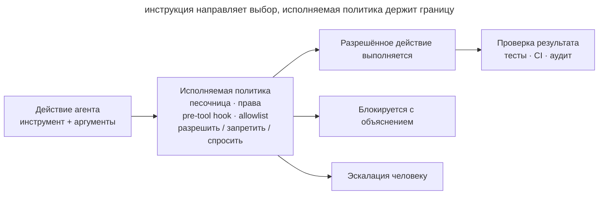

# Исполняемые ограничения

## Назначение

Закрепить критические правила работы агента правами доступа, песочницей, хуками и автоматическими проверками. Внутри разрешённой области агент действует самостоятельно. Попытку выйти за её границы останавливает система.

## Также известен как

Executable guardrails, policy as code, enforced constraints, rails for agents.

## Проблема

В `AGENTS.md` записан запрет менять миграции. Агент может пропустить его в длинном контексте или вызвать инструмент, который изменит файл побочным действием. Сам текст запрета не остановит запись. Для критического правила нужен механизм, проверяющий действие до выполнения.

Подтверждение каждой команды тоже требует внимания. После десятков одинаковых запросов разработчик может начать разрешать их машинально. Снятие всех ограничений сокращает число запросов, но расширяет область, которую затронет ошибка.

Не все правила одинаковы. «Предпочитай небольшие функции» требует суждения и принадлежит руководству. «Нельзя писать вне репозитория» проверяется однозначно и должно исполняться машиной. Если детерминированное правило остаётся только в промпте, проект полагается на вероятностное соблюдение того, что можно гарантировать.

## Решение

Разделите правила на **рекомендации** и **инварианты**. Рекомендации оставьте в памяти проекта, где агент сможет учитывать контекст. Для однозначно проверяемых инвариантов выберите подходящий механизм.

1. **Песочница** ограничивает доступные каталоги, сеть и процессы.
2. **Разрешения** заранее допускают узкий набор безопасных действий и требуют решения человека при выходе за него.
3. **Pre-action hook** проверяет намерение до выполнения и блокирует запрещённое.
4. **Post-action или stop hook** проверяет результат и не даёт объявить работу законченной без обязательного сигнала.
5. **CI** повторяет критические проверки вне агентской сессии и защищает целевую ветку.

Ограничение должно проверять узкое условие и объяснять причину отказа. Вместе с отказом возвращайте допустимый следующий шаг. Тогда агент сможет продолжать работу внутри разрешённой области без постоянных подтверждений.

## Структура



На схеме текстовая инструкция направляет выбор агента, а механизм проверяет каждое действие. Он разрешает допустимое, блокирует запрещённое и передаёт человеку случаи, требующие решения. После выполнения отдельная проверка подтверждает требования к результату.

## Участники / Компоненты

- **Политика** задаёт однозначно проверяемое правило.
- **Агент** предлагает действие и получает результат проверки.
- **Механизм ограничения** проверяет действие через песочницу, права, список разрешений, hook или CI.
- **Безопасная область** включает действия, разрешённые без участия человека.
- **Эскалация** передаёт человеку действие, которое нельзя автоматически разрешить или запретить.
- **Аудит** сохраняет сработавшее правило без секретов и лишних данных.

## Когда применять

- Нарушение правила может удалить данные, раскрыть секрет, изменить внешнюю систему или испортить релиз.
- Агент работает без постоянного наблюдения или запускает дочерние процессы.
- Одно и то же запретительное правило приходится повторять в промптах.
- Условия можно проверить быстро и однозначно по команде, пути, diff или коду возврата.
- Команда хочет уменьшить число ручных подтверждений, не расширяя доступ агента бесконтрольно.

Для требования «архитектура должна быть простой» нет однозначной быстрой проверки. Оставьте его руководством для проектирования и ревью. Hook с таким условием будет либо блокировать допустимую работу, либо создавать видимость контроля.

## Последствия и компромиссы

- ➕ Критические инварианты соблюдаются независимо от заполненности контекста и качества конкретного ответа.
- ➕ Агент выполняет знакомые разрешённые команды без участия разработчика.
- ➕ По отказу видно, какое правило сработало и почему.
- ➕ Политика хранится в git, проходит ревью и одинаково действует для всей команды.
- ➖ Ошибка в guardrail блокирует полезную работу; для границ нужен набор позитивных и негативных тестов.
- ➖ Синхронные хуки добавляют задержку, поэтому тяжёлые проверки следует переносить в stop-hook или CI.
- ➖ Allowlist постепенно разрастается; широкое правило вроде «разрешить любой shell» уничтожает смысл границы.
- ➖ Песочница уменьшает радиус воздействия, но не доказывает корректность кода и не заменяет тесты.

## Реализация

1. Соберите повторяющиеся запреты из инструкций и истории инцидентов. Для каждого определите, можно ли обнаружить нарушение без догадок о намерении агента.
2. Опишите в таблице действия, которые система разрешает, блокирует или передаёт на подтверждение. Начните с критических ограничений записи и публикации.
3. Поставьте границу на правильном уровне. Доступ к файлам и сети ограничивает ОС-песочница; конкретную команду проверяет pre-tool hook; качество результата проверяют тесты и CI.
4. В ответе на отказ назовите правило и допустимый следующий шаг.
5. Проверьте, что механизм блокирует запрещённое действие и пропускает ближайшее допустимое. Добавьте проверки экранирования входа и тайм-аута.
6. Ведите минимальный аудит решения, но не записывайте токены, содержимое секретных файлов и полные пользовательские данные.
7. Разбирайте ложные блокировки и уточняйте конкретное условие, которое их вызвало.

## Пример

Агенту разрешено менять сервис в `./app`, запускать тесты и читать документацию. Запись вне репозитория запрещена, публикация требует подтверждения. В памяти проекта остаётся общее правило работы.

> Работай в пределах задачи и предпочитай обратимые изменения.

Сначала запишем желаемые решения политики в условной нотации. Это псевдокод для обсуждения правил, который ещё нужно выразить настройками выбранной песочницы и разрешений.

```text
write path ./app/**          allow
write path ./docs/**         allow
write path ../**             deny: outside workspace
command make test            allow
command git push *           ask: external state change
network registry.npmjs.org   allow
network *                    deny: domain not approved
```

После настройки механизмов проверяем ожидаемые решения. Вызов `git push` должен запросить подтверждение, запись в _~/.ssh/config_ должна блокироваться, а `make test` должен выполняться без вопроса. Сам блок псевдокода таких ограничений не устанавливает.

Реальный узкий guardrail можно показать на запрете коммитить изменения миграций. Сохраните следующий скрипт как _.git/hooks/pre-commit_ в тестовом репозитории с обычным каталогом _.git_ и сделайте его исполняемым командой `chmod +x .git/hooks/pre-commit`.

```sh
#!/bin/sh
set -eu

changes=$(git diff --cached --name-only -- db/migrations/)
if [ -n "$changes" ]; then
    printf '%s\n' 'Blocked: staged migration changes require review.' >&2
    exit 1
fi
printf '%s\n' 'Allowed: no staged migration changes.'
```

В этом скрипте `git diff --cached` проверяет подготовленные к коммиту изменения. Если среди них есть файл из _db/migrations/_, хук возвращает код 1 и Git останавливает коммит. На временном репозитории вызов хука до и после добавления миграции даёт такой результат.

```console
$ .git/hooks/pre-commit
Allowed: no staged migration changes.
$ mkdir -p db/migrations
$ touch db/migrations/001.sql
$ git add db/migrations/001.sql
$ .git/hooks/pre-commit
Blocked: staged migration changes require review.
$ echo $?
1
```

Этот хук защищает момент коммита. Он не запрещает запись файла и может быть отключён, поэтому для обязательного ограничения нужна проверка вне контроля агента, например в CI с защитой ветки. Для запрета самой записи используют файловые разрешения или песочницу.

## Анти-паттерны и частые ошибки

- **Всё в промпте.** Детерминированные запреты конкурируют за внимание с описанием задачи и иногда проигрывают.
- **Запретить всё.** Каждая команда требует подтверждения; разработчик устаёт и начинает разрешать не читая.
- **Разрешить shell целиком.** Узкая allowlist заменяется универсальным обходом всей модели угроз.
- **Hook с интеллектом.** Медленный LLM-hook пытается судить намерение для каждой команды и делает границу дорогой и непредсказуемой.
- **Молчаливый отказ.** Агент видит только ненулевой код и начинает искать обход вместо безопасного пути.
- **Секреты в аудите.** Защита от утечки сама копирует чувствительные данные в лог.
- **Только локальная защита.** Агент отключает или не запускает hook; критический инвариант должен повторяться в CI или защите ветки.

## Известные применения

- **GitHub Copilot hooks** запускают команды в ключевых точках сессии. Pre-tool hook может разрешить или отклонить вызов инструмента; другие хуки проверяют состояние и ведут аудит.
- **Claude Code sandboxing** задаёт ограничения файловой системы и сети на уровне ОС, включая дочерние процессы, и позволяет свободно работать внутри разрешённой области.
- **Git hooks и CI** применяют тот же принцип к формату коммита, тестам и правилам ветки.

Механизмы описаны в документации [GitHub Copilot hooks](https://docs.github.com/en/copilot/concepts/agents/hooks) и статье о [Claude Code sandboxing](https://www.anthropic.com/engineering/claude-code-sandboxing).

## Связанные паттерны

- [Память проекта](claude-md-memory.md) хранит рекомендации и объясняет назначение ограничений.
- [Петля обратной связи](give-agent-a-way-to-verify.md) проверяет корректность полученного результата.
- [Изолированная параллельная работа](isolated-parallel-work.md) использует worktree, границы которых можно закрепить песочницей и правами.
- [Раздутая память](bloated-claude-md.md) описывает накопление запретов, которые полезнее перенести в исполняемые механизмы.
