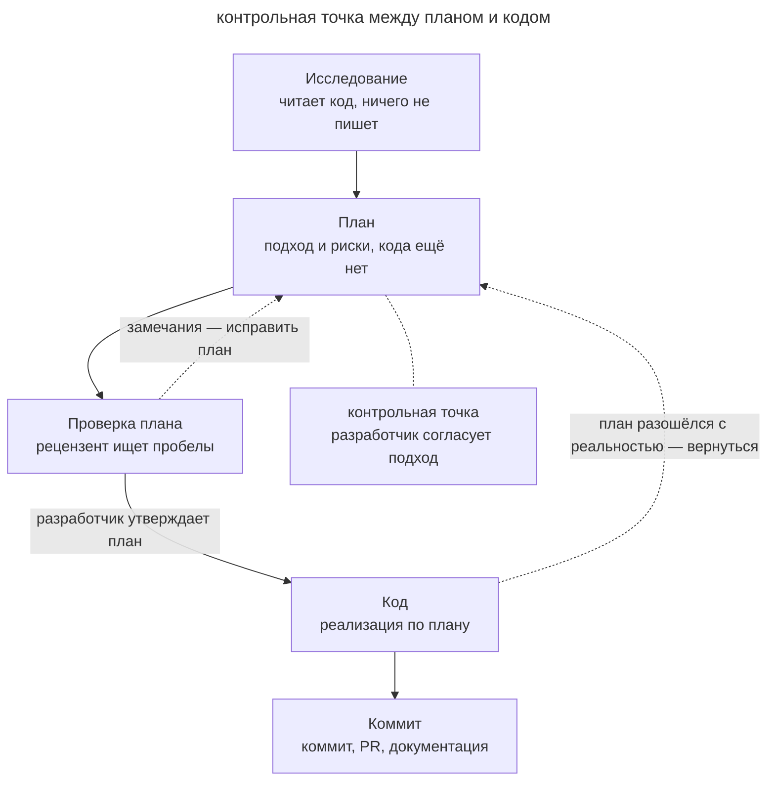

# Четыре фазы

## Назначение

Если задача нетривиальная, разделите работу агента на четыре фазы: исследование, план, код и коммит. Сначала агент изучает код и согласует с вами подход. Только после этого он пишет код и проверяет результат.

## Также известен как

Explore–Plan–Code–Commit (EPCC), «сначала план, потом код».

## Проблема

Если агент сразу начинает писать код, он может не заметить ограничение существующего интерфейса. Вы найдёте ошибку только на ревью готового кода, и агенту придётся переделывать реализацию. Если бы агент сначала изучил код и показал вам план, вы бы нашли это ограничение раньше.

Подробный промпт тоже может закрепить ошибку. Если вы заранее продиктуете в нём реализацию, агент выполнит её, даже когда решение неверное (см. [преждевременную спецификацию](premature-specification.md)). Поэтому лучше дайте агенту самому исследовать задачу и предложить подход. А вы проверьте этот подход, прежде чем агент начнёт менять код.

## Решение

Явно проведите агента через четыре фазы по порядку и запретите ему писать код в первых двух.

1. **Исследование.** Агент читает нужный код и собирает контекст, но ничего не правит.
2. **План.** Агент описывает подход, порядок изменений и риски. Прежде чем вы прочитаете план, его проверяет рецензент со свежим контекстом: ищет пробелы, противоречия с кодом и шаги, которые нечем проверить. Автор исправляет план по замечаниям. Затем вы читаете план и уточняете ограничения, прежде чем агент возьмётся за код.
3. **Код.** Агент реализует утверждённый план. Он сверяется с планом и с доступными проверками: тестами, сборкой, линтером.
4. **Коммит.** Агент сохраняет проверенный результат в коммите с осмысленным сообщением и готовит пулл-реквест. Если поведение изменилось, он обновляет документацию.

## Структура

На схеме агент проходит четыре фазы по порядку.

Рецензент снимает с плана механические ошибки: забытые файлы, противоречия с кодом, шаги без проверки. Поэтому вы читаете уже вычищенный план и тратите внимание на выбор подхода. Если во время работы над кодом выясняется, что в плане ошибка, агент возвращается к планированию и согласует с вами изменение. В этом варианте процесса вы явно утверждаете план, и только потом агент пишет код.

## Участники / Компоненты

- **Разработчик** ставит задачу, утверждает план и принимает результат.
- **Агент** исследует код, предлагает план и реализует его.
- **Рецензент плана** — агент со свежим контекстом, который проверяет план по критериям до того, как его прочитаете вы. Он не видел рассуждений автора, поэтому замечает, что в плане пропущено.
- **План** — подход, о котором вы договорились с агентом. Вы можете уточнить его или передать другой сессии.
- **Кодовая база** — то, что агент изучает при исследовании и на чём проверяет решение.

## Когда применять

- Задача затрагивает несколько модулей, или нужно выбрать подход.
- Неверное решение дорого переделывать. Например, если меняется публичный контракт.
- Вы хотите проверить направление работы до того, как агент напишет код.

Однострочную или механическую правку обычно проще попросить сразу, без отдельного плана.

## Последствия и компромиссы

- ➕ Вы замечаете, что агент пошёл не туда, раньше, чем он напишет много кода.
- ➕ Короткий план вы обычно проверите быстрее, чем готовую реализацию.
- ➕ Рецензент находит пробелы и противоречия в плане, и вы тратите внимание на решения, а не на поиск забытых файлов.
- ➕ Сохранённый план вы можете передать новой сессии или вставить в описание пулл-реквеста.
- ➖ На простой задаче четыре фазы идут медленнее и стоят дороже, чем просьба «сделай».
- ➖ Проверка плана добавляет ещё один проход агента. Часть замечаний рецензента оказывается шумом, и их приходится отсеивать.
- ➖ Если по ходу работы вы узнаёте что-то новое, план приходится пересматривать вместе с кодом.
- ➖ Возникает соблазн расписать план до пошаговой инструкции. Так вы возвращаетесь к [преждевременной спецификации](premature-specification.md).

## Реализация

1. Включите режим планирования, чтобы агент не правил код, пока вы не утвердите подход.
2. Передайте агенту задачу или ссылку на тикет. Попросите его изучить код, прежде чем составлять план.
3. Прежде чем читать план, отдайте его на проверку сабагенту со свежим контекстом, как в паттерне [«Писатель и рецензент»](writer-reviewer.md). Передайте задачу, план и критерии: план опирается на реальный код, покрывает всю задачу, называет риски и указывает, чем проверить каждый шаг. Пусть автор исправит план по замечаниям, с которыми вы согласны.
4. Прочитайте план. Уточните скрытые ограничения, обсудите альтернативы и вычеркните лишнюю работу.
5. Утвердите план и назовите команды, которыми агент проверит результат.
6. Попросите агента закоммитить результат, подготовить пулл-реквест и обновить документацию, которую затронули изменения.

Если вы работаете с инструментом [спеко-ориентированной разработки](spec-driven-development.md), для этих фаз в нём есть готовые команды. Ниже — что делает каждый инструмент на каждой фазе.

### Через GitHub Spec Kit

[Spec Kit](https://github.com/github/spec-kit) сохраняет результат каждой фазы в репозитории.

- **Исследование и план.** Команды `/speckit.specify`, `/speckit.clarify`, `/speckit.plan` и `/speckit.tasks` по очереди записывают требования, уточнения, технический подход и задачи. Дополнительно `/speckit.analyze` проверяет, что документы не противоречат друг другу. Это и есть машинная проверка плана: вы читаете документы после неё, до начала работы над кодом.
- **Код.** Команда `/speckit.implement` реализует задачи по списку.
- **Коммит.** Здесь вы работаете с Git как обычно.

### Через другие инструменты

Готовые [скиллы](skills-as-packaged-workflows.md) и другие инструменты спеко-ориентированной разработки сохраняют результаты фаз по-разному. Команды и то, когда какой инструмент выбрать, разобраны в отдельных обзорах.

| Инструмент | Исследование и план | Код | Коммит |
| --- | --- | --- | --- |
| [OpenSpec](openspec.md) | Пакет изменения с предложением и дельтами требований | Задачи из пакета | Проверка, синхронизация спецификаций и архивирование |
| [Superpowers](superpowers.md) | Согласование вопроса, дизайна в чате или письменной спецификации — по масштабу задачи | Процедуры реализации и TDD | Ревью и завершение ветки |
| [Скиллы Мэтта Покока](matt-pocock-skills.md) | Интервью, спецификация и тикеты в трекере | Выполнение выбранного тикета с тестами | Ревью по стандартам и требованиям |

Когда вы обсуждаете с агентом предметную область, скиллы Мэтта Покока также записывают словарь терминов и [ADR](domain-context-file.md). ADR — это записи архитектурных решений с их причинами. По ним следующий исполнитель поймёт, почему выбран именно этот подход. Порядок фаз при этом не меняется.

## Пример

В бэклоге лежит тикет: у части пользователей время в CSV-экспорте сдвинуто на час. Вы включаете режим планирования и передаёте тикет агенту.

> Разберись с REP-1432 и составь план исправления.

На фазе **исследования** агент находит код, который преобразует время при записи CSV.

В **плане** агент предлагает два варианта: преобразовывать время при записи или при чтении. Прежде чем читать план, вы отдаёте его на проверку.

> Попроси сабагента со свежим контекстом проверить план: всё ли в нём опирается на код и чем проверить каждый шаг.

Рецензент замечает, что в плане нет теста, который воспроизводит сдвиг на час. Агент добавляет такой тест в план. Вы читаете исправленный план и уточняете ограничение, которое рецензент знать не мог.

> Формат уже выгруженных файлов используют внешние интеграции. Исправляем преобразование при записи. В тесте возьми дату перехода на летнее время.

Вы утверждаете план. На фазе **кода** агент вносит изменение и запускает тесты экспортёра.

Вы проверяете результат и просите сделать **коммит**.

> Закоммить и открой пулл-реквест; в описание вынеси план и решение, которое мы выбрали.

Вариант с преобразованием при чтении вы отбросили сразу, пока обсуждали план, — иначе агент переделывал бы уже готовый код.

## Антипаттерны и частые ошибки

- **Пропуск исследования.** Агент не читал код и строит план на догадках. Такой план может противоречить тому, как устроен проект.
- **Утверждение плана без чтения.** Если вы одобряете план, не читая его, контрольная точка становится формальностью. Тогда паттерн только добавляет лишней работы к обычному «сделай». Проверка рецензентом чтение не заменяет: он находит пробелы и противоречия, но выбрать подход и назвать скрытые ограничения можете только вы.
- **План-инструкция.** Если требовать от плана пошаговых подробностей раньше, чем понятна задача, вы получите [преждевременную спецификацию](premature-specification.md).
- **Устаревший план.** Если во время работы над кодом план разошёлся с реальностью, не продолжайте по старому плану. Вернитесь к планированию и согласуйте новый подход.

## Известные применения

- **Claude Code** поддерживает режим планирования (plan mode). Этот рабочий процесс описан в [Claude Code best practices](https://code.claude.com/docs/en/best-practices).
- Похожие режимы есть в других агентах: plan mode в Cursor и architect mode в aider.
- **Инструменты спеко-ориентированной разработки** записывают результат каждой фазы в документы и связывают фазы командами.

## Связанные паттерны

- [Спеко-ориентированная разработка](spec-driven-development.md) записывает спецификацию, план и задачи в документы, чтобы работу можно было продолжить в другой сессии.
- [Преждевременная спецификация](premature-specification.md) возникает, когда план расписывают в деталях раньше, чем поняли задачу.
- [Писатель и рецензент](writer-reviewer.md) описывает проверку свежим агентом. Здесь тот же приём применяется к плану, а не к диффу.
- [Рефлексия](reflection.md) — более дешёвый вариант: агент сам проверяет свой план по критериям в том же окне, но пропускает больше, чем отдельный рецензент.
