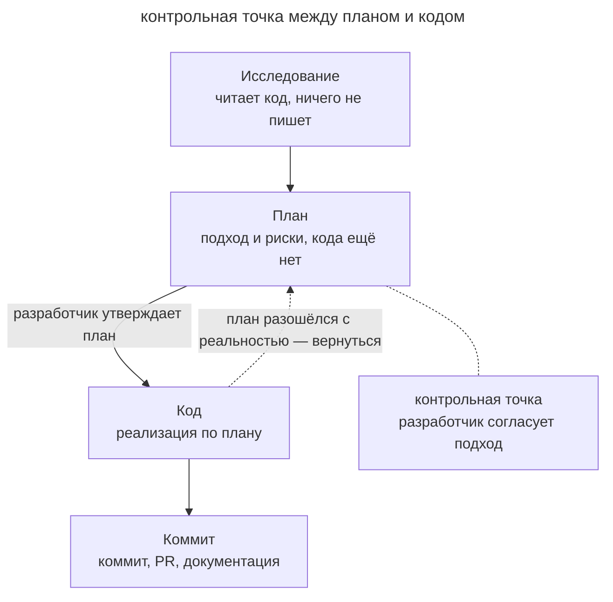

# Четыре фазы

## Назначение

Разделить работу над нетривиальной задачей на исследование, планирование, реализацию и фиксацию результата. Агент сначала изучает код и согласует подход с разработчиком, затем реализует и проверяет его.

## Также известен как

Explore–Plan–Code–Commit (EPCC), «сначала план, потом код».

## Проблема

Если агент сразу начинает писать код, он может пропустить ограничение существующего интерфейса. Разработчик обнаружит это на ревью готового диффа, когда исправление потребует переделать реализацию. Исследование перед правкой позволяет найти такое ограничение раньше.

Подробный промпт тоже может закрепить неверное решение, если разработчик заранее продиктовал реализацию (см. [преждевременную спецификацию](premature-specification.md)). Полезнее дать агенту исследовать задачу и проверить предложенный подход до изменения кода.

## Решение

Явно провести агента через четыре последовательные фазы и запретить писать код в первых двух.

1. **Исследование.** Агент читает нужный код и собирает контекст без правок.
2. **План.** Агент описывает подход, порядок изменений и риски. Разработчик проверяет план и уточняет ограничения до начала реализации.
3. **Код.** Агент реализует утверждённый план, сверяясь с ним и с доступными проверками (тесты, сборка, линтер).
4. **Коммит.** Агент сохраняет проверенный результат с осмысленным сообщением и готовит пулл-реквест. Если поведение изменилось, он обновляет документацию.

## Структура

Стрелки на схеме задают последовательность фаз. Если реализация обнаруживает ошибку плана, агент возвращается к планированию и согласует изменение. В этом варианте процесса разработчик явно утверждает переход к коду.

## Участники / Компоненты

- **Разработчик** ставит задачу, утверждает план и принимает результат.
- **Агент** исследует код, предлагает план и реализует его.
- **План** сохраняет согласованный подход. Его можно уточнить или передать другой сессии.
- **Кодовая база** даёт контекст для исследования и проверки решения.

## Когда применять

- Задача затрагивает несколько модулей или требует выбора подхода.
- Неверное решение приведёт к дорогой переделке, например при изменении публичного контракта.
- Разработчику нужно проверить направление работы до реализации.

Для однострочных и механических правок отдельное согласование плана обычно избыточно.

## Последствия и компромиссы

- ➕ Разработчик замечает ошибку направления до появления большого диффа.
- ➕ Короткий план обычно требует меньше времени на ревью, чем готовая реализация.
- ➕ Сохранённый план можно передать новой сессии или использовать в описании пулл-реквеста.
- ➖ Для простых задач цикл медленнее и дороже прямой просьбы «сделай».
- ➖ При новых сведениях план нужно пересматривать вместе с кодом.
- ➖ Соблазн довести план до пошаговой инструкции возвращает к [преждевременной спецификации](premature-specification.md).

## Реализация

1. Включите режим планирования, который ограничивает правки до утверждения подхода.
2. Передайте задачу или ссылку на тикет и попросите исследовать код перед составлением плана.
3. Прочитайте план. Уточните скрытые ограничения, обсудите альтернативы и удалите лишнюю работу.
4. Утвердите план и укажите команды проверки результата.
5. Попросите сохранить результат в коммите, подготовить пулл-реквест и обновить затронутую документацию.

Тулкиты спеко-ориентированной разработки поддерживают эти фазы готовыми командами. Ниже показано, какие действия выполняет каждый инструмент.

### Через GitHub Spec Kit

[Spec Kit](https://github.com/github/spec-kit) сохраняет результат каждой фазы в репозитории.

- **Исследование и план** выполняются через `/speckit.specify`, `/speckit.clarify`, `/speckit.plan` и `/speckit.tasks`. Команды последовательно фиксируют требования, уточнения, технический подход и задачи. Разработчик проверяет документы до реализации.
- **Код** создаётся командой `/speckit.implement` по списку задач.
- **Коммит** следует обычному git-процессу. `/speckit.analyze` дополнительно проверяет согласованность документов.

### Через OpenSpec

[OpenSpec](https://github.com/Fission-AI/OpenSpec) организует работу вокруг изменения с этапами propose, review, apply и archive.

- **Исследование** через `/opsx:explore` помогает прочитать код и сравнить варианты.
- **План** через `/opsx:propose` сохраняется в `proposal.md`, `specs/`, `design.md` и `tasks.md`. Разработчик проверяет связку до реализации.
- **Код** создаётся через `/opsx:apply` по задачам из `tasks.md`.
- **Завершение** включает архивирование изменения в `openspec/changes/archive/`, где сохраняется история решений.

### Через Superpowers

[Superpowers](https://github.com/obra/superpowers) объединяет скилы с контрольными точками между фазами.

- **Исследование и план** проходят через `brainstorming` и `writing-plans`. Разработчик согласует дизайн, затем получает план небольших задач с путями файлов и проверками.
- **Код** создаётся через `subagent-driven-development`. Скил `test-driven-development` задаёт цикл red–green–refactor, а `using-git-worktrees` изолирует работу.
- **Завершение** включает ревью через `requesting-code-review` и подготовку merge или PR через `finishing-a-development-branch`.

### Через скилы Мэтта Покока

В [паке Мэтта Покока](https://github.com/mattpocock/skills) фазы складываются из нескольких скилов.

- **Исследование и план** начинаются с `/grill-with-docs`. Решения сохраняются в `CONTEXT.md` и ADR. Вопросы, требующие эксперимента, передаются в `/prototype` через `/handoff`.
- **Фиксация плана** для долгой работы проходит через `/to-spec` и `/to-tickets`. Разговор превращается в спецификацию и трассирующие тикеты с зависимостями.
- **Код** создаётся через `/implement` с проверками `/tdd`.
- **Завершение** включает `/code-review` по стандартам проекта и требованиям спецификации.

Скилы согласуют с разработчиком итог обсуждения и выбранные границы тестирования.

## Пример

В беклоге есть тикет о сдвиге времени в CSV-экспорте на час у части пользователей. Разработчик включает режим планирования и передаёт тикет агенту.

> Разберись с REP-1432 и составь план исправления.

На фазе **исследования** агент находит преобразование времени при записи CSV.

При подготовке **плана** агент предлагает преобразовывать время при записи или чтении. Разработчик уточняет ограничение.

> Формат уже выгруженных файлов используют внешние интеграции. Исправляем преобразование при записи. Добавь тест на переход на летнее время.

Разработчик утверждает исправленный план. На фазе **кода** агент реализует изменение и запускает тесты экспортёра.

После проверки разработчик просит сделать **коммит**.

> Закоммить и открой пулл-реквест; в описание вынеси план и решение, которое мы выбрали.

Обсуждение плана позволило сразу отказаться от изменения чтения CSV. Если бы ограничение обнаружилось на ревью, агенту пришлось бы переделать готовый код.

## Анти-паттерны и частые ошибки

- **Пропуск исследования.** План, построенный на догадках, может противоречить устройству проекта.
- **Утверждение плана не читая.** Контрольная точка превращается в формальность, и паттерн лишь добавляет накладные расходы к обычному «сделай».
- **План-инструкция.** Детализация до понимания задачи приводит к [преждевременной спецификации](premature-specification.md).
- **Устаревший план.** При расхождении с реальностью вернитесь к планированию и согласуйте новый подход.

## Известные применения

- **Claude Code** поддерживает plan mode. Рабочий процесс описан в [Claude Code best practices](https://code.claude.com/docs/en/best-practices).
- Похожую задачу решают plan mode в Cursor и architect mode в aider.
- **Спеко-ориентированные тулкиты** сохраняют результаты фаз в документах и связывают их командами.

## Связанные паттерны

- [Спеко-ориентированная разработка](spec-driven-development.md) сохраняет спецификацию, план и задачи для работы между сессиями.
- [Преждевременная спецификация](premature-specification.md) возникает, когда план детализируют до понимания задачи.
