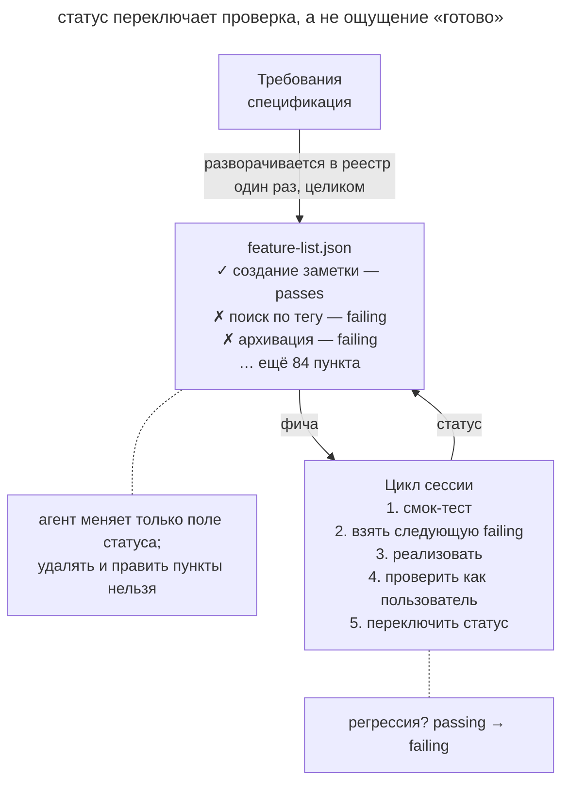

# Список фич

## Назначение

Вести реестр фич с проверяемыми статусами. Каждая фича начинает со статуса «не работает» и получает статус «работает» после сквозной проверки. По реестру новая сессия видит оставшуюся работу.

## Также известен как

Feature list, feature list harness, реестр фич.

## Проблема

При работе над десятками фич отчёта «готово 80 %» недостаточно. Агент мог написать код, но ещё не проверить пользовательский сценарий.

Например, создание заметки прошло проверку неделю назад, а вчерашнее изменение схемы сломало его. Если статус не связан с повторным запуском проверки, следующая сессия считает фичу завершённой и продолжает работу на сломанной базе.

Без общего реестра новая сессия также тратит время на восстановление очереди задач.
[Журнал прогресса](progress-file.md) объясняет ход работы и причины решений. Для статусов нужен отдельный структурированный файл, в котором агент меняет определённые поля.

## Решение

До начала реализации разверните требования в реестр. Для каждой фичи запишите описание пользовательского поведения, шаги проверки и начальный статус `passes: false`.

Правила обновления связывают реестр с результатами проверок.

1. **Успех подтверждает сквозной сценарий.** Агент ставит `passes: true` после проверки через пользовательский интерфейс. Для веб-приложения это может быть браузерный сценарий со скриншотами (см. [петлю обратной связи](give-agent-a-way-to-verify.md)).
2. **Требования защищены от подгонки.** При реализации агент меняет только статус. Удаление или переформулировка пункта требует отдельного решения о требованиях.
3. **Регрессия возвращает фичу в работу.** Если повторная проверка падает, агент меняет `passes` на `false`.

JSON задаёт явную структуру записи и ограничивает обычное обновление одним полем. Схема и проверка diff помогают обнаружить случайное изменение описания или шагов проверки.

Сессия читает реестр, выбирает непройденную фичу, реализует её и обновляет статус после проверки. Ограничение [одной фичей за проход](one-feature-at-a-time.md) позволяет закончить сценарий до перехода к следующему.

## Структура



На схеме требования превращаются в реестр до реализации. Агент выбирает из него пункт и проходит цикл разработки с проверкой. Пунктирная стрелка возвращает фичу в очередь, если позднее обнаружена регрессия.

## Участники / Компоненты

- **Реестр** хранит список фич и их статусы в JSON.
- **Фича** описывает проверяемое поведение и шаги его проверки.
- **Агент** реализует выбранный пункт и обновляет статус по результату проверки.
- **Проверка** подтверждает пользовательский сценарий.
- **Разработчик** проверяет состав реестра и выборочно сверяет статусы с поведением продукта.

## Когда применять

- Большая работа имеет ясный конечный результат, который можно разложить на сценарии.
- Агент работает несколькими автономными сессиями, и прогресс нужно видеть по файлу.
- Нескольким участникам нужна общая очередь работы.

Для небольшой задачи обычно хватает плана или `tasks.md`.

## Последствия и компромиссы

- ➕ Количество завершённых фич опирается на результаты проверок.
- ➕ После регрессии сломанная фича снова видна в очереди.
- ➕ Новая сессия может выбрать следующий пункт без пересказа всей истории.
- ➖ Слишком крупные пункты трудно проверить, а слишком мелкие усложняют ведение реестра.
- ➖ Текстовый запрет менять требования нужно подкреплять проверкой изменений реестра.
- ➖ Частично работающее поведение приходится разделять на самостоятельные сценарии.

## Реализация

1. Разверните требования в проверяемые сценарии до реализации. Например, «пользователь открывает чат, задаёт вопрос и видит ответ» описывает результат, который можно воспроизвести.
2. Храните категорию, описание, шаги проверки и `passes` в JSON. Начальное значение статуса задайте как `false`.
3. Запишите в [память проекта](claude-md-memory.md), что агент меняет только `passes` и только по результату сквозной проверки.
4. Начинайте сессию с чтения реестра и smoke-теста. Затем выбирайте пункт, реализуйте его, проверяйте и обновляйте статус.
5. Сохраняйте причины решений в [журнале прогресса](progress-file.md), а статусы в реестре.
6. Проверяйте состав реестра как требования и выборочно повторяйте сценарии завершённых фич.

## Пример

Агент строит сервис заметок. Начальная сессия разворачивает спецификацию в 87 пунктов, один из которых показан ниже.

```json
[
  {
    "category": "notes",
    "description": "Пользователь создаёт заметку и видит её в списке",
    "steps": ["открыть /notes", "нажать «Создать»", "ввести текст",
              "сохранить", "убедиться, что заметка в списке"],
    "passes": true
  },
  {
    "category": "search",
    "description": "Поиск по тегу возвращает только заметки с этим тегом",
    "steps": ["создать заметки с тегами work и home",
              "искать по тегу work",
              "убедиться, что home-заметок нет в выдаче"],
    "passes": false
  }
]
```

При старте сессии smoke-тест обнаруживает сбой архивации после изменения схемы. Агент возвращает её статус в `false` и фиксирует регрессию. После восстановления базового сценария он берёт поиск по тегу, реализует его и проходит шаги проверки через браузер. Только после этого поиск получает `passes: true`.

Вечером разработчик видит в реестре 41 проверенную фичу из 87, а в журнале может прочитать о найденной и исправленной регрессии.

## Анти-паттерны и частые ошибки

- **Чекбокс без проверки.** Отметка по факту написания кода скрывает непроверенное поведение. Обновляйте статус после [петли обратной связи](give-agent-a-way-to-verify.md).
- **Подгонка реестра.** Изменение требования под готовый код скрывает недостающую функциональность. Проверяйте такие изменения отдельно.
- **Статусы внутри рассказа.** При переписывании Markdown агент может случайно потерять отметку. Храните статусы в структурированных полях.
- **Реестр вместо спецификации.** Цель и ограничения остаются в спецификации. Реестр хранит проверяемые сценарии, выведенные из неё.
- **Только юнит-тесты.** Отдельные функции могут работать при сломанном пользовательском сценарии.

## Известные применения

- **Харнесс Anthropic для долгоживущих агентов** использует реестр фич и проверку через браузер перед изменением статуса.
- **Эвал-харнессы** используют фиксированный набор сценариев, который защищают от подгонки под результат.
- **SDD-тулкиты** хранят задачи в `tasks.md`, как в [OpenSpec](openspec.md). Реестр дополнительно связывает отметку с проверкой поведения.

## Связанные паттерны

- [Петля обратной связи](give-agent-a-way-to-verify.md) даёт основание для обновления статуса.
- [Одна фича за раз](one-feature-at-a-time.md) ограничивает объём одного прохода.
- [Журнал прогресса](progress-file.md) сохраняет причины решений и состояние незавершённой работы.
- [Спеко-ориентированная разработка](spec-driven-development.md) поставляет требования для реестра.
