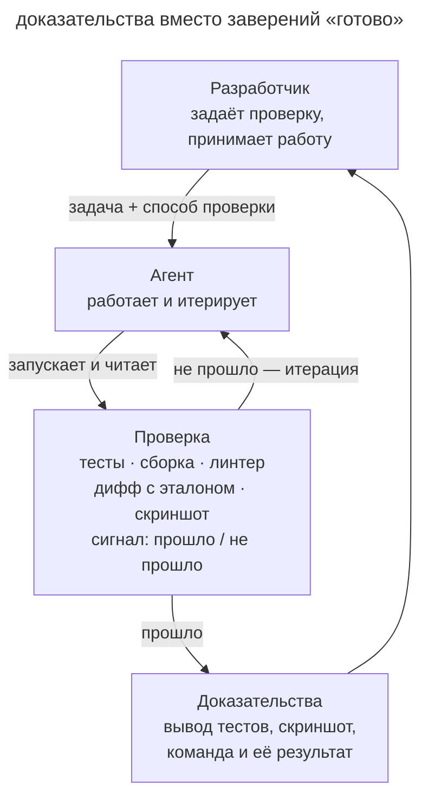

# Петля обратной связи

## Назначение

Дать агенту способ проверить результат, прочитать ошибку и повторить работу до выполнения критерия. Агент запускает проверку внутри сессии, а разработчик получает результат вместе с доказательствами.

## Также известен как

Give the agent a way to verify its work, verification loop, замкнутый цикл проверки.

## Проблема

Без проверки агент может остановиться на правдоподобном коде. Например, валидатор принимает корректный промокод, но ошибается на просроченном.

Если теста нет, ошибку должен заметить разработчик. До этого агент считает задачу завершённой.

Критерий готовности должен описывать наблюдаемое поведение. Тогда агент сможет отличить написанную реализацию от проверенного результата.

## Решение

Перед стартом задайте проверку с понятным результатом. Это может быть тест, сборка или сравнение вывода с эталоном. Для интерфейса задайте макет и критерии визуального сравнения. Попросите агента запускать проверку после изменений, разбирать ошибки и повторять цикл.

Агент выполняет правку, запускает проверку и исправляет найденный сбой. Разработчик выбирает критерии до начала работы и оценивает доказательства в конце.

Степень автоматизации цикла можно выбирать под задачу.

1. **Инструкция в промпте** просит агента запускать проверки и исправлять найденные ошибки.
2. **Цель на сессию** задаёт условие, к которому агент возвращается после очередного шага.
3. **Детерминированный гейт** блокирует завершение, пока обязательная проверка не прошла.
4. **Второе мнение** добавляет ревью в свежем контексте для проверки полноты и качества (см. [писателя и рецензента](writer-reviewer.md)).

Попросите приложить команду и результат её выполнения или скриншот проверенного сценария. Эти данные показывают, что именно агент проверил, и помогают принять работу без восстановления всей сессии.

## Структура

На схеме разработчик передаёт задачу и критерии проверки. Агент повторяет цикл правок и проверок до успеха, затем возвращает доказательства. Хук может закрепить условие выхода, а независимое ревью дополнить автоматические проверки.

## Участники / Компоненты

- **Разработчик** задаёт критерии и принимает результат по доказательствам.
- **Агент** меняет код, запускает проверку и разбирает результат.
- **Проверка** оценивает заданное свойство результата.
- **Сигнал** сообщает агенту, выполнен ли критерий.
- **Доказательства** сохраняют команду, вывод или изображение проверенного состояния.

## Когда применять

- Результат можно проверить воспроизводимым способом.
- Агент должен выполнять несколько итераций без постоянного наблюдения.
- Интерфейс можно сравнить с макетом по заданным критериям.
- Баг можно воспроизвести тестом до начала исправления.

## Последствия и компромиссы

- ➕ Агент разбирает найденные ошибки без ожидания ручной проверки каждого шага.
- ➕ Часть дефектов обнаруживается до ревью.
- ➕ По сохранённым результатам разработчик видит объём выполненной проверки.
- ➖ Если проверки нет, её подготовка потребует отдельной работы.
- ➖ Слабая проверка пропустит реализацию, которая не решает задачу полностью.
- ➖ Агент может ослабить проверку ради успеха. Изменения критериев нужно контролировать отдельно.

## Реализация

1. Опишите ожидаемое поведение до реализации и укажите, как его проверить.
2. Если проверки нет, начните с воспроизводящего теста (см. [TDD с агентом](tdd-with-agent.md)).
3. Попросите запускать проверку после правок, читать результат и исправлять обнаруженные ошибки.
4. Защитите критерии от подгонки. Изменение теста или ослабление условия согласуйте отдельно; при необходимости закрепите ограничение хуком.
5. Для длительной автономной работы добавьте контроль завершения и ревью в свежем контексте.
6. Попросите приложить команды, результаты тестов и нужные скриншоты.
7. Закрепите команды проверки в [памяти проекта](claude-md-memory.md), чтобы агент знал их в каждой сессии.

В [OpenSpec](openspec.md), [Superpowers](superpowers.md) и [скилах Мэтта Покока](matt-pocock-skills.md) проверки входят в рабочий процесс реализации. Конкретный механизм зависит от набора скилов и критериев задачи.

## Пример

Для валидатора промокодов разработчик задаёт проверяемые случаи вместе с задачей.

> Напиши validatePromoCode. Действующий SUMMER25 должен приниматься. Для просроченного кода верни false с причиной expired, для кода другого региона верни false с причиной region. Пустую строку отклоняй. Оформи случаи тестами, проверь их и исправляй реализацию до прохождения. После согласования тестов не меняй их без отдельного обсуждения.

Агент пишет тесты и реализацию. Проверка просроченного кода падает, потому что сравнение дат не учитывает часовой пояс. После исправления агент повторяет запуск и прикладывает результат `4 passed`.

Разработчик получает реализацию, в которой ошибка часового пояса уже найдена и исправлена. Его участие понадобилось для задания сценариев и приёмки результата.

## Анти-паттерны и частые ошибки

- **Поверить на слово.** Сообщение «готово» не показывает, что проверял агент. Требуйте результаты запуска.
- **Слабый оракул.** Проверка может пропустить значимые случаи. Сверяйте её с требованиями задачи.
- **Проверка без запуска.** Наличие тестов в репозитории не означает, что агент их выполнил. Задайте команду и условие завершения.
- **Подгонка проверки.** Ослабленное условие скрывает дефект. Изменения критерия требуют отдельного решения.
- **Юнит-тесты как финал.** Для пользовательской фичи проверьте также сквозной сценарий, иначе возможен преждевременный успех.

## Известные применения

- **Claude Code best practices** описывают постановку задач с критериями и примерами проверки.
- **Агентские инструменты** могут поддерживать цели на сессию, Stop-хуки и ревью-сабагентов.
- **Харнесс Anthropic для долгоживущих агентов** связывает статусы фич с проверками и запускает smoke-тест в начале сессии.
- **SDD-тулкиты** включают критерии приёмки в спецификации и задачи, а Superpowers использует цикл TDD.

## Связанные паттерны

- [TDD с агентом](tdd-with-agent.md) начинает итерацию с теста до изменения кода.
- [Писатель и рецензент](writer-reviewer.md) проверяет свойства, для которых нужно суждение.
- [Рефлексия](reflection.md) помогает найти недостатки через самокритику, но требует внешнего подтверждения.
- [Четыре фазы](explore-plan-code-commit.md) задаёт проверки в плане и использует их при реализации.
