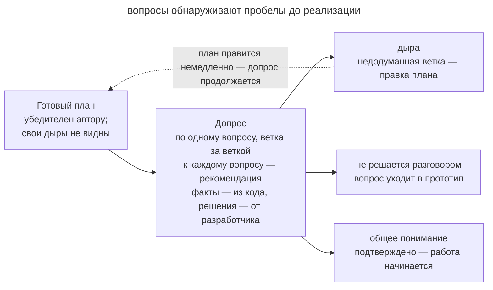

# Гриллинг

## Назначение

Проверить готовый план через последовательные вопросы агента. Агент разбирает допущения и зависимости решений, а разработчик уточняет план до начала реализации.

## Также известен как

Grilling, допрос с пристрастием; `/grilling` в скиллах Мэтта Покока.

## Проблема

Автору план может казаться полным, потому что он помнит допущения, которые не записал. Другой участник их не видит.

Например, план миграции описывает обычную подписку, но пропускает корпоративные зачисления. Если не задать вопрос об этом до реализации, агент применит одно правило ко всем пользователям. Обсуждение каждой ветки помогает обнаружить такой пропуск до изменения кода.

## Решение

Перед реализацией попросите агента проверить план вопросами.

> Проверь каждое допущение этого плана. Задавай по одному вопросу о зависимостях решений и предлагай рекомендуемый ответ с обоснованием. Факты ищи в коде самостоятельно. Решения согласуй со мной и жди ответа. Начинай реализацию после подтверждения общего понимания.

При интервью придерживайтесь следующих правил.

- **По одному вопросу.** Дождитесь ответа, чтобы нерешённая ветка не потерялась среди остальных.
- **Проверяйте факты в коде.** Вопросы разработчику оставляйте для решений, которые нельзя получить чтением проекта.
- **Обосновывайте рекомендацию.** Предложенный вариант даёт разработчику конкретный выбор для обсуждения.

Ответ может подтвердить пункт плана или потребовать его исправления. Если для решения нужны наблюдения, вынесите вопрос в [одноразовый прототип](prototype-to-answer.md). Когда значимые ветки разобраны, разработчик подтверждает план и начало реализации.

## Структура

На схеме агент получает готовый план и проходит по веткам решений.

Найденный пропуск возвращает его к документу, а вопрос, требующий эксперимента, уходит в прототип. Завершение обсуждения требует подтверждения разработчика.

## Участники / Компоненты

- **План** служит исходным документом для вопросов.
- **Агент-интервьюер** проверяет факты и предлагает варианты решений.
- **Разработчик** отвечает на вопросы и утверждает изменения плана.
- **Найденные пробелы** показывают, какие сценарии и зависимости ещё не разобраны.
- **Общее понимание** фиксируется явным подтверждением перед реализацией.

## Когда применять

- Предстоит значимая работа по плану, который автор составлял самостоятельно.
- Решение трудно обратить, например оно меняет публичный контракт или схему данных.
- План содержит допущения, которые ещё никто не проверял вопросами.

Для небольшой обратимой правки интервью может стоить дороже реализации. [Интервью у агента](let-claude-interview-you.md) помогает составить исходную спецификацию, а гриллинг проверяет уже написанный план.

## Последствия и компромиссы

- ➕ Пропущенные сценарии обнаруживаются до реализации.
- ➕ Рекомендации агента дают конкретные варианты для обсуждения.
- ➕ Допущения становятся явными и попадают в план.
- ➖ Автору может быть трудно пересматривать решения, которые казались завершёнными.
- ➖ Подробный разбор требует отдельного времени.
- ➖ Агент может соглашаться с автором и пропускать слабые места без ясной задачи на критическую проверку.

## Реализация

1. Запишите план, чтобы агент мог ссылаться на конкретные решения.
2. Попросите проверить допущения и задавать по одному вопросу с рекомендацией.
3. Если ответа нет, скажите «не знаю» и зафиксируйте открытый вопрос.
4. Вносите согласованные изменения в план по ходу разговора.
5. Вопросы, которые требуют эксперимента, передавайте в [одноразовый прототип](prototype-to-answer.md).
6. Сохраняйте термины в [словаре домена](domain-context-file.md), а причины архитектурных решений в ADR.
7. Явно подтвердите план перед началом реализации.

## Пример

Перед миграцией тарифов разработчик отдаёт план на проверку. Агент начинает с правил смены тарифа.

> Апгрейд в плане применяется сразу. Для даунгрейда предлагаю начало следующего периода без пропорционального возврата. Подходит ли это правило продукту?

Разработчик соглашается, агент дополняет план и переходит к следующей ветке.

> В плане подписка всегда связана с оплатой. По словарю корпоративный договор может создавать зачисление без подписки. Как мигрируют корпоративные тарифы с отложенным стартом?

В плане этот сценарий отсутствует. Разработчик уточняет продуктовое правило. Отменённый до начала действия контракт не должен открывать доступ в дату старта. Остаётся технический вопрос, сможет ли существующая очередь событий соблюсти это правило, если событие старта уже запланировано.

Для ответа нужен [прототип](prototype-to-answer.md). Команда создаст контракт с будущей датой старта, отменит его и переведёт часы за эту дату. Если доступ откроется, обработчик старта не учитывает отмену. Агент готовит [передачу сессии](handoff.md) с этим вопросом и сценарием. К реализации миграции команда возвращается после проверки решения.

## Антипаттерны и частые ошибки

- **Нет исходного плана.** Разговор становится [интервью](let-claude-interview-you.md) по сбору требований.
- **Пачки вопросов.** Часть вопросов легко пропустить. Разбирайте их последовательно.
- **Агент отвечает за пользователя.** Рекомендация не подтверждает решение. Дождитесь ответа разработчика.
- **Дыры «на потом».** Вскрытая дыра, не внесённая в план немедленно, испаряется к концу сессии.
- **Формальное согласие.** Похвала плану без проверки допущений не выявляет пропущенные сценарии.

## Известные применения

- **Скиллы Мэтта Покока** реализуют этот процесс через `/grilling` и `/grill-with-docs`. [Карта исследования](wayfinder.md) использует гриллинг как один из типов работы.
- **Премортем** предлагает представить провал проекта и найти его возможные причины до старта.
- **Ревью дизайн-документов** решает сходную задачу проверки плана другим участником.

## Связанные паттерны

- [Интервью у агента](let-claude-interview-you.md) помогает подготовить исходные требования.
- [Одноразовый прототип](prototype-to-answer.md) проверяет вопросы, для которых нужны наблюдения.
- [Писатель и рецензент](writer-reviewer.md) применяет независимую проверку к готовому коду.
- [Словарь домена](domain-context-file.md) сохраняет согласованные термины и решения.
