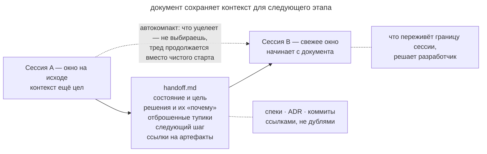

# Передача сессии

## Назначение

Перед сменой сессии сохранить состояние работы в передаточном документе. Следующий агент получает цель, принятые решения и первый шаг, с которого можно продолжить.

## Также известен как

Handoff, хендофф; `/handoff` в скилах Мэтта Покока; передаточный документ.

## Проблема

Сессию приходится завершать, когда заканчивается окно или меняется характер работы. Например, после планирования нужно проверить спорное решение отдельным прототипом.

Автоматическая сводка может сохранить ход обсуждения, но пропустить причину отказа от одного варианта. Новый агент тогда повторит уже проделанное исследование.
Ручной пересказ тоже требует времени и зависит от памяти разработчика.

Для следующего этапа полезнее заранее отобрать сведения под его цель. Прототипу нужен открытый вопрос и критерий эксперимента, а реализации нужен согласованный план.

## Решение

Перед завершением попросите агента подготовить документ для названной цели. Пока контекст доступен, он может сохранить нужные сведения.

- текущее состояние и цель следующей сессии;
- ключевые решения и их причины;
- что уже пробовали и отбросили, чтобы не пробовать снова;
- конкретный следующий шаг;
- ссылки на спецификации, ADR, коммиты и тикеты;
- рекомендации по скилам и инструментам следующей сессии.

Удалите из документа секреты и лишние персональные данные. В этом варианте паттерна handoff хранится во временном каталоге и используется для конкретной передачи. Долговременные знания сохраняйте в спецификациях, ADR и [журнале прогресса](progress-file.md).

Следующая сессия начинает с документа и читает по ссылкам дополнительные материалы, которые нужны для задачи.

## Структура



Верхний путь на схеме показывает передачу под заданную цель. Текущий агент составляет документ, а следующий читает его и обращается к постоянным артефактам по ссылкам. Нижний путь показывает автоматическое сжатие внутри текущего разговора, при котором разработчик меньше контролирует состав сводки.

## Участники / Компоненты

- **Уходящая сессия** собирает документ, пока нужный контекст ещё доступен.
- **Передаточный документ** сохраняет состояние и следующий шаг под конкретную цель.
- **Следующая сессия** читает документ перед продолжением работы.
- **Разработчик** выбирает момент передачи и цель следующего этапа.
- **Постоянные артефакты** дают подробности по ссылкам из документа.

## Когда применять

- Окно заканчивается до завершения задачи.
- Работа переходит от исследования к прототипу, реализации или ревью.
- Работа передаётся другому агенту или коллеге.
- Долгая дискуссия накопила решения, которые жалко доверить компакту.

При продолжении той же работы часто достаточно [журнала прогресса](progress-file.md). Handoff полезен в момент передачи между сессиями.

## Последствия и компромиссы

- ➕ Разработчик может проверить, какие сведения получит следующий исполнитель.
- ➕ Новая сессия получает контекст под свою задачу.
- ➕ Причины решений и проверенные гипотезы сохраняются явно.
- ➖ Документ нужно подготовить до потери нужных сведений из окна.
- ➖ Неполная сводка может пропустить те же детали, что и автоматическое сжатие.
- ➖ Пересказ постоянных документов создаёт копии, которые могут разойтись с оригиналами.

## Реализация

1. Подготовьте повторяемую команду передачи. Например, `/handoff` есть в [паке Мэтта Покока](matt-pocock-skills.md).
2. Назовите цель следующей сессии, чтобы агент отобрал сведения под неё.
3. Сохраните состояние, решения с причинами, проверенные гипотезы и следующий шаг.
4. На спецификации, ADR и тикеты дайте ссылки.
5. Проверьте, что в документе нет секретов.
6. Поместите handoff во временный каталог. Знания, нужные надолго, перенесите в постоянные документы.
7. Начните следующую сессию с просьбы прочитать handoff.
8. Готовьте передачу до сжатия окна, пока агент может восстановить причины решений.

## Пример

При планировании миграции тарифов остался вопрос о корпоративных контрактах с отложенным стартом. Разработчик решает проверить модель отмен прототипом и готовит новую сессию.

> Собери handoff для прототипа модели отмен. Следующая сессия должна проверить, поддерживает ли модель корпоративные контракты с отложенным стартом.

Агент сохраняет `handoff-cancellation-prototype.md` во временном каталоге.

```markdown
# Handoff: прототип модели отмен

## Цель сессии
Проверить прототипом: выдерживает ли событийная модель отмен
корпоративные контракты с отложенным стартом.

## Контекст
План миграции тарифов готов (см. docs/specs/tariff-migration.md).
Открытый вопрос №3 оттуда — модель отмен.

## Решения
- Отмена — событие с датой вступления, не смена статуса: нужна
  история для биллинга (ADR-0009).

## Отброшено
- Флаг cancelled_at на подписке: теряет повторные отмены после
  реактивации.

## Следующий шаг
Прототип: три сценария — немедленная отмена, отмена с датой,
отмена до старта контракта.

## Рекомендуемые скилы
/prototype — сессия целиком про throwaway-код.
```

В новой сессии разработчик передаёт путь к документу.

> Прочитай /tmp/handoff-cancellation-prototype.md и приступай.

Агент начинает прототип с поставленного вопроса и ссылок на согласованные решения. Ему не нужно восстанавливать их из нескольких часов обсуждения.

## Анти-паттерны и частые ошибки

- **Доверить границу автокомпакту.** Решения и причины уходят молча; паттерн существует ровно затем, чтобы этого не было.
- **Передача-дамп.** Полная история занимает окно следующей сессии. Отбирайте сведения под её цель.
- **Пересказ артефактов.** Копия спецификации может устареть. Передавайте ссылку на исходный документ.
- **Одноразовая передача в git.** Временная сводка быстро устаревает. Сохраняйте в репозитории сведения, которые команда собирается поддерживать.
- **Передача после потери контекста.** Агент сможет записать только оставшиеся сведения. Готовьте документ заранее.

## Известные применения

- **Скилы Мэтта Покока** используют `/handoff` для передачи между этапами, включая переход от интервью к прототипу.
- **Claude Code** позволяет задавать фокус для `/compact`. Такая сводка продолжает работу в текущем разговоре.
- **Статья Anthropic о контекст-инжиниринге** описывает сжатие контекста для долгой работы агентов.
- **Сабагенты** возвращают координатору сводку результатов, отобранных под его задачу.

## Связанные паттерны

- [Журнал прогресса](progress-file.md) обновляется по ходу работы и хранится в репозитории.
- [Инженерия контекста](context-engineering.md) объясняет отбор сведений для передачи.
- [Четыре фазы](explore-plan-code-commit.md) позволяет передать утверждённый план в новую сессию реализации.
- [Спеко-ориентированная разработка](spec-driven-development.md) сохраняет постоянные документы, на которые ссылается handoff.
