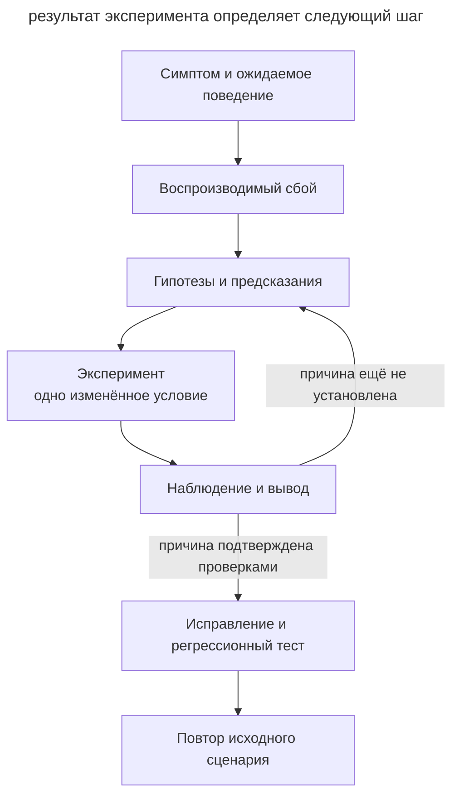

# Диагностика через гипотезы

## Назначение

Организовать поиск причины ошибки через воспроизведение и различающие эксперименты. Разработчик задаёт наблюдаемый симптом и границы работы, агент проверяет возможные объяснения до изменения рабочего кода.

## Также известен как

Hypothesis-driven debugging, отладка через проверку гипотез.

## Проблема

Агент читает жалобу, находит подозрительный код и сразу исправляет его. Правка выглядит убедительно, но исходная ошибка может остаться. Например, после жалобы на неверную сумму счёта агент уменьшает срок жизни кеша. Ошибка исчезает при первом запросе после очистки, а затем возвращается.

Один симптом допускает несколько причин. Неверную сумму могли вернуть хранилище, кеш или преобразование ответа. Проходящий тест выбранной правки ещё не показывает, какое объяснение соответствовало исходному сбою.

## Решение

Попросите агента сначала получить проверку, которая обнаруживает именно заявленный симптом. Затем он формулирует несколько возможных причин и для каждой указывает наблюдение, способное её опровергнуть.

> Сначала воспроизведи ошибку одной командой. До исправления предложи гипотезы и эксперимент, который их различит. Меняй по одному условию, записывай ожидание и результат. После установления причины внеси исправление и повтори исходный сценарий.

Разделите в отчёте наблюдения и выводы. «Без кеша суммы верны» сужает область поиска до пути с кешированием. Для вывода о неверном ключе нужны дополнительные проверки, например смена порядка запросов и идентификатора счёта.

## Структура

Каждый эксперимент должен сокращать набор возможных причин.



Если эксперимент не различает гипотезы, агент уточняет проверку. Исчезновение симптома после нескольких одновременных правок оставляет причину неустановленной.

## Участники / Компоненты

- **Разработчик** описывает ошибку, ожидаемое поведение и допустимые эксперименты.
- **Воспроизводящий сценарий** обнаруживает исходный симптом и возвращает результат проверки.
- **Агент** формулирует предсказания, проводит эксперименты и сохраняет наблюдения.
- **Регрессионный тест** проверяет поведение через ту границу, на которой возник дефект.

## Когда применять

- Один симптом допускает несколько правдоподобных объяснений.
- Предыдущие исправления временно скрывали ошибку.
- Сбой зависит от порядка запросов, состояния или взаимодействия нескольких вызовов.

Для очевидной опечатки полный цикл будет избыточен. Для редкого сбоя сначала зафиксируйте условия и частоту воспроизведения. Несколько успешных запусков не доказывают устранение нестабильной ошибки.

## Последствия и компромиссы

- ➕ Проверенные гипотезы помогают следующей сессии продолжить расследование.
- ➕ Минимальный сценарий облегчает проверку причины и исправления.
- ➖ Подготовка воспроизведения иногда занимает больше времени, чем сама правка.
- ➖ Упрощённая среда может скрыть условие исходного сбоя, поэтому нужен повтор полного сценария.

## Реализация

1. Запишите конкретный вход, ожидаемое поведение и фактический результат. Согласуйте доступные данные и среду экспериментов.
2. Запустите воспроизведение и убедитесь, что оно обнаруживает заявленную ошибку. Удаляйте лишние условия по одному, повторяя проверку после каждого сокращения.
3. Составьте небольшой набор гипотез. Для каждой запишите предсказание и способ проверки.
4. Выберите эксперимент, который различает оставшиеся причины. Сохраните команду, результат и изменившийся вывод.
5. Исправьте установленную причину. Закрепите сценарий тестом через публичное поведение и повторите исходный случай.
6. Уберите временные средства диагностики. В описании изменения сохраните причину и подтверждающие проверки.

Если воспроизведение недоступно, зафиксируйте, чего не хватает, например входного запроса или доступа к тестовой среде. Предположения должны оставаться помеченными как непроверенные. В журналах и примерах используйте обезличенные данные.

## Пример

В учебном сервисе организация `alpha` запрашивает счёт `42` с суммой `100`. Затем `beta` запрашивает свой счёт `42` с суммой `900`, но получает `100`. [Пример на Python](../assets/hypothesis-driven-debugging/examples/cache_probe.py) работает без внешних сервисов. Запускайте команды из корня репозитория.

```console
$ python3 book/assets/hypothesis-driven-debugging/examples/cache_probe.py shared
shared: expected=[100, 900] actual=[100, 100] FAIL
```

Команда завершается с кодом `1`. Агент теперь может отличить исходный дефект от других ошибок и сформулировать предсказания.

| Гипотеза | Что должно наблюдаться |
| --- | --- |
| Выборка данных не учитывает организацию | Ошибка сохранится при обходе кеша |
| Ключ кеша содержит только номер счёта | При одинаковом номере второй запрос получит сумму первого; при разных номерах ошибка исчезнет |

Агент запускает три эксперимента. Каждый начинается с пустого кеша и меняет одно условие относительно исходного сценария.

```console
$ python3 book/assets/hypothesis-driven-debugging/examples/cache_probe.py bypass
bypass: expected=[100, 900] actual=[100, 900] PASS
$ python3 book/assets/hypothesis-driven-debugging/examples/cache_probe.py distinct
distinct: expected=[100, 700] actual=[100, 700] PASS
$ python3 book/assets/hypothesis-driven-debugging/examples/cache_probe.py reverse
reverse: expected=[900, 100] actual=[900, 900] FAIL
```

Обход кеша опровергает первую гипотезу для проверенных входов. Разные номера и обратный порядок запросов дают результаты, предсказанные второй гипотезой. Чтение реализации подтверждает, что ключ равен `invoice` и теряет организацию. Исправление включает её в ключ.

```python
key = (tenant, invoice)
```

Режим `fixed` использует этот ключ и проверяет оба порядка запросов, разные номера и повторные обращения. Ожидаемые суммы заданы явно по учебным данным.

```console
$ python3 book/assets/hypothesis-driven-debugging/examples/cache_probe.py fixed
shared: expected=[100, 900] actual=[100, 900] PASS
reverse: expected=[900, 100] actual=[900, 100] PASS
distinct: expected=[100, 700] actual=[100, 700] PASS
repeat: expected=[100, 900, 100, 900] actual=[100, 900, 100, 900] PASS
```

Это локальная модель механизма ошибки. В рабочем сервисе дополнительно повторяют исходные запросы через API, чтобы проверить передачу организации и реальный слой кеширования.

## Антипаттерны и частые ошибки

- **Первая версия сразу становится правкой.** Попросите наблюдение, которое могло бы опровергнуть объяснение.
- **Несколько изменений за попытку.** Успех перестаёт показывать, какое изменение повлияло на симптом.
- **Проверка соседней ошибки.** Сверьте воспроизведение с жалобой пользователя.
- **Очистка вместо исправления.** Повторите последовательность, которая снова наполняет кеш и вызывает сбой.
- **Тест слишком узкого участка.** Если дефект возникает между двумя вызовами, тест одного вызова его не закрепит.

## Известные применения

- Скилл Мэтта Покока [diagnosing-bugs](https://github.com/mattpocock/skills/blob/main/skills/engineering/diagnosing-bugs/SKILL.md) задаёт воспроизведение, сокращение сценария, проверяемые гипотезы, эксперименты и регрессионную проверку. Число гипотез и форма инструмента зависят от задачи.

## Связанные паттерны

- [Петля обратной связи](give-agent-a-way-to-verify.md) обеспечивает наблюдаемый результат каждого эксперимента.
- [TDD с агентом](tdd-with-agent.md) закрепляет найденный дефект тестом до исправления.
- [Одноразовый прототип](prototype-to-answer.md) проверяет вопрос проектирования небольшим экспериментом.
- [Передача сессии](handoff.md) сохраняет воспроизведение, отвергнутые гипотезы и следующий эксперимент.
