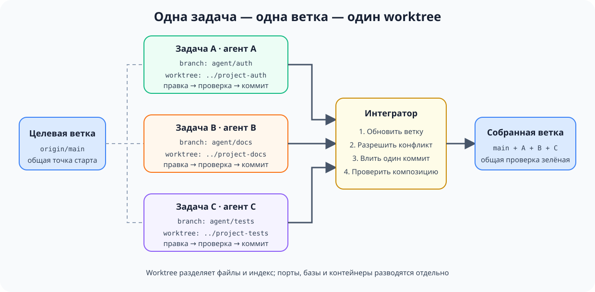

# Изолированная параллельная работа

## Назначение

Запускать несколько агентских задач одновременно так, чтобы каждая работала
в собственной ветке и рабочем дереве, не видела незакоммиченные правки соседей
и передавала результат через проверяемый коммит. Параллельность становится не
гонкой процессов за один каталог, а набором независимых изменений с явной
точкой интеграции.

## Также известен как

Worktree per task, branch per agent, isolated checkout, параллельные worktree.

## Проблема

Один агент уже меняет авторизацию, а разработчик запускает второго — обновить
документацию. Оба процесса открыты в одном checkout. Второй видит наполовину
переписанные файлы первого, принимает их за исходное состояние и форматирует
заодно. Первый запускает тесты уже на смеси двух изменений. Затем один из них
делает коммит и захватывает чужие строки.

Главная неприятность здесь не merge-конфликт. Конфликт хотя бы останавливает
интеграцию и показывает место столкновения. Общий checkout создаёт **скрытое
смешивание до коммита**:

- `git diff` больше не отвечает на вопрос, какая задача породила строку;
- проверка одной задачи выполняется на коде другой и даёт ложный зелёный
  сигнал;
- агент может удалить или переписать незнакомую правку как «лишнюю»;
- откат и ревью становятся опасными: граница изменения потеряна;
- два процесса конкурируют за индекс Git, генерируемые файлы и локальные
  зависимости.

Обычная ветка проблему не решает. В одном рабочем каталоге в каждый момент
выбрана только одна ветка, а незакоммиченные файлы принадлежат каталогу, не
задаче. Переключать ветку под работающими процессами ещё опаснее.

Полный клон на каждую задачу даёт изоляцию, но дорого дублирует историю и
усложняет уборку. Git worktree даёт несколько рабочих каталогов, связанных с
одним репозиторием: у каждого свои `HEAD`, индекс и файлы, а объекты Git общие.

## Решение

Выдавайте каждой параллельной задаче **собственную ветку и собственный
worktree**. Назначайте ей явную область владения и критерий завершения. Агент
работает только внутри своего каталога, проверяет результат там же и завершает
работу коммитом. Коммит — граница передачи: до него изменение принадлежит
задаче, после него готово к интеграции.

Интегрируйте готовые ветки по одной. Перед вливанием обновите ветку от целевой,
разрешите конфликты в контексте её задачи и снова прогоните проверки. Так
конкуренция превращается из неуправляемой записи в общие файлы в обычную,
наблюдаемую интеграцию Git.

Паттерн держится на четырёх границах:

1. **Файловая граница:** один worktree принадлежит одной задаче или сессии.
2. **Граница ответственности:** заранее известно, что задача меняет и чего не
   касается.
3. **Граница передачи:** между задачами ходят коммиты, а не незакоммиченные
   файлы из общего каталога.
4. **Граница интеграции:** только один поток в каждый момент обновляет целевую
   ветку и подтверждает общий зелёный результат.

## Структура



Одна целевая ветка порождает независимые ветки и рабочие деревья. В каждом
worktree агент проходит полный цикл своей задачи и выпускает отдельный коммит.
Интегратор принимает коммиты по одному и после каждого проверяет уже собранное
состояние. Если задачи пересекаются, столкновение проявляется в контролируемой
точке — при обновлении или слиянии, — а не посреди чужой сессии.

## Участники / Компоненты

- **Целевая ветка** — состояние, в которое в итоге собираются изменения;
  обычно `main` или ветка общей фичи.
- **Задача** — независимый кусок работы с областью файлов и проверяемым
  результатом.
- **Ветка задачи** — история одного изменения; её имя связывает коммиты с
  задачей.
- **Worktree** — отдельный каталог со своими рабочими файлами и индексом Git.
- **Агент** — работает только в назначенном worktree и не интегрирует соседние
  задачи по собственной инициативе.
- **Интегратор** — разработчик или выделенный процесс, который задаёт порядок
  слияния, разрешает пересечения и прогоняет общую проверку.
- **Контракт окружения** — правила для ресурсов вне Git: портов, баз данных,
  контейнеров, кешей и временных файлов.

## Когда применять

- Две или больше независимых задач действительно можно выполнять одновременно.
- Один агент реализует изменение, пока другой пишет тесты, документацию или
  проводит исследование в коде.
- Нужно сравнить несколько реализаций, не перетирая результаты экспериментов.
- Долгая задача не должна блокировать срочное исправление в том же репозитории.
- Параллельные сессии запускаются локально или автоматическим харнессом.

Не применяйте паттерн автоматически к двум тесно связанным правкам одного
модуля. Если задачи постоянно требуют незакоммиченного состояния друг друга,
это не параллельные задачи, а одна задача, искусственно разрезанная пополам.
Сначала проведите её последовательно или найдите настоящую границу.

## Последствия и компромиссы

- ➕ Незакоммиченные изменения физически разделены: агент не может случайно
  включить соседний дифф в свой коммит.
- ➕ Проверка относится к конкретному изменению: тесты запускаются на чистой
  ветке задачи, а затем повторяются на интегрированном состоянии.
- ➕ Отмена дешева: неудачный эксперимент удаляется вместе с веткой и worktree,
  не требуя разбирать общий каталог.
- ➕ Ревью проще: один коммит или PR соответствует одной задаче и одному
  владельцу.
- ➖ Параллельность не отменяет конфликтов — она переносит их в явную точку
  интеграции. Плохое разбиение даст очередь тяжёлых слияний.
- ➖ Каждый worktree требует установки зависимостей и отдельной конфигурации
  окружения; без быстрого bootstrap выигрыш съедается подготовкой.
- ➖ Git изолирует файлы, но не внешние ресурсы. Одинаковые порты, одна тестовая
  база или общий каталог кеша всё ещё создают гонки.
- ➖ Чем больше активных веток, тем выше цена координации: нужен владелец
  интеграции и понятный порядок зависимостей.

## Реализация

1. Разделите работу по результатам, а не по агентам. У каждой задачи должны
   быть имя, критерий завершения, область владения и известные зависимости.
2. Зафиксируйте исходную точку и создайте отдельные ветки с worktree:

   ```bash
   git fetch origin
   git worktree add -b agent/auth ../project-auth origin/main
   git worktree add -b agent/docs ../project-docs origin/main
   ```

   `git worktree list` показывает все активные каталоги и ветки. Git не даст
   случайно использовать одну и ту же ветку в двух worktree без принудительного
   обхода защиты.
3. Запустите в каждом каталоге штатную подготовку проекта. Команда вроде
   `make setup` должна довести свежий worktree до воспроизводимого зелёного
   состояния; ручная настройка каждого экземпляра плохо масштабируется.
4. Передайте агенту не только задачу, но и границу: «работай только в этом
   каталоге; не переключай ветку; не трогай изменения вне перечисленного
   скоупа; заверши проверенным коммитом».
5. Разведите внешнее окружение. Назначьте разные порты, имена контейнеров,
   тестовые базы и временные каталоги. Секреты лучше подключать read-only или
   заменять безопасными локальными значениями.
6. Каждый агент проверяет изменение внутри своей ветки и создаёт один
   содержательный коммит. Незавершённое состояние не передаётся соседям как
   зависимость.
7. Интегратор выбирает порядок по зависимостям. Перед слиянием каждая ветка
   подтягивает актуальную целевую ветку, разрешает конфликты и повторяет свою
   проверку.
8. После каждого слияния запускайте проверку общего состояния. Две зелёные
   ветки не гарантируют зелёную композицию.
9. После интеграции удалите чистые worktree штатной командой:

   ```bash
   git worktree remove ../project-auth
   git worktree remove ../project-docs
   git worktree prune
   ```

   Не удаляйте каталог вслепую: `git worktree remove` откажется убирать
   worktree с незакоммиченными файлами и тем самым сохранит работу.

## Пример

Команда готовит релиз интернет-магазина. Нужно независимо добавить ограничение
частоты запросов и обновить страницу эксплуатации. Разработчик создаёт два
worktree от одного `origin/main`:

```text
shop/                 main, только интеграция
shop-rate-limit/      agent/rate-limit, код + тесты
shop-runbook/         agent/runbook, документация + проверка ссылок
```

Первый агент меняет middleware и тесты, второй — runbook. Оба выполняют
`make setup`, затем свои проверки. Агент документации не видит наполовину
готовый middleware, а тесты первого не получают случайные изменения второго.
На выходе два коммита:

```text
4d23f91 feat: add API rate limiting
8a771bc docs: document rate-limit operations
```

Документация зависит от окончательных имён метрик, поэтому интегратор сначала
вливает код. Затем обновляет ветку runbook от нового состояния, замечает
переименование `rate_limit_rejected_total`, исправляет ссылку и прогоняет
проверку документации. Конфликт смысла проявился там, где его можно увидеть и
разрешить, а не был случайно спрятан в общем рабочем каталоге.

Если обоим экземплярам нужен локальный сервер, одного worktree недостаточно:
первому назначают `PORT=4101`, второму `PORT=4102`, а тестовые базы получают
разные имена. Иначе файловая изоляция будет честной, но процессы продолжат
ломать состояние друг друга через окружение.

## Анти-паттерны и частые ошибки

- **Общий checkout.** Несколько агентов пишут в один каталог. Это не
  параллельная разработка, а совместное редактирование без протокола.
- **Ветка без worktree.** Процессы по очереди переключают ветку в одном
  каталоге; файлы меняются у них под ногами.
- **Worktree без владельца.** Несколько задач отправлены в один изолированный
  каталог — смешивание просто переехало в другое место.
- **Разделение по файлам вместо результата.** «Ты меняешь контроллер, ты тесты»
  создаёт две половины, которые нельзя независимо проверить и завершить.
- **Общая инфраструктура.** Разные каталоги запускают один Compose project,
  используют одну базу или один порт и получают гонки за пределами Git.
- **Параллельное слияние.** Несколько процессов одновременно обновляют целевую
  ветку. Точка сериализации исчезает, а зелёные проверки быстро устаревают.
- **Интеграция без повторной проверки.** Каждая ветка зелёная отдельно, но их
  композицию никто не запускал.
- **Бесконечные worktree.** Завершённые каталоги не удаляются, ветки теряют
  владельцев, и через неделю непонятно, где осталась ценная работа.

## Известные применения

- **Claude Code** рекомендует отдельные worktree для параллельных CLI-сессий,
  чтобы их изменения не сталкивались, и использует тот же приём при массовом
  fan-out по файлам.
- **Эксперимент Anthropic с C-компилятором** запускал каждого агента в
  собственном контейнере с отдельным клоном, а задачи защищал простыми
  блокировками. Это более тяжёлый вариант тех же границ: отдельное рабочее
  состояние, владение задачей и последовательная синхронизация через Git.
- **Git worktree** — штатный механизм Git для нескольких рабочих деревьев
  одного репозитория: ветки можно держать открытыми одновременно без полных
  клонов.

Источники: [Claude Code best practices](https://code.claude.com/docs/en/best-practices),
[Building a C compiler with a team of parallel Claudes](https://www.anthropic.com/engineering/building-c-compiler),
[документация Git worktree](https://git-scm.com/docs/git-worktree).

## Связанные паттерны

- [Одна фича за раз](one-feature-at-a-time.md) — определяет размер задачи
  внутри одного worktree: параллельность не оправдывает широкий незавершённый
  фронт.
- [Писатель и рецензент](writer-reviewer.md) — полезный частный случай двух
  изолированных сессий: вторая получает чистый контекст и проверяет готовый
  коммит первой.
- [Петля обратной связи](give-agent-a-way-to-verify.md) — даёт локальный сигнал
  готовности каждой ветке и общий сигнал после интеграции.
- [Четыре фазы](explore-plan-code-commit.md) — коммит завершает работу в ветке
  и становится безопасной границей передачи результата.
- **Воспроизводимый старт** — будущий соседний паттерн: делает подготовку
  нового worktree одной быстрой и проверяемой командой.
