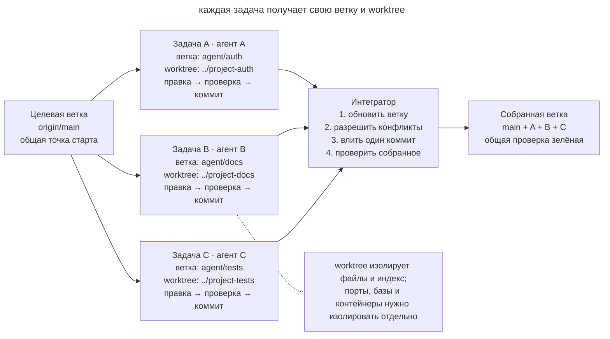
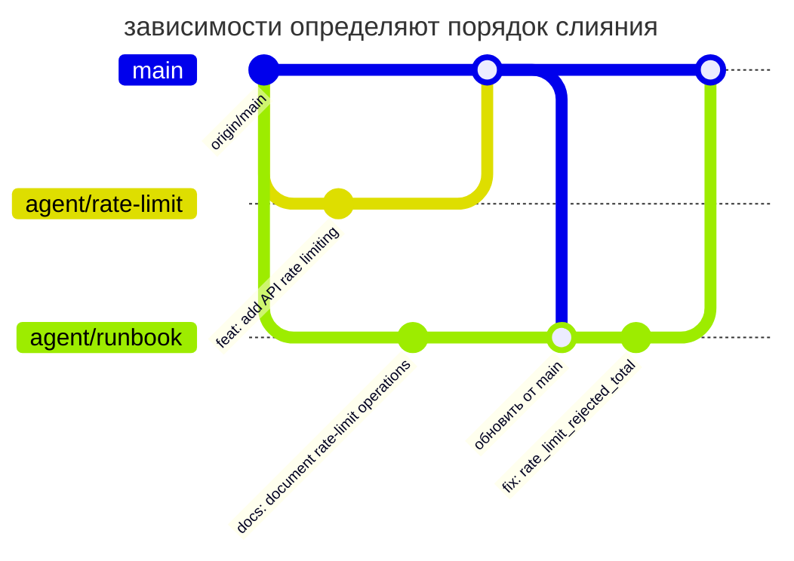

# Изолированная параллельная работа

## Назначение

Выделить каждой параллельной задаче собственную ветку и рабочее дерево. Агент проверяет изменение в своём каталоге и передаёт результат коммитом. Интегратор объединяет готовые изменения последовательно.

## Также известен как

Worktree per task, branch per agent, isolated checkout, параллельные worktree.

## Проблема

Один агент меняет авторизацию, а второй обновляет документацию в том же checkout. Второй видит незавершённые файлы первого и форматирует их. Теперь тесты работают на смеси изменений, а коммит одного агента может захватить чужие строки.

Общий checkout смешивает изменения ещё до коммита. Это затрудняет несколько обычных операций.

- `git diff` больше не отвечает на вопрос, какая задача породила строку;
- проверка одной задачи выполняется на коде другой и даёт ложный зелёный сигнал;
- агент может удалить или переписать незнакомую правку как «лишнюю»;
- при ревью и откате трудно определить границы задачи;
- два процесса конкурируют за индекс Git, генерируемые файлы и локальные зависимости.

Простое создание веток не разделяет рабочие файлы. В одном каталоге выбрана одна ветка, поэтому её переключение затрагивает все процессы, которые используют этот каталог.

Отдельные клоны изолируют работу, но дублируют историю. Git worktree позволяет создать несколько каталогов со своими `HEAD`, индексом и файлами при общем хранилище объектов Git.

## Решение

Выделите каждой задаче **собственную ветку и worktree**, область ответственности и критерий завершения. Агент меняет и проверяет файлы внутри своего каталога. Проверенный коммит служит результатом, который можно передать на интеграцию.

Интегрируйте готовые ветки по одной. Перед вливанием обновите ветку от целевой, разрешите конфликты в контексте её задачи и снова прогоните проверки. Так конкуренция превращается из неуправляемой записи в общие файлы в обычную, наблюдаемую интеграцию Git.

Изоляцию поддерживают следующие правила.

1. **Рабочий каталог** принадлежит одной задаче или сессии.
2. **Область ответственности** задаёт допустимые изменения.
3. **Передача результата** происходит через проверенный коммит.
4. **Интеграция** обновляет целевую ветку последовательно и проверяет общее состояние.

## Структура



На схеме каждая задача проходит свой цикл в отдельном worktree. Интегратор принимает коммиты по одному и проверяет собранное состояние. Пересечения задач обнаруживаются при обновлении и слиянии веток.

## Участники / Компоненты

- **Целевая ветка** собирает готовые изменения, например в `main`.
- **Задача** задаёт независимый результат и область изменений.
- **Ветка задачи** хранит историю её реализации.
- **Worktree** содержит рабочие файлы и отдельный индекс Git.
- **Агент** работает в назначенном каталоге.
- **Интегратор** определяет порядок слияния и проверяет общий результат.
- **Контракт окружения** разделяет порты, базы данных, контейнеры и временные файлы.

## Когда применять

- Две или больше независимых задач действительно можно выполнять одновременно.
- Один агент реализует изменение, пока другой пишет тесты, документацию или проводит исследование в коде.
- Нужно сравнить несколько реализаций, не перетирая результаты экспериментов.
- Долгая задача не должна блокировать срочное исправление в том же репозитории.
- Параллельные сессии запускаются локально или автоматическим харнессом.

Если две правки постоянно требуют незакоммиченных результатов друг друга, выполните их последовательно. Параллельная работа полезна после выделения частей с самостоятельной проверкой.

## Последствия и компромиссы

- ➕ Рабочие файлы задач разделены по каталогам.
- ➕ Проверка в ветке относится к конкретной задаче, а повторная проверка после слияния оценивает совместное поведение.
- ➕ Неудачный эксперимент можно удалить вместе с его отдельным worktree.
- ➕ Один PR связывает результат с задачей и ответственным участником.
- ➖ Плохо разделённые задачи всё равно создают сложные конфликты при слиянии.
- ➖ Каждый worktree требует установки зависимостей и отдельной конфигурации окружения; без быстрого bootstrap выигрыш съедается подготовкой.
- ➖ Git изолирует файлы, но не внешние ресурсы. Одинаковые порты, одна тестовая база или общий каталог кеша всё ещё создают гонки.
- ➖ Для большого числа веток нужны ответственный за интеграцию и порядок зависимостей.

## Реализация

1. Выделите самостоятельные результаты. Для каждой задачи запишите критерий завершения, область ответственности и зависимости.
2. Зафиксируйте исходную точку и создайте отдельные ветки с worktree.

   ```bash
   git fetch origin
   git worktree add -b agent/auth ../project-auth origin/main
   git worktree add -b agent/docs ../project-docs origin/main
   ```

   `git worktree list` показывает все активные каталоги и ветки. Git не даст случайно использовать одну и ту же ветку в двух worktree без принудительного обхода защиты.
3. Запустите в каждом каталоге штатную подготовку проекта. Команда вроде `make setup` должна довести свежий worktree до воспроизводимого зелёного состояния; ручная настройка каждого экземпляра плохо масштабируется.
4. Передайте агенту задачу и правила работы в назначенном каталоге. Укажите, какие файлы он может менять и какой проверенный результат должен вернуть.
5. Разведите внешнее окружение. Назначьте разные порты, имена контейнеров, тестовые базы и временные каталоги. Секреты лучше подключать read-only или заменять безопасными локальными значениями.
6. Каждый агент проверяет изменение внутри своей ветки и создаёт один содержательный коммит. Незавершённое состояние не передаётся соседям как зависимость.
7. Интегратор выбирает порядок по зависимостям. Перед слиянием каждая ветка подтягивает актуальную целевую ветку, разрешает конфликты и повторяет свою проверку.
8. После каждого слияния запускайте проверку общего состояния. Две зелёные ветки не гарантируют зелёную композицию.
9. После интеграции удалите чистые worktree штатной командой.

   ```bash
   git worktree remove ../project-auth
   git worktree remove ../project-docs
   git worktree prune
   ```

   Используйте `git worktree remove`. Команда откажется удалять worktree с незакоммиченными файлами, чтобы работа не потерялась.

## Пример

Команда готовит ограничение частоты запросов и страницу эксплуатации интернет-магазина. Разработчик создаёт два worktree от одного `origin/main`.

```text
shop/                 main, только интеграция
shop-rate-limit/      agent/rate-limit, код + тесты
shop-runbook/         agent/runbook, документация + проверка ссылок
```

Первый агент меняет middleware и тесты, второй пишет runbook. Каждый выполняет `make setup` и свои проверки в отдельном каталоге. В результате получаются два коммита.

```text
4d23f91 feat: add API rate limiting
8a771bc docs: document rate-limit operations
```

Runbook зависит от окончательных имён метрик, поэтому интегратор сначала вливает код. Затем обновляет ветку документации и замечает переименование `rate_limit_rejected_total`. Он исправляет ссылку и повторяет проверку документации до слияния.



На диаграмме обе ветки начинаются от одной точки. Ветка `agent/runbook` получает влитый код до своего завершения, поэтому исправление имени метрики видно отдельным коммитом документации.

Для локальных серверов нужны разные порты, например `PORT=4101` и `PORT=4102`, и отдельные тестовые базы. Worktree разделяет файлы, но общие внешние ресурсы всё ещё могут создавать гонки.

## Анти-паттерны и частые ошибки

- **Общий checkout.** Запись нескольких агентов в один каталог смешивает незавершённые изменения.
- **Ветка без worktree.** Процессы по очереди переключают ветку в одном каталоге; файлы меняются у них под ногами.
- **Worktree без владельца.** Несколько задач в одном каталоге снова смешивают правки.
- **Разделение по файлам вместо результата.** «Ты меняешь контроллер, ты тесты» создаёт две половины, которые нельзя независимо проверить и завершить.
- **Общая инфраструктура.** Разные каталоги запускают один Compose project, используют одну базу или один порт и получают гонки за пределами Git.
- **Параллельное слияние.** Несколько процессов одновременно обновляют целевую ветку. Точка сериализации исчезает, а зелёные проверки быстро устаревают.
- **Интеграция без повторной проверки.** Каждая ветка зелёная отдельно, но их композицию никто не запускал.
- **Бесконечные worktree.** Завершённые каталоги не удаляются, ветки теряют владельцев, и через неделю непонятно, где осталась ценная работа.

## Известные применения

- **Claude Code** рекомендует отдельные worktree для параллельных CLI-сессий, чтобы их изменения не сталкивались, и использует тот же приём при массовом fan-out по файлам.
- **Эксперимент Anthropic с C-компилятором** использовал отдельные контейнеры и клоны агентов, блокировки задач и синхронизацию через Git.
- **Git worktree** поддерживает несколько рабочих деревьев одного репозитория без полных клонов.

Примеры описаны в [Claude Code best practices](https://code.claude.com/docs/en/best-practices), [эксперименте с C-компилятором](https://www.anthropic.com/engineering/building-c-compiler) и [документации Git worktree](https://git-scm.com/docs/git-worktree).

## Связанные паттерны

- [Одна фича за раз](one-feature-at-a-time.md) ограничивает работу внутри одного worktree.
- [Писатель и рецензент](writer-reviewer.md) разделяет реализацию и проверку между сессиями.
- [Петля обратной связи](give-agent-a-way-to-verify.md) проверяет ветки до и после интеграции.
- [Четыре фазы](explore-plan-code-commit.md) завершает цикл проверенным коммитом.
- [Воспроизводимый старт агента](reproducible-agent-bootstrap.md) подготавливает новый worktree одной проверяемой командой.
