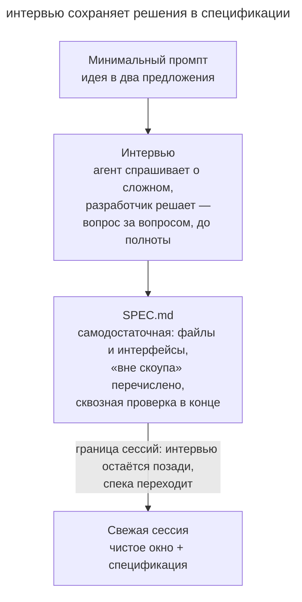

# Интервью у агента

## Назначение

Если требования к фиче ещё не записаны, коротко опишите агенту идею и попросите его расспросить вас. Агент спросит о сценариях, которые вы могли пропустить. По вашим ответам он составит самодостаточную спецификацию — документ, который можно понять, не читая интервью. Потом задачу по ней реализует свежая сессия.

## Также известен как

Let Claude interview you, интервью наоборот, agent-led interview.

## Проблема

Допустим, вы просите агента добавить вебхуки заказов. Вы представляете, как должна работать фича, но ещё не записали все сценарии. Опыт подсказывает вам обычный путь, а исключений вы не замечаете.

В вашем запросе не сказано, что делать, если получатель отвечает медленно. Значит, политику повторов агенту придётся выбрать самому, уже во время реализации. Даже подробное описание идеи может сохранить этот пропуск, ведь вы пишете его, опираясь на тот же опыт. Поэтому нужен собеседник, который спросит, что должно происходить при сбое.

## Решение

Опишите замысел в нескольких предложениях и попросите агента расспросить вас о том, что вы могли упустить. Например, так:

> Хочу построить [краткое описание]. Задавай вопросы о пользовательских сценариях, ограничениях и ошибках, которые я мог пропустить. Факты, доступные в проекте, проверь самостоятельно. После обсуждения запиши требования и критерии приёмки в SPEC.md.

Агент ищет места, где поведение фичи ещё не определено, и спрашивает вас о них. То, что записано в проекте, агент выясняет без вас, а продуктовые решения принимаете вы. Каждым ответом вы решаете то, что иначе агент выбрал бы сам во время реализации: например, что делать с медленным получателем.

В конце агент записывает **самодостаточную спецификацию** — документ, который следующий исполнитель поймёт, не читая интервью. В неё входят требования, границы задачи и сквозная проверка, то есть сценарий, который показывает, что фича работает целиком.

Реализацию начните в свежей сессии — новом разговоре с агентом. Длинное интервью уже заняло часть [контекстного окна](glossary.md), то есть объёма данных, который модель учитывает при каждом ответе. А свежая сессия начинает с чистым окном и спецификацией. Интервью она не видит, поэтому все важные решения из него должны быть записаны в документе.

## Структура

На схеме вы начинаете с короткой идеи, отвечаете на вопросы агента и получаете спецификацию.



Граница сессий на схеме — это момент, когда вы открываете новую сессию и передаёте ей SPEC.md.

## Участники / Компоненты

- **Разработчик** принимает решения и ограничивает объём задачи.
- **Агент-интервьюер** задаёт вопросы о пропущенных сценариях.
- **SPEC.md** — файл с требованиями и критериями приёмки.
- **Свежая сессия** реализует задачу по спецификации.

## Когда применять

- У вас есть идея большой фичи, но требования к ней ещё не записаны.
- Команде нужен собеседник, который поможет проверить, все ли сценарии учтены.
- Спецификации, которые вы писали в одиночку, раз за разом оказывались с дырами в одних и тех же местах.

Мелкую правку обычно достаточно просто поручить агенту. А готовый план полезнее проверить [гриллингом](grilling.md): там агент задаёт вопросы уже по написанному плану.

## Последствия и компромиссы

- ➕ Отвечая на вопросы агента, вы находите ошибки и ограничения, которые ещё не обсуждали.
- ➕ Спецификацию можно взять за основу [спеко-ориентированной разработки (SDD)](spec-driven-development.md).
- ➕ Исполнитель получает только отобранные решения, без всей истории интервью.
- ➖ Подробное интервью отнимает у вас время и внимание.
- ➖ Если агент не видит код, он может спрашивать вас о том, что уже записано в проекте.
- ➖ Если вы не принимаете решений, агент заполнит спецификацию своими предположениями.

## Реализация

1. Опишите идею в нескольких предложениях и попросите агента выяснить, какие сценарии вы пропустили.
2. Обсуждайте с агентом варианты ответа. Если решения пока нет, запишите открытый вопрос.
3. Попросите агента сохранить спецификацию в _SPEC.md_.
4. Перечитайте требования, ограничения и сквозную проверку. Уточните места, которые исполнитель не поймёт без интервью.
5. Передайте документ свежей сессии. Если работа долгая, добавьте к спецификации план и задачи по [SDD](spec-driven-development.md).

### Если ответ знает другой человек

Бывает, что агент спрашивает о правиле, которого вы не знаете. Тогда выясните, кто может его объяснить и какое решение зависит от ответа. Попросите агента подготовить для этого человека отдельный опросник: контекст задачи, вопросы в порядке важности и место для ответов. Раз контекст задачи есть в самом опроснике, его можно отдать эксперту, который не участвовал в вашем разговоре с агентом.

Например, вы готовите миграцию биллинга, и правила возврата должна уточнить финансовая команда. Тогда агент спросит в опроснике, что происходит, если клиент использовал только часть периода, и какие исключения предусмотрены договором. Если на какой-то вопрос ответят «не знаю», запишите его как открытый. Когда ответы придут, проверьте их и попросите агента обновить требования.

Готовить такой опросник умеет скилл [to-questionnaire](https://github.com/mattpocock/skills/blob/main/skills/productivity/to-questionnaire/SKILL.md). [Скилл](glossary.md) — это повторяемая процедура, записанная в инструкции для агента. Сначала to-questionnaire спрашивает вас, кому адресован опросник и какие сведения нужно получить. Но отправить опросник и перенести ответы в спецификацию команда должна сама: скилл этого не делает.

## Пример

Вернёмся к вебхукам заказов. Вы начинаете с такого запроса:

> Хочу добавить вебхуки, чтобы клиенты получали события о заказах. Интервьюируй меня подробно, копай то, о чём я не подумал, потом запиши спецификацию в SPEC.md.

Агент по очереди расспрашивает вас, что делать при ошибках доставки. Когда он спрашивает о получателе, который постоянно отвечает медленно, вы понимаете, что пропустили этот сценарий. Вы договариваетесь с агентом: после заданного числа неудач вебхук отключается, а клиент получает уведомление.

Агент записывает эти условия в _SPEC.md_ вместе с форматом событий, подписью и политикой повторов. Вот фрагмент про отключение вебхука, который вы согласовали:

```markdown
Отключаем вебхук после пяти подряд неудачных попыток доставки.
Неудачей считаем ответ вне диапазона 200–299 или отсутствие ответа
за 10 секунд. Успешная доставка сбрасывает счётчик в ноль.
После пятой неудачи прекращаем отправку и создаём одно уведомление
в кабинете клиента. Включить вебхук снова может сам клиент.
```

Во фрагменте есть порог, способ подсчёта неудач и наблюдаемый результат. Поэтому по нему можно построить сквозную проверку. Она воспроизводит пять неудач и убеждается, что вебхук отключён, а клиент получил уведомление. Отдельный сценарий вставляет успешную доставку между неудачами и проверяет, что счётчик сбросился.

Это условия учебного продукта. В своём продукте подберите значения под свою нагрузку и требования к доставке.

## Антипаттерны и частые ошибки

- **«Как считаешь лучше» на всё.** Если вы так отвечаете на каждый вопрос, в документ вместо ваших решений попадут догадки агента.
- **Интервью без файла.** Важные решения остаются только в разговоре, и следующая сессия их не увидит.
- **Исполнение в заполненном окне.** Длинное интервью занимает место в контекстном окне, которое понадобится для реализации. Передайте согласованную спецификацию свежей сессии.
- **Только очевидные вопросы.** Если агент спрашивает только о том, что и так ясно, пропуски остаются незамеченными. Просите его спрашивать об исключениях и ограничениях, которые вы ещё не обсуждали. В промпте из примера для этого есть слова «копай то, о чём я не подумал».
- **Повторное интервью по готовому плану.** Если план уже написан, проверьте его решения [гриллингом](grilling.md), а не новым интервью.

## Известные применения

- **Claude Code best practices** советуют проводить интервью через инструмент AskUserQuestion, сохранять итог в SPEC.md и реализовывать его в свежей сессии.
- **Kiro** составляет требования в диалоге с вами, и вы подтверждаете их поэтапно.
- **Скиллы Мэтта Покока** сохраняют итоги `/grill-with-docs` в CONTEXT.md и ADR — записи об архитектурных решениях.

## Связанные паттерны

- [Гриллинг](grilling.md) проверяет уже написанный план.
- [Спеко-ориентированная разработка](spec-driven-development.md) берёт результат интервью за основу плана.
- [Четыре фазы](explore-plan-code-commit.md) отделяют исследование задачи от её реализации.
- [Преждевременная спецификация](premature-specification.md) — антипаттерн: вы выбираете реализацию раньше, чем уточнили требования.
