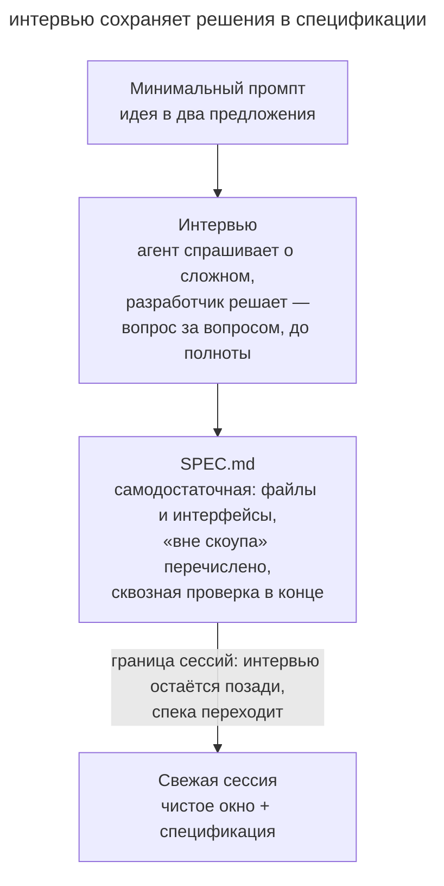

# Интервью у агента

## Назначение

Начать с краткого описания идеи и поручить агенту уточнить требования вопросами. По ответам агент составляет самодостаточную спецификацию, которую получает свежая сессия реализации.

## Также известен как

Let Claude interview you, интервью наоборот, agent-led interview.

## Проблема

Разработчик представляет будущую фичу, но ещё не записал все сценарии. Собственный опыт подсказывает обычный путь и оставляет незаметными исключения.

Например, запрос «добавить вебхуки заказов» не определяет поведение при медленном получателе. Во время реализации агенту придётся выбрать политику повторов самостоятельно.
Длинное описание идеи может сохранить тот же пропуск. Нужен участник, который задаст вопрос о поведении при сбое.

## Решение

Опишите замысел и попросите агента уточнить трудные места.

> Хочу построить [краткое описание]. Задавай вопросы о пользовательских сценариях, ограничениях и ошибках, которые я мог пропустить. Факты, доступные в проекте, проверь самостоятельно. После обсуждения запиши требования и критерии приёмки в SPEC.md.

Агент помогает обнаружить неопределённость, а разработчик принимает продуктовые решения. Каждый ответ уточняет поведение, которое иначе пришлось бы выбирать при реализации.

Итогом служит **самодостаточная спецификация**. В ней записаны требования, границы задачи и сквозной сценарий проверки. Для существующей системы полезны ссылки на затронутые интерфейсы и файлы. Следующий исполнитель должен понять документ без доступа к интервью.

Передайте спецификацию свежей сессии, чтобы её окно было доступно для реализации. Существенные решения интервью уже должны быть записаны в документе.

## Структура



Схема показывает переход от краткой идеи через вопросы к спецификации. Граница перед реализацией означает передачу документа в новую сессию.

## Участники / Компоненты

- **Разработчик** принимает решения и ограничивает объём задачи.
- **Агент-интервьюер** задаёт вопросы о пропущенных сценариях.
- **SPEC.md** сохраняет требования и критерии проверки.
- **Свежая сессия** реализует задачу по документу.

## Когда применять

- Идея большой фичи ещё не оформлена в требования.
- В команде нужен собеседник, который поможет проверить полноту сценариев.
- Прошлые спеки, написанные в одиночку, стабильно оказывались с дырами в одних и тех же местах.

Для мелкой правки обычно достаточно прямой постановки. Готовый план полезнее проверить через [гриллинг](grilling.md).

## Последствия и компромиссы

- ➕ Вопросы помогают обнаружить необсуждённые ошибки и ограничения.
- ➕ Спецификация становится входом для [процесса SDD](spec-driven-development.md).
- ➕ Исполнитель получает отобранные решения без полной истории интервью.
- ➖ Подробное интервью требует времени и внимания.
- ➖ Без доступа к коду агент может тратить вопросы на сведения, которые уже записаны в проекте.
- ➖ Если разработчик не принимает решений, спецификация заполняется предположениями агента.

## Реализация

1. Опишите идею в нескольких предложениях и попросите выяснить пропущенные сценарии.
2. Обсуждайте варианты ответов. Если решения пока нет, зафиксируйте открытый вопрос.
3. Попросите сохранить спецификацию в `SPEC.md`.
4. Проверьте требования, ограничения и сквозной сценарий приёмки. Уточните то, что исполнитель не сможет понять из документа.
5. Передайте документ новой сессии. Для долгой работы добавьте план и задачи через [SDD](spec-driven-development.md).

## Пример

Разработчик начинает с запроса о вебхуках.

> Хочу добавить вебхуки, чтобы клиенты получали события о заказах. Интервьюируй меня подробно, копай то, о чём я не подумал, потом запиши спецификацию в SPEC.md.

Агент последовательно уточняет поведение при ошибках доставки. На вопросе о постоянно медленном получателе разработчик замечает пропущенный сценарий. Они согласуют отключение вебхука после заданного числа неудач с уведомлением клиента.

В _SPEC.md_ агент записывает выбранные условия. Например, команда согласовала такой фрагмент требования.

```markdown
Отключаем вебхук после пяти подряд неудачных попыток доставки.
Неудачей считаем ответ вне диапазона 200–299 или отсутствие ответа
за 10 секунд. Успешная доставка сбрасывает счётчик в ноль.
После пятой неудачи прекращаем отправку и создаём одно уведомление
в кабинете клиента. Включить вебхук снова может сам клиент.
```

В этом фрагменте указаны порог, способ подсчёта и наблюдаемый результат. Сквозная проверка воспроизводит пять неудач и проверяет отключение с уведомлением. Отдельный сценарий вставляет успешную доставку между неудачами и подтверждает сброс счётчика. Эти условия относятся к учебному продукту; команда выбирает значения для своей нагрузки и требований к доставке.

## Анти-паттерны и частые ошибки

- **«Как считаешь лучше» на всё.** Без решений разработчика документ заполняется догадками агента.
- **Интервью без файла.** Существенные решения остаются недоступны следующей сессии.
- **Исполнение в заполненном окне.** Длинное интервью занимает контекст реализации. Передайте согласованную спецификацию новой сессии.
- **Только очевидные вопросы.** Просите проверить исключения и ограничения, которые ещё не обсуждались.
- **Повторное интервью по готовому плану.** Используйте [гриллинг](grilling.md), чтобы проверить существующие решения.

## Известные применения

- **Claude Code best practices** описывают интервью через AskUserQuestion, сохранение SPEC.md и реализацию в свежей сессии.
- **Kiro** формирует требования в диалоге с поэтапным подтверждением.
- **Скилы Мэтта Покока** сохраняют результаты `/grill-with-docs` в CONTEXT.md и ADR.

## Связанные паттерны

- [Гриллинг](grilling.md) проверяет уже написанный план.
- [Спеко-ориентированная разработка](spec-driven-development.md) использует результат интервью для планирования.
- [Четыре фазы](explore-plan-code-commit.md) помогает организовать исследование и реализацию задачи.
- [Преждевременная спецификация](premature-specification.md) напоминает о риске выбора реализации до уточнения требований.
