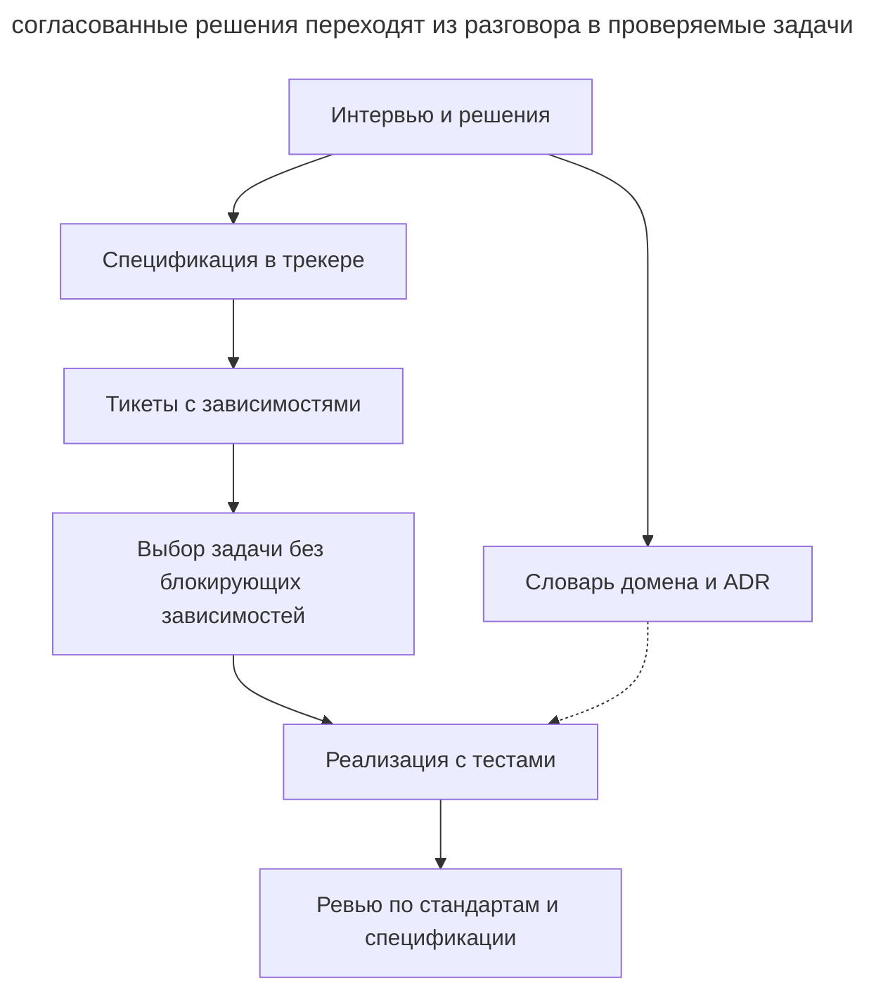

# Скиллы Мэтта Покока

_Команды и возможности проверены 21 сентября 2026 года._

[Пак скиллов Мэтта Покока](https://github.com/mattpocock/skills) реализует [спеко-ориентированную разработку](spec-driven-development.md) через набор [процедур для кодинг-агента](skills-as-packaged-workflows.md). Спецификация и связанные тикеты попадают в **трекер задач**, где команда продолжает привычную работу.

## Установка и настройка

Для редактируемой установки используйте `npx skills@latest add mattpocock/skills`. Для управляемой установки через маркетплейс Claude Code предусмотрена команда `/plugin install mattpocock-skills`. После установки один раз запустите `/setup-matt-pocock-skills`, который согласует трекер, метки триажа и расположение доменных документов. Конфигурация сохраняется в _docs/agents/_; поддерживаются GitHub, GitLab, Linear, локальные Markdown-файлы и настраиваемые процессы.

## Рабочий процесс

Основной процесс состоит из нескольких фаз.

1. **Интервью.** `/grill-me` задаёт по одному вопросу с рекомендацией. Факты скилл ищет в коде, решения согласует с человеком. `/grill-with-docs` дополнительно сохраняет термины в _CONTEXT.md_ и архитектурные решения в ADR через `domain-modeling`.
2. **Спецификация.** `/to-spec` собирает требования из обсуждения и публикует документ с меткой `ready-for-agent`. Конкретные пути файлов и обычные листинги в него не включаются, поскольку быстро устаревают. Исключение составляет короткий фрагмент из прототипа, который точнее фиксирует принятое решение, например модель состояний. Границы тестирования скилл согласует с пользователем.
3. **Задачи.** `/to-tickets` создаёт трассирующие тикеты с самостоятельным проверяемым результатом и блокирующими связями. Агент выбирает тикет, зависимости которого закрыты. Для широкого механического рефакторинга используется expand–contract.
4. **Реализация.** `/implement` выполняет задачу с `/tdd` на согласованных границах и запускает проверки типов и тесты.
5. **Ревью.** `/code-review` проверяет стандарты проекта и требования спецификации в отдельных контекстах.

Схема показывает, какие артефакты связывают разговор с реализацией.

В этой схеме трекер хранит требования и очередь работы. Словарь и ADR дополняют задачу смыслом терминов и причинами решений, а ревью сверяет результат с исходной спецификацией.

Дополнительные скиллы поддерживают другие этапы работы.

- `/wayfinder` создаёт карту исследовательских вопросов для большого замысла.
- `/triage` доводит входящие задачи до брифа и статуса готовности.
- `/prototype` проверяет конкретный вопрос одноразовым экспериментом.
- `/handoff` передаёт состояние работы следующей сессии.

## Артефакты

| Артефакт | Где живёт |
| ---------- | ----------- |
| Спецификация (PRD) | Иссью в трекере с меткой `ready-for-agent` |
| Тикеты с blocking-связями | Трекер (или файлы в _.scratch/\<фича\>/issues/_, если трекер локальный) |
| _CONTEXT.md_ | Корень репозитория: доменный глоссарий |
| ADR | _docs/adr/_: архитектурные решения |
| Handoff-документ | Временный каталог ОС — намеренно вне репозитория |

## Чем отличается

- Спецификации и тикеты живут в трекере вместе с задачами команды.
- Интервью помогает обнаружить неопределённость до записи спецификации.
- Каждый трассирующий тикет заканчивается проверяемым поведением и явно задаёт зависимости.
- Глоссарий и ADR пополняются по ходу обсуждения и используются остальными скиллами.

## Когда выбирать

Пак подходит команде, которая хочет организовать SDD внутри кодинг-агента и существующего трекера. Управляемая установка доступна в Claude Code, редактируемая позволяет менять процедуры под проект. [OpenSpec](openspec.md) удобен для хранения пакета изменения в репозитории, а [Superpowers](superpowers.md) предлагает другой набор скиллов с обязательными контрольными точками.
