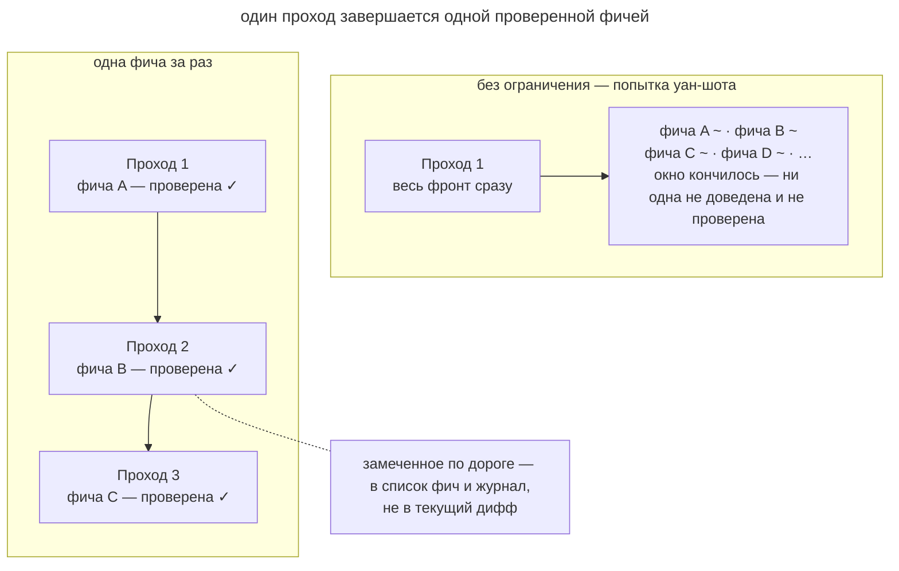

# Одна фича за раз

## Назначение

Ограничить проход одной фичей и завершить её проверкой перед переходом к следующей. Тогда в окне остаётся место для разбора ошибок и доведения сценария до рабочего состояния.

## Также известен как

One feature at a time, one feature per session, инкрементальный прогресс; родня WIP-лимита из канбана.

## Проблема

На большой задаче агент может начать несколько фич подряд. Файлов становится больше, но ни один сценарий ещё нельзя проверить целиком.

Например, сессия одновременно меняет поиск, фильтры и экспорт заметок. К моменту заполнения окна каждая часть требует доработки. Следующая сессия сначала выясняет, какие части можно использовать и какие проверки уже запускались. Такое восстановление отнимает время у реализации, а незавершённые изменения мешают локализовать ошибки.

## Решение

Закрепите правило **завершать одну фичу за проход**. Для каждого пункта выполняйте полный цикл.

1. Выберите непройденный пункт из [списка фич](feature-list-harness.md) или один тикет.
2. Реализовать только его.
3. Пройдите пользовательский сценарий через [петлю обратной связи](give-agent-a-way-to-verify.md).
4. Обновите статус, создайте коммит и запишите результат в [журнал прогресса](progress-file.md).

Попутные находки сохраняйте отдельными задачами или заметками. Если они блокируют текущий сценарий, явно пересмотрите план. Следующую фичу начинайте после завершения текущей, даже если обе помещаются в одну сессию.

Размер фичи должен оставлять место для проверки и исправлений. При таком ограничении обрыв сессии оставляет одну незавершённую часть, а предыдущие результаты уже сохранены и проверены.

## Структура

Верхняя часть схемы показывает несколько начатых фич без проверки.

Нижняя показывает последовательные проходы с завершённым результатом каждого. Прогресс измеряется количеством проверенных сценариев.

## Участники / Компоненты

- **Проход** посвящён одной фиче и может занимать сессию или её часть.
- **Фича** задаёт самостоятельный проверяемый результат.
- **Список фич** хранит очередь работы.
- **Агент** реализует и проверяет выбранный пункт.
- **Разработчик** удерживает границы задачи и принимает результат.

## Когда применять

- Работа разбита на список фич с отдельными критериями проверки.
- Агент выполняет длительные автономные проходы.
- Попутные задачи регулярно мешают завершить исходную.

Для миграции формата или массового переименования нужен отдельный проход со своим критерием завершения. Такие изменения не всегда удобно делить по пользовательским фичам.

## Последствия и компромиссы

- ➕ Каждый проход оставляет проверенный результат.
- ➕ Контекст доступен для проверки и исправления одной фичи.
- ➕ После обрыва нужно восстановить состояние только текущего пункта.
- ➖ Проверка каждого пункта требует времени до перехода к следующему.
- ➖ Общие подготовительные изменения приходится планировать отдельно.
- ➖ Разработчику тоже нужно удерживаться от расширения текущей задачи.

## Реализация

1. Запишите в [память проекта](claude-md-memory.md) правило завершения одной фичи за проход и отдельной фиксации попутных находок.
2. Назовите конкретный пункт или попросите выбрать следующую непройденную фичу.
3. Определите завершение через проверку, обновлённый статус, коммит и запись в журнале.
4. Сохраняйте попутные баги и идеи в отдельных задачах, если они не блокируют текущую работу.
5. Начинайте следующий пункт новым проходом после фиксации предыдущего.
6. Планируйте миграции и общие подготовительные изменения отдельно.

## Пример

В сервисе заметок из [главы о списке фич](feature-list-harness.md) разработчик запускает проход по очереди.

> Возьми следующую непройденную фичу из feature-list.json и доведи до passes.

Агент выбирает поиск по тегу и замечает сбой пагинации, который не мешает проверить поиск. Он записывает баг отдельной задачей и продолжает выбранный сценарий. После проверки поиска через браузер агент обновляет статус, делает коммит и записывает результат в журнале.

Следующая сессия получает работающий поиск и отдельную задачу по пагинации. Ей не нужно разбирать смешанный дифф двух незавершённых изменений.

## Антипаттерны и частые ошибки

- **Попытка уан-шота.** Большой объём работы может заполнить окно до проверки первого сценария.
- **«Заодно».** Попутные правки расширяют дифф и откладывают завершение. Записывайте их отдельно.
- **Фича без финала.** Непроверенный код оставляет следующей сессии работу по восстановлению состояния.
- **Несколько начатых пунктов.** Агент расходует контекст на переключение между незавершёнными сценариями.
- **Попутный рефакторинг.** Смешанный дифф требует одновременно проверять новое поведение и сохранение старого.

## Известные применения

- **Харнес Anthropic для долгоживущих агентов** ограничивает агента выбранной фичей и задаёт порядок завершения сессии.
- **Superpowers** разбивает план на небольшие задачи для отдельных сабагентов.
- **Скиллы Мэтта Покока** реализуют трассирующие тикеты по одному через `/implement`.
- **WIP-лимиты канбана** ограничивают объём незавершённой работы.

## Связанные паттерны

- [Список фич](feature-list-harness.md) задаёт очередь и хранит проверенные статусы.
- [Петля обратной связи](give-agent-a-way-to-verify.md) определяет готовность фичи.
- [Журнал прогресса](progress-file.md) сохраняет состояние прохода и попутные находки.
- [Четыре фазы](explore-plan-code-commit.md) завершает работу проверкой и коммитом.
