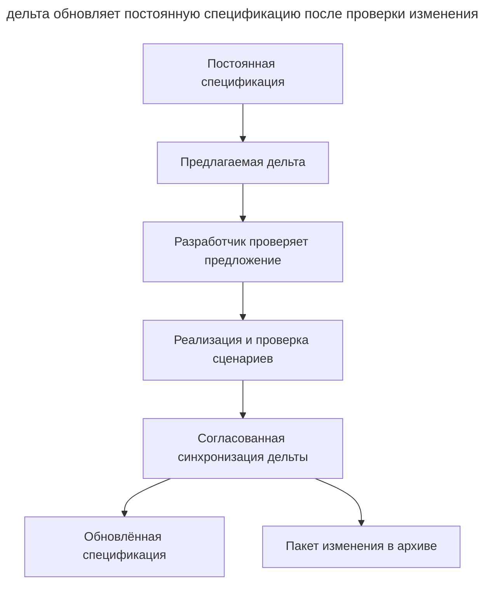

# OpenSpec

_Команды и возможности проверены 21 сентября 2026 года._

[OpenSpec](https://github.com/Fission-AI/OpenSpec) от Fission-AI организует [SDD](spec-driven-development.md) вокруг **изменения** с этапами propose, review, apply и archive. Постоянные спецификации описывают систему, а дельты фиксируют предлагаемые изменения требований.

OpenSpec поддерживает разные кодинг-агенты и ассистенты, включая Claude Code, Codex, Cursor и GitHub Copilot.

## Установка

CLI устанавливается через npm и требует Node.js ≥ 20.19.

```sh
npm install -g @fission-ai/openspec@latest
openspec init
```

`openspec init` создаёт каталог _openspec/_ и регистрирует слэш-команды с префиксом `/opsx:`; `openspec update` обновляет инструкции для агентов после апгрейда.

## Рабочий процесс

Набор команд зависит от профиля. Выберите его через `openspec config profile`, затем выполните `openspec update` в проекте, чтобы применить выбор к инструкциям агента. Базовый рабочий процесс проходит следующие шаги.

1. `/opsx:explore` помогает исследовать код и сравнить варианты до подготовки артефактов.
2. `/opsx:propose <идея>` создаёт пакет предложения, который разработчик проверяет до реализации.
3. `/opsx:apply` выполняет задачи из чек-листа.
4. `/opsx:archive` предлагает синхронизировать дельты с постоянными спецификациями, если это ещё не сделано, и переносит изменение в архив.

Расширенный профиль включает `/opsx:new`, `/opsx:continue`, `/opsx:ff`, `/opsx:verify`, `/opsx:bulk-archive` и `/opsx:onboard`. Они поддерживают поэтапную подготовку, проверку и архивирование больших изменений.

При завершении изменения выполните `/opsx:archive` и подтвердите предложенную синхронизацию дельт. Если спецификации уже обновлены через `/opsx:sync`, повторная синхронизация не нужна. Архивирование сохраняет артефакты изменения; порядок относительно мержа команда выбирает в своём процессе.

Схема показывает, как пакет изменения связывает реализацию и постоянное описание системы.



Здесь спецификация сохраняется отдельно от предложения. Синхронизация переносит принятые требования из дельты, а архив хранит объяснение и историю изменения.

Синтаксис зависит от агента. Codex может показывать `$openspec-propose`, а Cursor и GitHub Copilot используют форму `/opsx-propose`. Точный синтаксис выбранного инструмента печатает `openspec init`.

## Артефакты

Каталог _openspec/_ разделяет постоянные спецификации и пакеты изменений.

| Путь | Что лежит |
| ------ | ----------- |
| _openspec/specs/_ | Постоянные спецификации — актуальная модель того, что _уже построено_ |
| _openspec/changes/\<изменение\>/proposal.md_ | Зачем меняем |
| _openspec/changes/\<изменение\>/specs/_ | Дельты требований с конкретными сценариями |
| _openspec/changes/\<изменение\>/design.md_ | Технический подход |
| _openspec/changes/\<изменение\>/tasks.md_ | Чек-лист реализации |
| _openspec/changes/archive/_ | Завершённые изменения |

## Пример изменения требования

В сервисе доставки событий вебхук отключается после пяти неудач подряд. Постоянная спецификация в _openspec/specs/webhooks/spec.md_ содержит это правило.

```markdown
### Requirement: Delivery failure cutoff
Система SHALL отключать вебхук после пяти неудачных попыток подряд.

#### Scenario: Failed deliveries reach cutoff
- **WHEN** пятая подряд попытка доставки завершается неудачей
- **THEN** вебхук отключается
```

Команда согласовала другой порог для временно недоступных получателей. В пакете изменения агент создаёт дельту в _openspec/changes/raise-cutoff/specs/webhooks/spec.md_. Для изменяемого требования он сохраняет заголовок и приводит новое требование со сценарием целиком.

```markdown
## MODIFIED Requirements

### Requirement: Delivery failure cutoff
Система SHALL отключать вебхук после десяти неудачных попыток подряд.

#### Scenario: Failed deliveries reach cutoff
- **WHEN** десятая подряд попытка доставки завершается неудачей
- **THEN** вебхук отключается
```

В этом примере `MODIFIED Requirements` обозначает замену существующего требования. После реализации и проверки команда подтверждает sync при `/opsx:archive`. В постоянном _spec.md_ требование `Delivery failure cutoff` теперь содержит порог десять и соответствующий сценарий; маркер `MODIFIED Requirements` остаётся частью дельты в архиве. Если предложение отклонено, постоянное правило с порогом пять не меняется. Формат разделов и сценариев описан в [документации OpenSpec](https://github.com/Fission-AI/OpenSpec/blob/main/docs/concepts.md).

## Чем отличается

- Постоянные спецификации описывают текущее требуемое поведение системы.
- Дельта фиксирует разницу между текущими и предлагаемыми требованиями.
- Процесс рассчитан на последовательные изменения существующей кодовой базы.
- Общие спецификации помогают команде согласовать требования и историю их изменения.

## Когда выбирать

OpenSpec подходит для существующей системы, требования к которой нужно поддерживать вместе с кодом. Для процесса на основе скиллов с обязательными контрольными точками рассмотрите [Superpowers](superpowers.md), а для работы через трекер задач сравните [пак Мэтта Покока](matt-pocock-skills.md).
