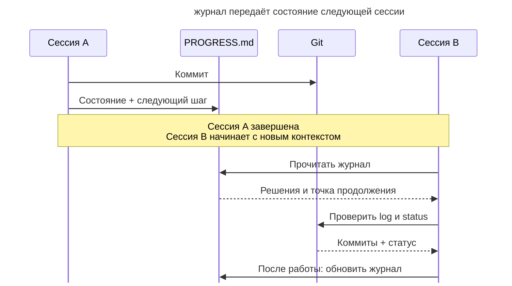

# Журнал прогресса

## Назначение

Вести рядом с кодом журнал состояния долгой работы. Агент обновляет его по ходу и читает в начале новой сессии, чтобы узнать, что осталось сделать и какие подходы уже проверены.

## Также известен как

Progress file, progress log; _claude-progress.txt_ из статьи Anthropic про харнесы, _PROGRESS.md_.

## Проблема

При многодневной миграции новые сессии получают код и коммиты, но могут не знать причин незавершённого решения.

Например, вчера агент проверил адаптер старого API и отказался от него из-за несовместимой модели возвратов. В git осталась только принятая реализация. Без записи причины новый агент может снова предложить адаптер и повторить тот же эксперимент. Восстановление таких решений по файлам и переписке задерживает полезную работу.

Автоматическое сжатие контекста может сохранить не все причины решений. Журнал позволяет выбрать их явно.

## Решение

Создайте журнал в репозитории и обновляйте его после значимого шага. Новая сессия читает журнал и последние коммиты перед продолжением работы.

В журнале сохраняйте сведения, которых недостаточно в git-истории.

- **Текущее состояние** показывает, что работает и что ещё не завершено.
- **Следующий шаг** задаёт первое действие после возобновления.
- **Известные проблемы** предупреждают о найденных ограничениях и сбоях.
- **Отброшенные подходы** сохраняют результаты экспериментов и причины отказа.

Git показывает изменения кода, а журнал объясняет состояние и направление работы. На подробности коммитов достаточно ссылаться.

Запишите порядок чтения и обновления журнала в [память проекта](claude-md-memory.md), чтобы новые сессии получали эту инструкцию.

## Структура

Каждая сессия читает сохранённое состояние перед работой и обновляет его перед передачей следующей сессии.



Журнал объясняет, почему работа остановилась в этой точке и что делать дальше. Git показывает фактические изменения; при расхождении с журналом новая сессия сначала выясняет текущее состояние.

## Участники / Компоненты

- **Журнал прогресса** (_PROGRESS.md_) хранит состояние, следующий шаг и причины решений.
- **Git-история** сохраняет изменения кода.
- **Агент** читает журнал при старте и обновляет после значимых шагов.
- **Разработчик** задаёт порядок работы и проверяет записи.
- **Память проекта** сохраняет инструкцию ведения журнала.

## Когда применять

- Задача занимает несколько сессий.
- Долгие сессии требуют сжатия контекста.
- Исполнители сменяют друг друга при работе над одной задачей.

Для короткой задачи обычно достаточно плана в сессии.

## Последствия и компромиссы

- ➕ Новая сессия быстрее находит следующий шаг.
- ➕ Агент видит причины отказа от уже проверенных подходов.
- ➕ Разработчик может оценить состояние без чтения всех диффов.
- ➖ Пропущенное обновление вводит следующую сессию в заблуждение.
- ➖ Без сокращения журнал сам становится избыточным контекстом (см. [инженерию контекста](context-engineering.md)).
- ➖ Пересказ коммитов увеличивает файл без объяснения состояния работы.

## Реализация

1. Создайте журнал и запишите порядок его использования в [память проекта](claude-md-memory.md).
2. Выделите состояние, следующий шаг, проблемы и отброшенные подходы. Формулируйте следующий шаг так, чтобы его можно было выполнить после обрыва сессии.
3. Объясняйте причины решений и незавершённую работу. На изменения кода ссылайтесь через коммиты.
4. Включите обновление журнала в завершение значимого шага вместе с проверкой и коммитом.
5. Держите текущее состояние наверху, а отработанные записи сокращайте.
6. Статусы фич храните в отдельном структурированном файле, где агент меняет определённые поля (см. [список фич](feature-list-harness.md)).

В [OpenSpec](openspec.md) отметки в _tasks.md_ и планы [Superpowers](superpowers.md) помогают продолжить работу над фичей. Журнал дополняет отметки причинами решений и открытыми проблемами; его можно использовать и без SDD-тулкита.

## Пример

Команда мигрирует платежи на новый шлюз и сохраняет состояние в _PROGRESS.md_.

```markdown
# Миграция платежей на шлюз PayFlow

## Состояние
Вебхуки переведены и покрыты тестами. Карта ошибок шлюза готова.
Возвраты — в работе.

## Следующий шаг
Перевести `RefundService`: он последний ходит в старый клиент.
Начать с идемпотентных ключей — см. «Отброшено».

## Известные проблемы
- Sandbox шлюза отклоняет суммы меньше 1.00 — в тестах используем 1.05.

## Отброшено
- Адаптер поверх старого интерфейса: не ложатся идемпотентные ключи
  PayFlow, дешевле переписать вызовы (подробности в ADR-0007).
```

Когда окно заканчивается, разработчик открывает новую сессию.

> Продолжаем миграцию на PayFlow. Начни с PROGRESS.md.

Агент читает журнал и git log, затем продолжает `RefundService`. Он видит причину отказа от адаптера и не повторяет эксперимент. После завершения возвратов агент записывает результат и следующий шаг.

## Антипаттерны и частые ошибки

- **Журнал-дневник.** Полная история действий затрудняет поиск текущего состояния.
- **Дубликат git log.** Перечень изменённых файлов уже доступен в коммитах. Журналу нужны причины решений и открытые задачи.
- **Обновление «потом».** Устаревшая запись направляет следующую сессию к неверному действию.
- **Статусы внутри рассказа.** При переписывании текста отметки могут потеряться. Используйте структурированные поля.
- **Журнал вместо передачи.** Для новой цели подготовьте отдельный [handoff](handoff.md), который отберёт сведения под следующий этап.

## Известные применения

- **Харнес Anthropic для долгоживущих агентов** использует _claude-progress.txt_ вместе с git-историей и списком фич при старте сессии.
- **Автопамять Claude Code** сохраняет заметки о проекте на уровне инструмента. Журнал в репозитории описывает конкретную долгую работу.
- **SDD-тулкиты** сохраняют задачи и отметки в [OpenSpec](openspec.md) и планах [Superpowers](superpowers.md).
- **Структурированные заметки** в статье Anthropic о контекст-инжиниринге сохраняют состояние за пределами окна.

## Связанные паттерны

- [Передача сессии](handoff.md) готовит документ для конкретного перехода между исполнителями.
- [Инженерия контекста](context-engineering.md) помогает отобрать содержимое журнала.
- [Память проекта](claude-md-memory.md) задаёт порядок чтения и обновления журнала.
- [Спеко-ориентированная разработка](spec-driven-development.md) связывает состояние работы со спецификацией и задачами.
