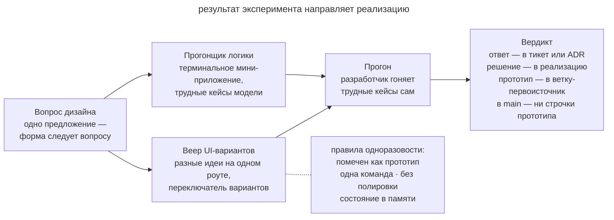

# Одноразовый прототип

## Назначение

Проверить конкретный вопрос проектирования небольшим одноразовым прототипом. После эксперимента команда сохраняет вывод и использует его при подготовке рабочей реализации.

## Также известен как

Throwaway prototype, spike (в терминах экстремального программирования), прототип-ответ; `/prototype` в скиллах Мэтта Покока.

## Проблема

Некоторые решения трудно проверить одним обсуждением. Модель состояний может выглядеть полной, пока её не применили к последовательности реальных действий.

Например, отмена подписки и реактивация работают по отдельности, но при реактивации до отложенной отмены старое событие остаётся в очереди. Чтобы заметить ошибку, полезно выполнить переходы и увидеть состояние после каждого. Для интерфейса прототип позволяет попробовать разные способы выполнить одну задачу и сравнить их на практике.

Полная реализация ради такой проверки обходится дорого. Быстрый прототип сокращает затраты, если команда заранее отделяет эксперимент от кода, который будет сопровождать.

## Решение

Сформулируйте вопрос и выберите минимальный эксперимент, способный дать ответ.

- Для **модели состояний** создайте терминальное приложение с командами и выводом состояния после каждого действия.
- Для **интерфейса** подготовьте несколько вариантов с переключателем и сравните их на одном пользовательском сценарии.

Ограничьте объём экспериментального кода.

1. Явно пометьте прототип в имени и описании.
2. Обеспечьте запуск одной командой.
3. Храните состояние в памяти, если вопрос не требует проверки постоянного хранилища.
4. Добавляйте только код, необходимый для эксперимента.

Агент может быстро собрать такой инструмент, поэтому стоимость проверки решения снижается. Это особенно полезно, когда неверный выбор потребует переделки нескольких модулей.

Запишите вопрос, наблюдения и вывод в тикет или ADR. Сохраните прототип в отдельной ветке со ссылкой из решения. Рабочую реализацию создавайте по проверенным требованиям с обычными тестами и обработкой ошибок.

## Структура

На схеме вопрос определяет форму прототипа.

Разработчик выполняет сценарии и записывает вывод. Решение переходит в рабочую реализацию, а экспериментальный код остаётся в отдельной ветке как свидетельство проверки.

## Участники / Компоненты

- **Вопрос проектирования** задаёт цель эксперимента.
- **Прототип** позволяет получить нужные наблюдения.
- **Разработчик** выполняет сценарии и принимает решение по результатам.
- **Агент** строит минимальный инструмент эксперимента.
- **Вывод** сохраняет проверенный вопрос, наблюдения и решение.

## Когда применять

- Модель имеет последовательности состояний, которые трудно проверить рассуждением.
- Нужно сравнить варианты интерфейса на практике.
- Для труднообратимого решения не хватает наблюдений.

Сначала проверьте, можно ли получить ответ чтением кода или документации. Прототип нужен, когда более дешёвых сведений недостаточно.

## Последствия и компромиссы

- ➕ Ошибка модели может обнаружиться до полной реализации.
- ➕ Участники обсуждают результаты одного эксперимента.
- ➕ Ограниченный объём снижает стоимость проверки идеи.
- ➖ Экспериментальный код легко принять за готовую основу продукта.
- ➖ Результат относится только к проверенному вопросу и условиям эксперимента.
- ➖ Прототип тратит время, если ответ уже доступен в документации.

## Реализация

1. Запишите вопрос одним предложением.
2. Выберите терминальный сценарий, UI-макет или другую форму, которая даст нужные наблюдения.
3. Задайте имя, команду запуска и минимальные ограничения эксперимента.
4. Выполните трудные сценарии и сохраните наблюдения.
5. Запишите вывод и принятое решение в тикет или ADR.
6. Сохраните прототип в отдельной ветке, а рабочую реализацию создавайте по проверенному решению.
7. Для отдельной сессии прототипа подготовьте [handoff](handoff.md) с вопросом и контекстом.

## Пример

В истории из главы о [передаче сессии](handoff.md) нужно проверить модель отмен для корпоративных контрактов с отложенным стартом. Разработчик передаёт новой сессии документ и задачу эксперимента.

> Прочитай /tmp/handoff-cancellation-prototype.md. Собери одноразовый терминальный прототип модели отмен с командами subscribe <дата старта>, cancel <дата>, reactivate и tick <дата>. После каждой команды печатай состояние подписки и очередь событий. Храни состояние в памяти и пометь прототип в имени.

Первый сценарий проверяет исходный вопрос. Разработчик назначает старт контракта на 1 октября, отмену на 25 сентября и переводит часы на 2 октября. В учебном эксперименте обработчик старта открывает доступ, хотя отмена уже вступила в силу. Такое наблюдение показывает, что одной очереди датированных событий недостаточно. При обработке старта нужно учитывать действующую отмену.

Второй сценарий проверяет реактивацию до отложенной отмены. Если в очереди остаётся прежнее событие отмены, оно позднее закроет восстановленную подписку. Команда фиксирует отдельное правило об аннулировании этого события при реактивации.

В ADR сохраняют оба наблюдения и решения с границами эксперимента. Прототип остаётся в _prototype/cancellation-model_, а тикет реализации получает ссылку на него. В рабочем коде оба сценария будут защищены тестами. Описанные наблюдения иллюстрируют возможные результаты прототипа; для своего проекта команда получает их реальным запуском.

## Антипаттерны и частые ошибки

- **«Допили этот прототип».** Экспериментальный код может не иметь защиты, нужной рабочей системе. Реализуйте принятое решение с обычными проверками качества.
- **Прототип без вопроса.** Без критерия нельзя определить, какие наблюдения завершат эксперимент.
- **Полировка одноразового.** Лишние абстракции увеличивают стоимость получения ответа.
- **Обобщение вывода.** Успех сценария не подтверждает нагрузку и другие условия, которых эксперимент не касался.
- **Потерянный вывод.** Если удалить код без записи результата, вопрос придётся исследовать повторно.

## Известные применения

- **Скиллы Мэтта Покока** реализуют эксперимент через `/prototype` с отдельными вариантами для логики и UI.
- **Spike solutions в экстремальном программировании** снимают технический риск коротким экспериментом.
- **«Design it twice» Джона Аустерхаута** предлагает сравнивать существенно разные варианты дизайна.
- **Трассирующие пули из «Прагматичного программиста»** дают код, который развивается дальше. Одноразовый прототип сохраняет только проверенное решение для новой реализации.

## Связанные паттерны

- [Петля обратной связи](give-agent-a-way-to-verify.md) связывает решение с наблюдаемым результатом проверки.
- [Передача сессии](handoff.md) сохраняет вопрос для отдельного эксперимента.
- [Четыре фазы](explore-plan-code-commit.md) позволяет вынести неопределённость плана в прототип.
- [Спеко-ориентированная разработка](spec-driven-development.md) сохраняет вывод прототипа как требование или ограничение.
