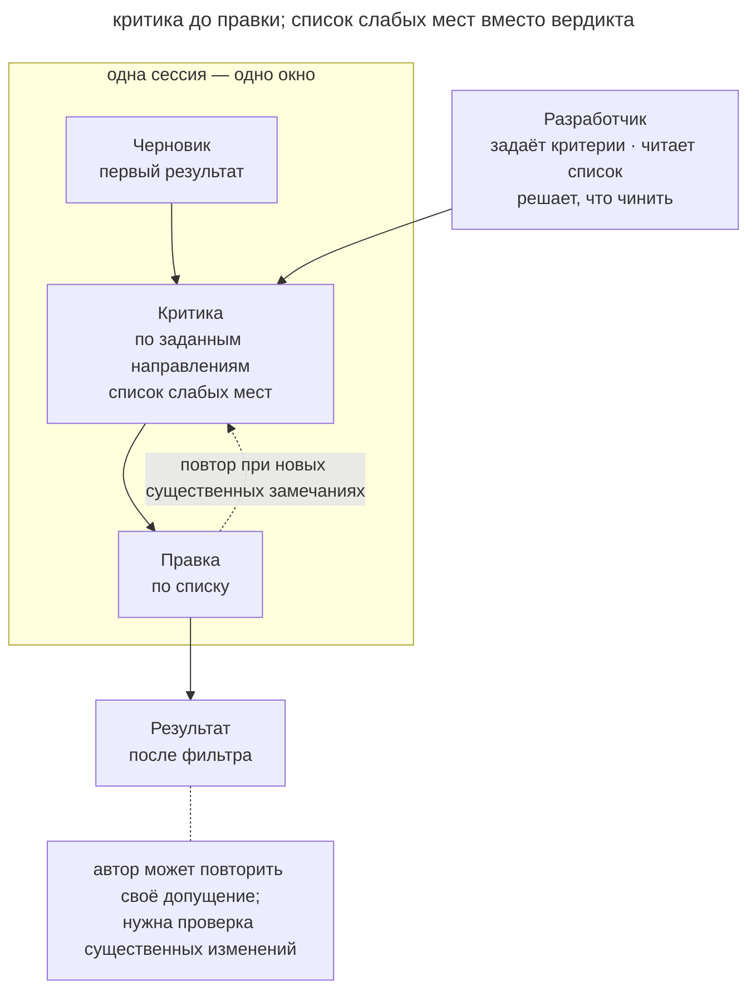

# Рефлексия

## Назначение

Попросить агента отдельно оценить собственный результат по заданным направлениям, затем исправить подтверждённые недостатки. Проверка проходит в том же окне и помогает улучшить черновик перед внешней оценкой.

## Также известен как

Reflection, self-critique, самокритика. Сходный цикл генерации и оценки используется в evaluator-optimizer.

## Проблема

Первый результат может пропустить требование или обработку ошибки, даже если обычный сценарий работает. Для таких упущений полезен отдельный проход проверки.

Например, функция экспорта создаёт корректный CSV, но разработчик ещё не проверял закрытие файла при ошибке записи. Просьба разобрать обработку ошибок направит агента к этому пути.
Полное ревью в новой сессии имеет дополнительные затраты на передачу контекста. Для небольшого черновика можно начать с [рефлексии](reflection.md), а существенные изменения передать [независимому рецензенту](writer-reviewer.md).
Просьба «сделай лучше» не задаёт предмет проверки, поэтому может привести лишь к переименованиям и комментариям.

Отдельная задача на поиск недостатков меняет фокус работы агента. Но найденные замечания всё равно требуют проверки.

## Решение

После того как результат получен, сделать два явных хода.

**Сначала получите критику без правок.** Укажите направления проверки и попросите описать конкретные недостатки с условиями их проявления. Например, для экспорта полезно проверить ошибки записи и размер данных.

**Затем выберите исправления.** Разработчик оценивает замечания, отделяет дефекты от принятых компромиссов и поручает агенту нужные изменения.

Разделение помогает увидеть, на каком основании агент меняет код. Иначе полезное исправление может смешаться с необязательной переделкой.

Автор и критик используют один контекст, поэтому могут повторить исходное неверное допущение. Если новый проход не добавляет проверяемых замечаний, остановите полировку и используйте тесты или свежий контекст.

## Структура

На схеме агент получает черновик, составляет список замечаний и исправляет выбранные пункты. Разработчик задаёт направления и принимает решения. Результат цикла всё ещё требует проверки, соответствующей риску изменения.

## Участники / Компоненты

- **Агент** создаёт и критикует результат в одном контексте.
- **Направления критики** задают свойства, которые нужно проверить.
- **Список замечаний** сохраняет найденные недостатки до правок.
- **Разработчик** оценивает замечания и выбирает исправления.

## Когда применять

- Для оценки читаемости или полноты требований недостаточно существующих автоматических проверок.
- Черновик нужно подготовить к независимому ревью.
- Требуется проверить план, спецификацию или документацию.
- Небольшой объём правки пока не оправдывает отдельную сессию рецензента.

## Последствия и компромиссы

- ➕ Для начала достаточно дополнительного запроса в текущей сессии.
- ➕ Агент может заметить пропущенный сценарий или требование.
- ➕ Приём применим к коду и документам.
- ➖ Критик может повторить допущения автора.
- ➖ Повторные проходы могут создавать косметические правки без новых находок.
- ➖ Формальное одобрение создаёт необоснованную уверенность в результате.

## Реализация

1. После получения результата попросите отдельную критическую оценку.
2. Укажите конкретные направления, например обработку ошибок и соблюдение требований.
3. Попросите описать недостатки с условиями проявления и доказательствами.
4. Разберите список и выберите исправления с учётом принятых ограничений.
5. Попросите правку по выбранным пунктам и остановитесь после одного-двух раундов.
6. Повторяющиеся критерии сохраните в команде или скиле.
7. Подтвердите исправления тестами или [независимым ревью](writer-reviewer.md), если этого требует изменение.

## Пример

Агент закончил экспорт отчёта в CSV. Перед коммитом разработчик просит проверить код.

> Найди проблемы в обработке ошибок, граничных случаев и памяти на больших данных. Для каждой покажи условие, при котором она проявляется. Пока ничего не правь.

Агент обнаруживает незакрытый дескриптор при ошибке записи и отсутствие заголовков у пустого отчёта. Он также отмечает, что отчёт целиком собирается в памяти. Разработчик выбирает исправления.

> Исправь закрытие файла и заголовки пустого отчёта. Выгрузки ограничены десятью тысячами строк, поэтому стриминг пока не нужен. Запиши это ограничение в комментарии.

Агент исправляет два дефекта и сохраняет выбранный способ сборки отчёта. Разбор замечаний позволил учесть известное ограничение объёма данных.

## Анти-паттерны и частые ошибки

- **Вопрос-вердикт.** Просьба одобрить код может дать формальное согласие. Запрашивайте конкретные недостатки и доказательства.
- **Критика вместе с правкой.** Сначала разберите замечания, затем меняйте код по выбранным пунктам.
- **Нет критериев.** Общая просьба улучшить код не задаёт предмет проверки.
- **Бесконечная полировка.** Если новые проходы не дают существенных находок, смените способ проверки.
- **Самокритика как доказательство.** Рефлексия помогает подготовить результат, но не подтверждает корректность сама по себе.

## Известные применения

- **Эндрю Ын** описывает Reflection как отдельный паттерн, в котором модель изучает свою работу для её улучшения.
- **Reflexion (Shinn et al., NeurIPS 2023)** сохраняет выводы саморефлексии между попытками в эпизодической памяти.
- **Anthropic evaluator-optimizer** автоматизирует цикл генерации, оценки и доработки результата.
- **Constitutional AI** использует критику ответов по списку принципов и их последующее переписывание в процессе обучения.

## Связанные паттерны

- [Петля обратной связи](give-agent-a-way-to-verify.md) добавляет проверяемый внешний сигнал.
- [Писатель и рецензент](writer-reviewer.md) переносит критику в свежий контекст.
- [TDD с агентом](tdd-with-agent.md) задаёт проверку поведения до реализации.
