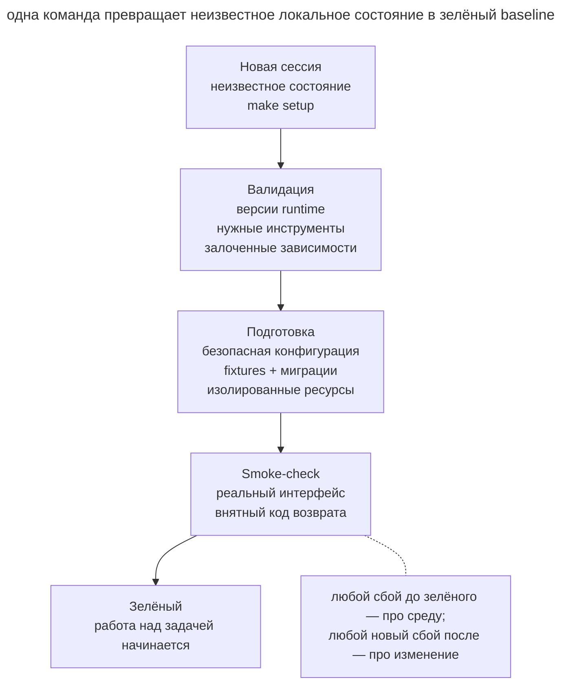

# Воспроизводимый старт агента

## Назначение

Дать новой сессии одну команду подготовки окружения и проверки исходного состояния. После её выполнения агент знает, что базовый сценарий работает, и может сравнивать с ним последующие изменения.

## Также известен как

Reproducible agent bootstrap, one-command setup, initializer script, green baseline.

## Проблема

Новая сессия открывает репозиторий и не знает, как его оживить. README перечисляет пять команд, часть устарела, `.env` нужно собрать из сообщения в чате, база ожидает ручную миграцию, а проверка требует отдельного сервиса. Агент перебирает варианты, случайно меняет конфигурацию и через двадцать минут получает падающий тест.

Если исходный тест уже падал, позднее трудно определить причину нового сбоя. В отдельном worktree ручная подготовка повторяется, увеличивая затраты каждой параллельной задачи.

Команда «установить зависимости» недостаточна. Готовность означает, что нужные инструменты доступны, безопасная конфигурация создана, сервисы подняты или заменены fixtures, а минимальный сквозной smoke-check проходит.

## Решение

Подготовьте идемпотентную команду, например `make setup` или `./scripts/bootstrap`, которая приводит поддерживаемое окружение к **проверенному исходному состоянию**.

Bootstrap последовательно выполняет четыре действия.

1. **Проверяет предпосылки**, включая версии среды выполнения и системных инструментов.
2. **Готовит локальное состояние** с зависимостями, безопасной конфигурацией и тестовыми данными.
3. **Запускает сервисы** либо сообщает известную неинтерактивную команду старта.
4. **Проверяет готовность** коротким smoke-тестом ключевого сценария.

Скрипт должен быть безопасен для повторного запуска. Он не требует продакшен-секретов, не трогает пользовательские данные и не маскирует красный baseline. Если предпосылка отсутствует, ошибка называет конкретную команду исправления.

Bootstrap проверяет стартовое состояние и использует зафиксированные версии зависимостей. Полный набор тестов запускается отдельно по требованиям задачи.

## Структура



Новая сессия входит с неизвестным локальным состоянием и вызывает единственную команду. Команда валидирует инструменты, создаёт безопасное состояние и запускает smoke-check. Только зелёный результат открывает работу над задачей; красный останавливает её и отделяет проблему среды от будущего диффа.

## Участники / Компоненты

- **Поддерживаемая база** задаёт ОС и версии инструментов.
- **Bootstrap-команда** повторяемо готовит окружение.
- **Lockfile** фиксирует версии зависимостей.
- **Безопасная конфигурация** использует локальные значения и тестовые данные.
- **Изолированные ресурсы** разделяют порты, базы и контейнеры экземпляров.
- **Smoke-check** проверяет минимальный рабочий сценарий.
- **Агент** запускает подготовку до реализации и сохраняет результат.

## Когда применять

- Репозиторий регулярно открывают новые разработчики, агенты, CI jobs или worktree.
- Запуск требует больше одной очевидной команды либо внешних сервисов.
- Агентские сессии короткие, и повторная настройка заметно съедает контекст.
- Параллельные задачи требуют независимых локальных экземпляров.
- Часто выясняется, что тесты падали до начала изменения.

Для простой библиотеки достаточно короткой команды установки и проверки. Объём bootstrap зависит от устройства проекта.

## Последствия и компромиссы

- ➕ Исходный результат помогает отделить существующие сбои от появившихся после правки.
- ➕ Новая сессия быстрее ориентируется и тратит контекст на продуктовую работу.
- ➕ Worktree и CI получают одинаковый путь подготовки, уменьшая эффект «у меня работает».
- ➕ Запуск в чистом окружении проверяет актуальность процедуры подготовки.
- ➖ Bootstrap становится продуктом внутри продукта и требует поддержки при изменении окружения.
- ➖ Полный setup может быть медленным; нужны кеширование и отдельный быстрый smoke, но без скрытого пропуска шагов.
- ➖ Идемпотентность сложна для баз и внешних сервисов; неосторожный повторный запуск может уничтожить данные.
- ➖ Локальные fixtures могут слишком отличаться от продакшена и дать ложную уверенность.

## Реализация

1. Выпишите путь от чистого checkout до первого успешного пользовательского действия. Уберите все шаги, которые живут только в личных заметках.
2. Зафиксируйте версии runtime и зависимостей lockfile-ом. Проверяйте несовместимые версии в начале с понятной ошибкой.
3. Создавайте конфигурацию из безопасного примера. Не копируйте реальные токены и не перезаписывайте существующий `.env` без явного решения.
4. Сделайте повторный запуск безопасным. Он должен подтверждать нужное состояние без дублирования данных.
5. Задавайте базу, порт и Compose project через параметр экземпляра или имя worktree.
6. Завершайте smoke-тестом через пользовательский интерфейс системы, например HTTP-запросом или CLI-командой.
7. Возвращайте ненулевой код при любой незавершённой фазе и печатайте следующий безопасный шаг.
8. Запускайте bootstrap в CI на чистом окружении, чтобы команда не протухала незаметно.

## Пример

Ниже показан каркас общей команды подготовки сервиса.

```make
setup:
	pnpm install --frozen-lockfile
	cp -n .env.example .env.local || true
	docker compose up -d db
	pnpm db:migrate
	pnpm smoke
```

Для реального проекта каркас нужно уточнить. Ошибка копирования конфигурации не должна скрываться за `|| true`. Порт и Compose project должны различаться между worktree, а smoke-тест должен ждать готовности базы с ограниченным тайм-аутом.

При успешной подготовке агент получает такой отчёт.

```text
$ make setup
runtime: node 24.8.0 ✓
dependencies: lockfile unchanged ✓
database: agent_auth_42 ready ✓
smoke: create and read note ✓
baseline: green
```

Если smoke-тест падает до изменений, агент фиксирует исходную проблему. Если сбой появился после реализации, он начинает проверку с нового диффа, учитывая возможность нестабильного теста или изменения внешней среды.

## Анти-паттерны и частые ошибки

- **README вместо команды.** Пять ручных шагов расходятся с реальностью и исполняются каждый раз немного иначе.
- **Только install.** Пакеты стоят, но конфигурация, база и пользовательский путь не проверены.
- **Боевые секреты.** Для локального старта требуется production-токен с широкими правами.
- **Неидемпотентный setup.** Второй запуск дублирует fixtures, сбрасывает базу или ломает первый.
- **Зелёный любой ценой.** `|| true` проглатывает значимую ошибку и объявляет неполный старт успешным.
- **Плавающие версии.** Одна команда сегодня устанавливает другой набор зависимостей, чем вчера.
- **Общие ресурсы.** Все worktree используют одну базу и порт, поэтому независимые сессии мешают друг другу.
- **Тяжёлый полный прогон.** Setup занимает час, хотя для доказательства старта достаточно пятиминутного smoke; разработчики перестают его запускать.

## Известные применения

- **Харнесс Anthropic для долгоживущих агентов** использует initializer agent, который создаёт `init.sh`, а каждая следующая сессия запускает сервер и базовый end-to-end тест до новой работы.
- **Dev containers и Codespaces** кодируют runtime, системные пакеты и команды подготовки в версионируемой конфигурации.
- **CI с чистого checkout** проверяет воспроизводимость установки без локального состояния автора.

Подход описан в статье [Effective harnesses for long-running agents](https://www.anthropic.com/engineering/effective-harnesses-for-long-running-agents).

## Связанные паттерны

- [Изолированная параллельная работа](isolated-parallel-work.md) использует bootstrap для каждого нового worktree.
- [Журнал прогресса](progress-file.md) сохраняет состояние после стартовой проверки.
- [Петля обратной связи](give-agent-a-way-to-verify.md) начинается с короткой проверки исходного поведения.
- [Одна фича за раз](one-feature-at-a-time.md) использует проверенный старт для ограниченного прохода.
