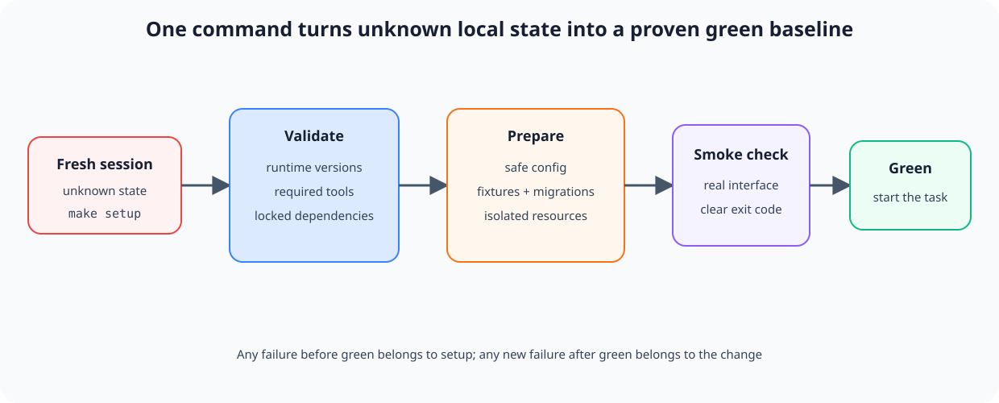

# Воспроизводимый старт агента

## Назначение

Дать каждой новой сессии или рабочему дереву одну команду, которая подготавливает зависимости и безопасную локальную конфигурацию, а затем доказывает, что исходное состояние работоспособно. Агент начинает задачу с известной зелёной базы, а не тратит контекст на археологию запуска.

## Также известен как

Reproducible agent bootstrap, one-command setup, initializer script, green baseline.

## Проблема

Новая сессия открывает репозиторий и не знает, как его оживить. README перечисляет пять команд, часть устарела, `.env` нужно собрать из сообщения в чате, база ожидает ручную миграцию, а проверка требует отдельного сервиса. Агент перебирает варианты, случайно меняет конфигурацию и через двадцать минут получает падающий тест.

Теперь непонятно, кто сломал систему: задача, агент или исходное окружение. Если сессия начинает реализацию на красной базе, каждое последующее изменение смешивает продуктовый дефект с проблемой установки. В новом worktree это повторяется заново, поэтому параллельность умножает не скорость, а расходы на подготовку.

Команда «установить зависимости» недостаточна. Готовность означает, что нужные инструменты доступны, безопасная конфигурация создана, сервисы подняты или заменены fixtures, а минимальный сквозной smoke-check проходит.

## Решение

Сделайте один идемпотентный entry point — например, `make setup` или `./scripts/bootstrap` — который переводит поддерживаемое чистое окружение в **проверенный зелёный baseline**.

Bootstrap выполняет четыре фазы:

1. **Проверяет предпосылки:** версии runtime и системных инструментов, а не надеется на случайный PATH.
2. **Подготавливает локальное состояние:** зависимости, безопасный `.env`, fixtures, миграции и уникальные ресурсы экземпляра.
3. **Запускает или описывает сервисы:** команда старта известна агенту и не требует интерактивных шагов.
4. **Доказывает готовность:** короткий smoke-check проверяет ключевой пользовательский путь и завершается понятным кодом возврата.

Скрипт должен быть безопасен для повторного запуска. Он не требует продакшен-секретов, не трогает пользовательские данные и не маскирует красный baseline. Если предпосылка отсутствует, ошибка называет конкретную команду исправления.

Bootstrap отвечает только за старт. Он не подменяет полную тестовую матрицу и не обновляет зависимости самовольно: воспроизводимость требует зафиксированных версий и одинакового результата сегодня и в следующем worktree.

## Структура



Новая сессия входит с неизвестным локальным состоянием и вызывает единственную команду. Команда валидирует инструменты, создаёт безопасное состояние и запускает smoke-check. Только зелёный результат открывает работу над задачей; красный останавливает её и отделяет проблему среды от будущего диффа.

## Участники / Компоненты

- **Поддерживаемая база** — явно перечисленные ОС, runtime и версии инструментов.
- **Bootstrap-команда** — единая идемпотентная точка входа.
- **Lockfile** — фиксирует разрешённые версии зависимостей.
- **Безопасная конфигурация** — локальные значения и fixtures без боевых секретов.
- **Изолированные ресурсы** — порты, базы и имена контейнеров конкретного экземпляра.
- **Smoke-check** — быстрый тест, доказывающий минимальную работоспособность.
- **Агент** — запускает bootstrap до чтения глубокой реализации и сохраняет его результат как baseline.

## Когда применять

- Репозиторий регулярно открывают новые разработчики, агенты, CI jobs или worktree.
- Запуск требует больше одной очевидной команды либо внешних сервисов.
- Агентские сессии короткие, и повторная настройка заметно съедает контекст.
- Параллельные задачи требуют независимых локальных экземпляров.
- Часто выясняется, что тесты падали до начала изменения.

Для библиотеки без runtime-зависимостей bootstrap может быть одной строкой. Паттерн требует единой проверенной точки входа, а не обязательно большого скрипта.

## Последствия и компромиссы

- ➕ Ошибка до зелёного baseline явно относится к окружению, а после — к изменению задачи.
- ➕ Новая сессия быстрее ориентируется и тратит контекст на продуктовую работу.
- ➕ Worktree и CI получают одинаковый путь подготовки, уменьшая эффект «у меня работает».
- ➕ Документация запуска проверяется исполнением, а не надеждой, что список команд ещё актуален.
- ➖ Bootstrap становится продуктом внутри продукта и требует поддержки при изменении окружения.
- ➖ Полный setup может быть медленным; нужны кеширование и отдельный быстрый smoke, но без скрытого пропуска шагов.
- ➖ Идемпотентность сложна для баз и внешних сервисов; неосторожный повторный запуск может уничтожить данные.
- ➖ Локальные fixtures могут слишком отличаться от продакшена и дать ложную уверенность.

## Реализация

1. Выпишите путь от чистого checkout до первого успешного пользовательского действия. Уберите все шаги, которые живут только в личных заметках.
2. Зафиксируйте версии runtime и зависимостей lockfile-ом. Проверяйте несовместимые версии в начале с понятной ошибкой.
3. Создавайте конфигурацию из безопасного примера. Не копируйте реальные токены и не перезаписывайте существующий `.env` без явного решения.
4. Делайте шаги идемпотентными: повторный запуск подтверждает состояние или аккуратно обновляет его, но не дублирует данные.
5. Изолируйте экземпляр: выводите имя базы, порт и Compose project из имени worktree либо явного параметра.
6. Завершайте коротким smoke-check, который использует тот же интерфейс, что пользователь: HTTP-запрос, CLI-команду или браузерный сценарий.
7. Возвращайте ненулевой код при любой незавершённой фазе и печатайте следующий безопасный шаг.
8. Запускайте bootstrap в CI на чистом окружении, чтобы команда не протухала незаметно.

## Пример

У сервиса есть единая команда:

```make
setup:
	pnpm install --frozen-lockfile
	cp -n .env.example .env.local || true
	docker compose up -d db
	pnpm db:migrate
	pnpm smoke
```

Пример показывает форму, но требует доработки для реального проекта: `cp -n` не должен скрывать ошибку конфигурации, Compose project и порт нужно параметризовать для параллельных worktree, а smoke обязан ждать готовности базы с ограниченным тайм-аутом.

Агент начинает сессию так:

```text
$ make setup
runtime: node 24.8.0 ✓
dependencies: lockfile unchanged ✓
database: agent_auth_42 ready ✓
smoke: create and read note ✓
baseline: green
```

Если smoke падает до изменений, агент не начинает новую фичу и фиксирует проблему окружения отдельно. Если тот же smoke краснеет после реализации, причинная граница уже известна.

## Анти-паттерны и частые ошибки

- **README вместо команды.** Пять ручных шагов расходятся с реальностью и исполняются каждый раз немного иначе.
- **Только install.** Пакеты стоят, но конфигурация, база и пользовательский путь не проверены.
- **Боевые секреты.** Для локального старта требуется production-токен с широкими правами.
- **Неидемпотентный setup.** Второй запуск дублирует fixtures, сбрасывает базу или ломает первый.
- **Зелёный любой ценой.** `|| true` проглатывает значимую ошибку и объявляет неполный старт успешным.
- **Плавающие версии.** Одна команда сегодня устанавливает другой набор зависимостей, чем вчера.
- **Общие ресурсы.** Все worktree используют одну базу и порт, поэтому независимые сессии мешают друг другу.
- **Тяжёлый полный прогон.** Setup занимает час, хотя для доказательства старта достаточно пятиминутного smoke; разработчики перестают его запускать.

## Известные применения

- **Харнесс Anthropic для долгоживущих агентов** использует initializer agent, который создаёт `init.sh`, а каждая следующая сессия запускает сервер и базовый end-to-end тест до новой работы.
- **Dev containers и Codespaces** кодируют runtime, системные пакеты и команды подготовки в версионируемой конфигурации.
- **CI с чистого checkout** — постоянная проверка, что задокументированный путь установки воспроизводим без состояния машины автора.

Источник: [Effective harnesses for long-running agents](https://www.anthropic.com/engineering/effective-harnesses-for-long-running-agents).

## Связанные паттерны

- [Изолированная параллельная работа](isolated-parallel-work.md) — создаёт новые worktree; bootstrap делает каждый из них быстро готовым и разводит внешние ресурсы.
- [Журнал прогресса](progress-file.md) — сообщает новой сессии, что происходило после подтверждённого baseline.
- [Петля обратной связи](give-agent-a-way-to-verify.md) — smoke-check является первой короткой петлёй до реализации.
- [Одна фича за раз](one-feature-at-a-time.md) — зелёный старт гарантирует, что проход начинает одну новую фичу, а не ремонтирует неизвестное наследство.
