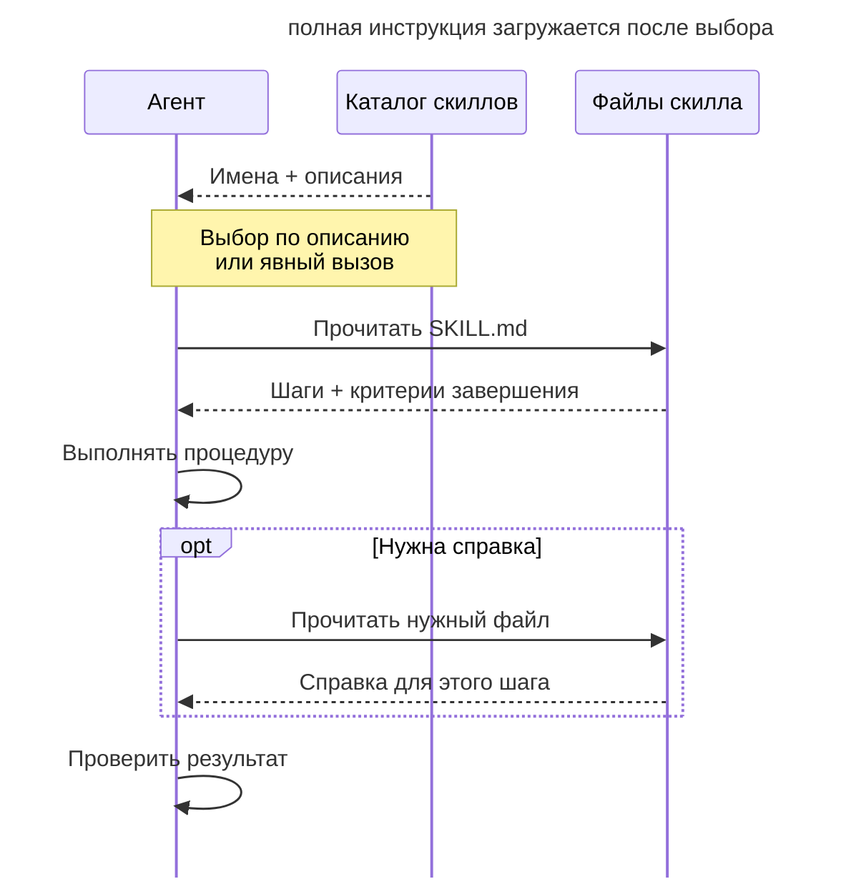

# Скиллы

## Назначение

Сохранить повторяющуюся процедуру в скилле, который агент загружает при необходимости. Разработчик получает именованный рабочий процесс с версией и критериями завершения, который можно использовать в разных сессиях.

## Также известен как

Skills, слэш-команды, custom commands, packaged workflows.

## Проблема

При каждом релизе разработчик заново объясняет агенту порядок подготовки. Однажды он забывает упомянуть проверку миграций, и агент выпускает версию без неё.

Если хранить процедуру только в переписке, полнота каждого запуска зависит от нового запроса. Коллега может описать тот же процесс иначе и получить другой порядок действий. Перенос всей процедуры в [память проекта](claude-md-memory.md) загружает её и в сессии, которые не занимаются релизом.

## Решение

Запишите процедуру в _SKILL.md_ с именем, описанием назначения и последовательностью действий. Такая упаковка даёт несколько возможностей.

1. **Загрузка по требованию.** Полная инструкция попадает в контекст при использовании скилла. Описание для выбора скилла может оставаться в каталоге доступных процедур.
2. **Выбор способа вызова.** Пользователь может вызвать скилл по имени. Если инструмент поддерживает автоматический выбор, описание должно объяснять, к каким задачам применима процедура.
3. **Версионирование.** Команда хранит скилл в git и обсуждает изменения процесса на ревью.
4. **Переносимость.** Набор скиллов можно переносить между проектами и адаптировать под местные правила.

Для каждого шага укажите проверяемый результат. Например, шаг релиза должен подтвердить прохождение миграций на тестовой базе. Справочные подробности вынесите в отдельные файлы, чтобы агент читал их по мере необходимости.

**Постоянные правила храните в памяти проекта, а процедуры загружайте через скиллы.** Правило языка коммитов нужно при разных задачах. Подробный порядок релиза нужен во время выпуска версии.

## Структура

Агент сначала получает каталог имён и описаний. Полная процедура и справочные материалы попадают в контекст по мере необходимости.



Процедура хранится в git и проходит ревью. При вызове агент читает её актуальную версию, а соседние файлы открывает по ссылкам из инструкции. Набор описаний занимает контекст до выбора скилла, поэтому его тоже нужно поддерживать компактным.

## Участники / Компоненты

- **Скилл** хранит одну процедуру в _SKILL.md_ и связанных материалах.
- **Описание** объясняет, когда применять процедуру.
- **Разработчик** пишет, проверяет и обновляет инструкции.
- **Агент** выполняет шаги и проверяет критерии завершения.
- **Пак** объединяет связанные скиллы для установки в проект.

## Когда применять

- Разработчик повторно объясняет одну процедуру.
- Команде нужен согласованный порядок релиза, ревью или триажа.
- Один из паттернов книги нужно применять регулярно.

Для одноразовой задачи отдельный скилл обычно создаёт лишнюю работу по поддержке файла.

## Последствия и компромиссы

- ➕ Все участники получают согласованную версию процедуры.
- ➕ Полная инструкция загружается только при необходимости.
- ➕ Изменения процесса проходят ревью и сохраняются в истории.
- ➖ Команде нужно удалять устаревшие шаги и проверять процедуру после изменений проекта.
- ➖ Пользователю нужно находить нужный скилл среди доступных.
- ➖ Большой каталог описаний тоже занимает контекст.

## Реализация

1. Выберите процедуру, которую приходится объяснять повторно.
2. Создайте _SKILL.md_ с именем, назначением, шагами и критериями их завершения.
3. Определите способ вызова и напишите условия применимости в описании.
4. Вынесите справку в соседние файлы и добавьте ссылки из нужных шагов (см. [инженерию контекста](context-engineering.md)).
5. Используйте согласованные термины процесса и объясните их там, где они влияют на действие.
6. Проверяйте процедуру на реальных задачах и удаляйте устаревшие инструкции.
7. Для большого набора добавьте указатель, который помогает выбрать нужный скилл.
8. При необходимости адаптируйте готовые процедуры [Superpowers](superpowers.md) или [Мэтта Покока](matt-pocock-skills.md).

## Пример

Каждый релиз сервиса включает changelog, обновление версии, проверку миграций, smoke-тест и создание релиза. Разработчик хочет сохранить этот порядок, чтобы не восстанавливать его по памяти.

Он записывает процедуру в _.claude/skills/release/SKILL.md_.

```markdown
---
name: release
description: Собрать и выпустить релиз сервиса
disable-model-invocation: true
---

1. Собери changelog из коммитов от последнего тега; каждая строка —
   Conventional Commit. Критерий: каждый коммит либо в changelog,
   либо явно отброшен как служебный.
2. Подними версию по semver из содержимого changelog.
3. На отдельной тестовой базе восстанови схему предыдущего релиза и примени новые миграции. Приложи результат запуска и проверки данных после миграции.
4. Прогони смок-набор: make smoke. Критерий: зелёный вывод приложен.
5. Тег и релиз с changelog в описании.
```

Теперь разработчик вызывает `/release`. Когда команда добавляет проверку незакрытых фиче-флагов, она меняет скилл через пулл-реквест. Следующие запуски получают новую версию инструкции.

По тому же принципу пак Мэтта Покока сохраняет процедуры передачи сессии, TDD, триажа, исследования и прототипирования.

## Антипаттерны и частые ошибки

- **Скилл на всё.** Несвязанные процедуры в одном файле затрудняют выбор применимых шагов.
- **Слишком широкие условия вызова.** Агент загружает процедуру даже для задач, которым она не нужна.
- **Шаги без критериев.** Без проверяемого результата агенту трудно определить завершение шага.
- **Устаревшие инструкции.** Накопленные правила могут направлять агента к уже неверному действию.
- **Дублирование правил.** Копии в памяти и скилле могут разойтись. Храните правило в одном месте и ссылайтесь на него.

## Известные применения

- **Claude Code** поддерживает _SKILL.md_ в _.claude/skills/_, аргументы и настройку вызова через `disable-model-invocation`.
- **Superpowers** объединяет планирование, TDD, реализацию и ревью в набор скиллов.
- **Скиллы Мэтта Покока** включают указатель процедур и руководство [writing-for-agents](https://github.com/mattpocock/skills/blob/main/skills/productivity/writing-for-agents/SKILL.md) по написанию инструкций для агентов.
- **Другие кодинг-агенты** тоже поддерживают сохранённые процедуры, хотя формат и правила загрузки различаются.

## Связанные паттерны

- [Память проекта](claude-md-memory.md) хранит постоянные правила, на которые ссылаются процедуры.
- [Инженерия контекста](context-engineering.md) объясняет загрузку инструкций по требованию.
- [Передача сессии](handoff.md), [TDD с агентом](tdd-with-agent.md), [триаж](triage-state-machine.md) и [карта исследования](wayfinder.md) могут быть оформлены как повторяемые скиллы.
- [Раздутая память](bloated-claude-md.md) описывает перегруженный файл памяти, который разгружают вынесением процедур в скиллы.
