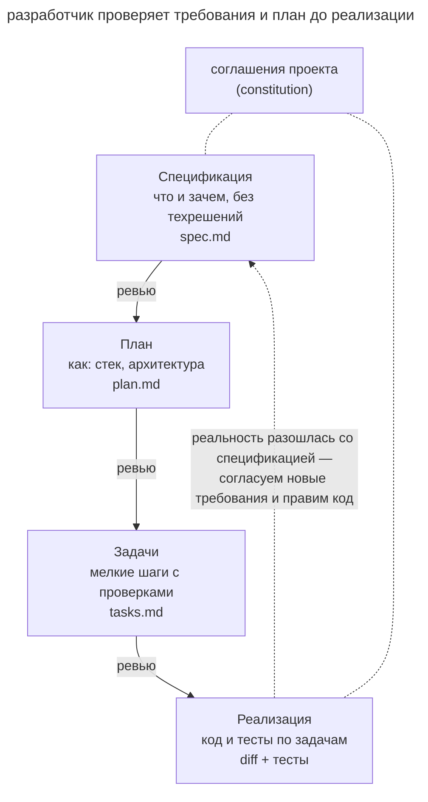

# Спеко-ориентированная разработка

## Назначение

Сохранить цель и требования в согласованной спецификации. По ней команда готовит технический план и задачи, а агент реализует их с проверкой результата. Документы позволяют продолжить работу в другой сессии и оценить соответствие исходному замыслу.

## Также известен как

Spec-Driven Development (SDD), spec-first, «спецификация как источник истины».

## Проблема

При большой фиче требования могут остаться среди сообщений длинного разговора. Новая сессия видит код, но не знает всех договорённостей.

Например, в чате решили отправлять большие отчёты ссылкой. В реализации осталась отправка вложений, и новый агент не может определить, было ли это осознанным ограничением или недоработкой. Без записи требования приходится восстанавливать по памяти автора. Последующие правки могут ещё дальше увести поведение от цели, поскольку сравнивать его не с чем.

Принятие сгенерированного кода без такого сравнения описано в антипаттерне [вайб-кодинга](vibe-coding.md).

## Решение

Перед реализацией запишите цель в спецификации и используйте её на следующих этапах.

1. **Спецификация** описывает сценарии, требования, ограничения и критерии приёмки.
2. **План** выбирает технический подход после согласования требований.
3. **Задачи** делят план на небольшие шаги с проверяемым результатом.
4. **Реализация.** Агент выполняет задачи по списку, сверяясь со спецификацией и планом.

На переходе разработчик проверяет полученный документ. Это позволяет исправить требование до его реализации. Если новые сведения меняют задачу, согласуйте спецификацию и затем приведите код в соответствие с ней.

## Структура

Схема связывает спецификацию, план, задачи и код.

Постоянные соглашения проекта ограничивают выбор на каждой фазе. Обратная стрелка показывает пересмотр требований по новым сведениям.

## Участники / Компоненты

- **Разработчик** задаёт цель и проверяет документы и результат.
- **Агент** готовит документы и реализует согласованные задачи.
- **Спецификация** хранит требования и критерии приёмки.
- **План и задачи** задают технический подход и порядок реализации.
- **Соглашения проекта** сохраняют общие стандарты и ограничения.

## Когда применять

- Работа занимает несколько сессий.
- Нескольким участникам нужны общие требования.
- Корректность системы нужно сверять с явно заданными сценариями.
- Команда ещё уточняет поведение новой системы.

Для небольшой правки достаточно [четырёх фаз](explore-plan-code-commit.md) или прямой постановки.

## Последствия и компромиссы

- ➕ Требования доступны следующей сессии и другим участникам.
- ➕ Расхождения реализации с замыслом можно проверить по документу.
- ➕ Ошибки требований и подхода могут обнаружиться до написания кода.
- ➕ Актуальная спецификация объясняет ожидаемое поведение после завершения разработки.
- ➖ Подготовка документов увеличивает стоимость коротких задач.
- ➖ Документы нужно обновлять при изменении требований.
- ➖ Чрезмерная детализация реализации в спецификации приводит к [преждевременной спецификации](premature-specification.md).

## Реализация

1. Запишите общие стандарты и ограничения проекта.
2. Подготовьте сценарии, требования и критерии приёмки. Проверьте их полноту с разработчиком.
3. Составьте и обсудите технический план.
4. Разделите план на задачи с проверкой результата каждой.
5. Запускайте реализацию по списку задач; агент сверяется со спецификацией и планом.
6. Если код нарушает действующие требования, исправьте реализацию. Если изменились сами требования, согласуйте новую спецификацию и затем приведите код в соответствие с ней.

Рабочий процесс можно собрать вручную или использовать готовый тулкит. В этом разделе разобраны три варианта.

- [OpenSpec](openspec.md) хранит постоянные спецификации и дельты изменений.
- [Superpowers](superpowers.md) связывает фазы через скиллы и обязательные контрольные точки.
- [Скиллы Мэтта Покока](matt-pocock-skills.md) сохраняют спецификации и трассирующие тикеты в трекере.

Другие инструменты собраны в [полезных ссылках](resources.md) и сравнении [spec-compare](https://cameronsjo.github.io/spec-compare/).

## Пример

Команда добавляет экспорт отчётов по расписанию.

Сначала она записывает **спецификацию**, например через `/opsx:propose` в OpenSpec.

> Пользователь выбирает отчёт, расписание и получателей. Система отправляет отчёт не позже пяти минут после назначенного времени. При ошибке сборки она уведомляет получателей о сбое. Удаление отчёта отключает его расписания.

На ревью команда замечает, что не определён часовой пояс расписания, и дополняет требование до реализации.

В **плане** агент предлагает cron-воркер и `report_schedules`. Разработчик указывает уже используемый планировщик, и агент уточняет подход.

**Задачи** последовательно добавляют проверяемые сценарии создания расписания, отправки отчёта и обработки сбоя.

При **реализации** выясняется ограничение почтового шлюза в 10 МБ на вложение. Команда согласует отправку ссылки для крупных отчётов и записывает это поведение в спецификации.

## Антипаттерны и частые ошибки

- **Документы без ревью.** Непроверенные требования могут перенести ошибку в реализацию.
- **Устаревшая спецификация.** При изменении поведения обновляйте согласованные требования вместе с кодом.
- **Спецификация-псевдокод.** Детальный порядок вызовов до исследования задачи создаёт [преждевременную спецификацию](premature-specification.md).
- **Избыточный процесс.** Для небольшой обратимой правки полный набор документов может стоить дороже самой работы.

## Известные применения

- [OpenSpec](openspec.md), [Superpowers](superpowers.md) и [скиллы Мэтта Покока](matt-pocock-skills.md) разобраны в этом разделе. Общий подход также описан в [анонсе Spec Kit](https://github.blog/ai-and-ml/generative-ai/spec-driven-development-with-ai-get-started-with-a-new-open-source-toolkit/).
- Сравнение других инструментов доступно в [spec-compare](https://cameronsjo.github.io/spec-compare/) и [подборке ссылок](resources.md).

## Связанные паттерны

- [Четыре фазы](explore-plan-code-commit.md) организует согласование и реализацию в масштабе одной задачи.
- [Преждевременная спецификация](premature-specification.md) описывает риск выбора реализации до уточнения требований.
