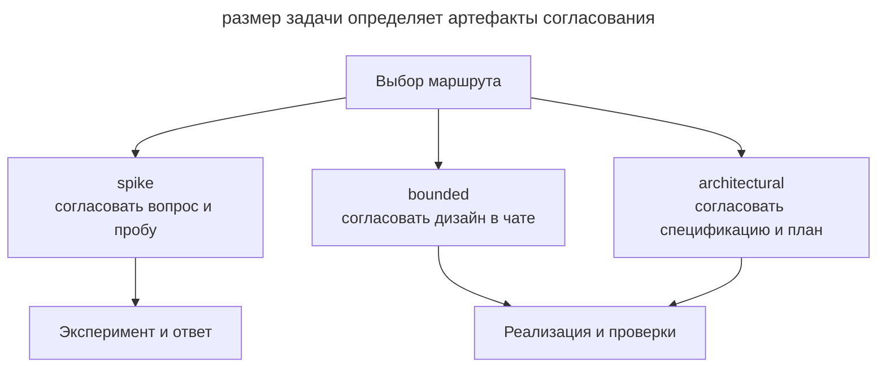

# Superpowers

_Команды и возможности проверены 21 сентября 2026 года._

[Superpowers](https://github.com/obra/superpowers) Джесси Винсента (obra) реализует [SDD](spec-driven-development.md) набором [скиллов](skills-as-packaged-workflows.md). Между дизайном и реализацией инструкции задают обязательные контрольные точки с названием HARD-GATE.

## Установка

Основной способ установки использует маркетплейс Claude Code.

```text
/plugin install superpowers@claude-plugins-official
```

Пак также содержит инструкции и манифесты для Codex, Cursor, Antigravity, GitHub Copilot CLI и OpenCode.

## Рабочий процесс

При старте сессии хук загружает `using-superpowers`, который требует проверять применимость скиллов перед ответом. Запрос на новую фичу направляется в `brainstorming`, а сообщение о баге в `systematic-debugging`. Выбор процедуры становится частью общего процесса.

В `brainstorming` агент сначала выбирает маршрут по характеру задачи. Во всех маршрутах разработчик согласует предложенный шаг до реализации, но объём документов различается.

| Маршрут | Задача | Что согласуют |
| --- | --- | --- |
| `spike` | Проверить осуществимость идеи | Вопрос и способ эксперимента; результатом служит ответ |
| `bounded` | Ограниченно изменить существующий код | Краткий дизайн в чате; отдельные спецификация и план не нужны |
| `architectural` | Создать проект, подсистему или изменить связи компонентов | Письменную спецификацию, затем план и способ исполнения |

Следующая схема показывает разные результаты этих маршрутов.



В этой схеме эксперимент заканчивается выводом о возможности решения. Ограниченная правка переходит к реализации после согласования в чате, а архитектурная задача требует отдельных документов. Детали выбора описаны в [инструкции brainstorming](https://github.com/obra/superpowers/blob/main/skills/brainstorming/SKILL.md).

Для архитектурной задачи полный процесс выглядит так.

1. **`brainstorming`** уточняет замысел и варианты решения. Разработчик согласует дизайн, затем проверяет записанную спецификацию.
2. **`using-git-worktrees`** изолирует работу в отдельном рабочем дереве и ветке.
3. **`writing-plans`** создаёт небольшие задачи с действиями и проверками, достаточными для исполнителя без истории обсуждения.
4. **`subagent-driven-development`** или **`executing-plans`** выполняют план. Первый вариант использует свежего сабагента на задачу и отдельное ревью. Независимые задачи можно распределять через `dispatching-parallel-agents`, а `test-driven-development` задаёт цикл TDD.
5. **`requesting-code-review`** сверяет результат с планом. `receiving-code-review` помогает разобрать замечания.
6. **`finishing-a-development-branch`** проверяет тесты и предлагает завершение через merge или PR.

Отладку поддерживает `systematic-debugging`, а `verification-before-completion` требует проверку перед объявлением готовности.

## Артефакты

| Артефакт | Где живёт |
| ---------- | ----------- |
| Дизайн-документ | _docs/superpowers/specs/ГГГГ-ММ-ДД-\<тема\>-design.md_ |
| План реализации | _docs/superpowers/plans/ГГГГ-ММ-ДД-\<фича\>.md_ |

Эти документы относятся к архитектурному маршруту и хранятся в Markdown. Спецификация проходит самопроверку агента и ревью пользователя; расположение планов можно задать в настройках. Маршруты `spike` и `bounded` обходятся без этих файлов.

## Чем отличается

- Инструкции требуют согласования до реализации; для небольшой правки достаточно краткого дизайна в чате.
- Хук помогает агенту выбирать нужную процедуру автоматически.
- Отдельный контекст исполнителя и рецензента разделяет реализацию и оценку.
- План включает шаги red–green–refactor.

## Когда выбирать

Superpowers подходит команде, которой нужен единый порядок с обязательными контрольными точками. Для быстрых правок этот процесс может быть избыточен. Если удобнее хранить результат обсуждений в трекере, сравните [скиллы Мэтта Покока](matt-pocock-skills.md).
