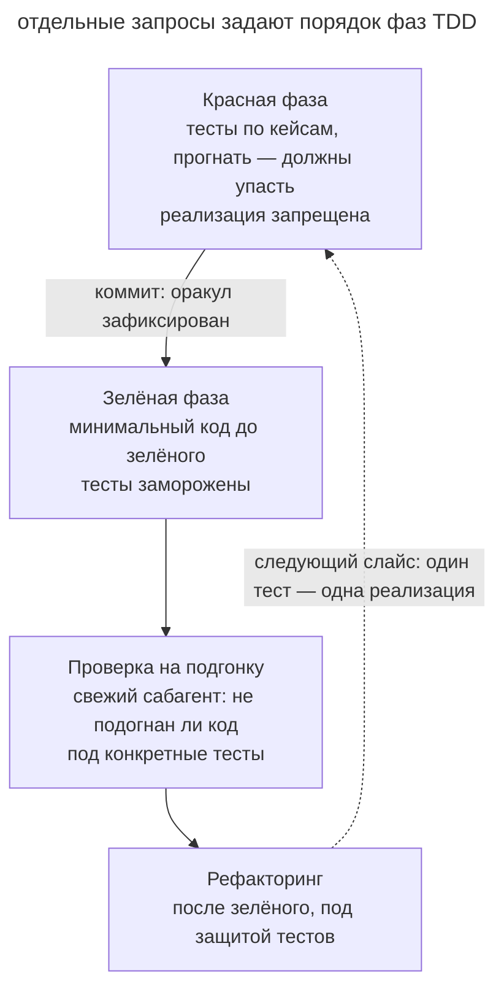

# TDD с агентом

## Назначение

Разделить написание теста и реализацию на явные фазы. Сначала агент подтверждает падение теста по ожидаемой причине, затем меняет код до его прохождения. Зафиксированные критерии помогают заметить подгонку результата.

## Также известен как

Test-driven development с агентом, red–green–refactor, test-first.

## Проблема

Когда агент пишет тесты по готовой реализации, он может принять её поведение за ожидаемое. Ошибка условия тогда попадает и в код, и в проверку.

Например, тест вычисляет скидку той же формулой, которую использует функция. Если формула неверна, оба результата совпадут. Ожидаемое значение нужно получить независимо из требования или разобранного примера. Даже независимый тест можно пройти частной заглушкой. Поэтому после зелёного результата полезна проверка на подгонку.

Явное разделение фаз позволяет увидеть тест до реализации и контролировать изменение критерия.

## Решение

Развести красную и зелёную фазы по разным промптам и держать ворота между ними за разработчиком.

1. **Задайте порядок.** Сначала агент пишет тест, затем реализацию.
2. **Получите красный результат.** Агент запускает тест и показывает, что он падает из-за отсутствующего поведения.
3. **Зафиксируйте критерий.** Проверьте тест и сохраните его коммитом.
4. **Получите зелёный результат.** Агент меняет реализацию и повторяет [проверку](give-agent-a-way-to-verify.md). Изменение теста требует отдельного решения.
5. **Проверьте подгонку.** Рецензент оценивает, решает ли код общий случай (см. [писателя и рецензента](writer-reviewer.md)).
6. **Выполните рефакторинг** под защитой проходящих тестов.

Проходите цикл по одному поведению за раз. Следующий тест учитывает то, что выяснилось на предыдущем шаге. До начала согласуйте публичную границу, на которой проверяется результат, чтобы внутренний рефакторинг не ломал тест без изменения поведения.

## Структура

Схема показывает переход от падающего теста к реализации и независимой проверке.

Обратная петля повторяет цикл для следующего сценария после подтверждения текущего.

## Участники / Компоненты

- **Разработчик** задаёт ожидаемое поведение и согласует изменение критериев.
- **Агент** последовательно пишет тест и реализацию.
- **Тест** проверяет требование и сохраняется перед реализацией.
- **Граница тестирования** задаёт публичный интерфейс наблюдения поведения.
- **Рецензент** ищет подгонку под частные случаи.

## Когда применять

- Результат можно выразить конкретными входами и ожидаемыми выходами.
- Баг воспроизводится тестом до исправления.
- Код, где цена регрессии высока и тесты останутся жить как спецификация.

Для визуального выбора или исследовательского прототипа могут лучше подойти [проверка по скриншотам](give-agent-a-way-to-verify.md) и [одноразовый эксперимент](prototype-to-answer.md).

## Последствия и компромиссы

- ➕ Тест можно сверить с требованием до появления реализации.
- ➕ Изменение зафиксированного критерия видно в diff.
- ➕ Проверка публичного поведения меньше зависит от внутреннего устройства кода.
- ➖ Явные фазы и ревью увеличивают затраты небольшой правки.
- ➖ Нужно контролировать порядок действий и причины падения тестов.
- ➖ Неудачно выбранная граница делает тесты хрупкими.

## Реализация

1. Объявите порядок работы test-first.
2. Согласуйте ожидаемые случаи и попросите агента предложить пропущенные границы.
3. Выберите публичный интерфейс проверки до написания тестов.
4. Проверьте причину падения первого теста и сохраните его коммитом.
5. Попросите изменить реализацию до прохождения, сохранив тест. Получите вывод запуска.
6. Передайте код свежему рецензенту для поиска частных заглушек и пропущенных случаев.
7. Рефакторинг просите отдельно, под защитой зелёных тестов.
8. Повторяйте цикл для следующего поведения. Закрепите порядок в [памяти проекта](claude-md-memory.md).

[Superpowers](superpowers.md) включает `test-driven-development` в реализацию задач. В [паке Мэтта Покока](matt-pocock-skills.md) `/tdd` также задаёт границы тестирования и работу по одному сценарию.

## Пример

При истёкшей сессии пользователь видит бесконечный спиннер. Разработчик начинает с воспроизведения.

> Работаем по TDD. Напиши тест для истёкшей сессии. API возвращает 401, после чего пользователь должен попасть на /login. Покажи падение теста по этой причине. Исправление пока не пиши.

Агент проверяет поведение HTTP-клиента при ответе 401. Тест падает, потому что клиент бесконечно повторяет запрос. Разработчик проверяет тест и сохраняет его коммитом.

> Теперь чини. Тест не редактируй, запускай и итерируй до зелёного.

Агент исправляет общий перехватчик, добавляя обработку 401 с переходом на страницу входа. После прохождения теста разработчик запрашивает ревью.

> Проверь в свежем контексте, что обработка 401 действует для всех запросов и не зависит от конкретного эндпоинта из теста.

Рецензент проверяет общий перехватчик. Тест сохраняет исходный сценарий и обнаружит его повторный сбой.

## Антипаттерны и частые ошибки

- **Тесты по реализации.** Проверка может закрепить ошибку готового кода. Выводите ожидаемое поведение из требования.
- **Пропуск красного.** Без наблюдаемого падения непонятно, обнаруживает ли тест исходный дефект.
- **Все тесты заранее.** Большой набор может закрепить непроверенные предположения. Добавляйте сценарии последовательно.
- **Подгонка критерия.** Ослабление теста во время исправления требует отдельного обсуждения.
- **Проверка внутренних деталей.** Тесты приватных методов могут ломаться после рефакторинга при сохранённом поведении.
- **Тавтологический оракул.** Вычисление ожидаемого ответа тем же способом повторяет ошибку реализации. Используйте независимый пример или требование.

## Известные применения

- **Claude Code best practices** описывают подтверждение падения, фиксацию тестов, реализацию и проверку на подгонку.
- **Superpowers** задаёт TDD как обязательную часть выполнения плана.
- **Скиллы Мэтта Покока** используют `/tdd` с согласованными границами проверки.
- **Кент Бек** описал практику в книге _Test-Driven Development: By Example_.

## Связанные паттерны

- [Петля обратной связи](give-agent-a-way-to-verify.md) задаёт общий цикл проверки и исправления.
- [Писатель и рецензент](writer-reviewer.md) помогает обнаружить подгонку после прохождения тестов.
- [Четыре фазы](explore-plan-code-commit.md) позволяет согласовать проверяемые сценарии в плане.
- [Диагностика через гипотезы](hypothesis-driven-debugging.md) помогает установить причину дефекта до исправления.
