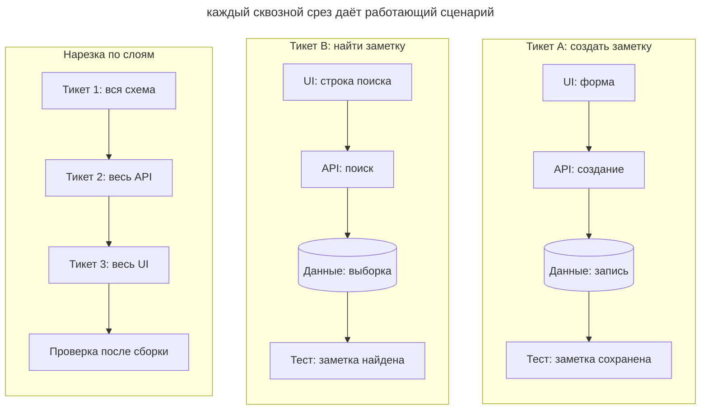
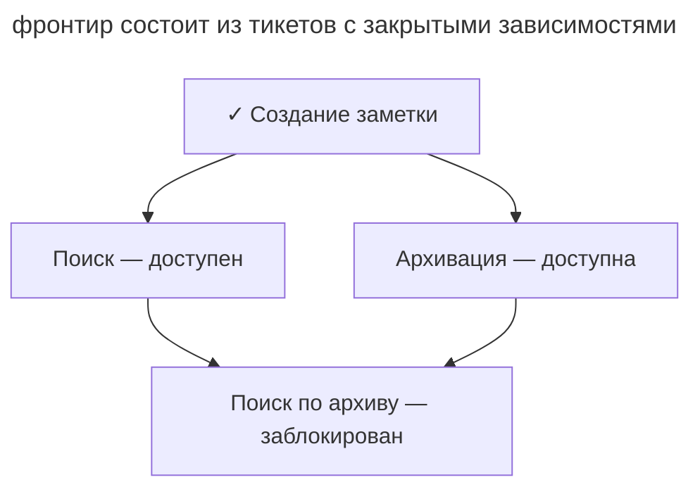

# Трассирующие тикеты

## Назначение

Разделить спецификацию на небольшие тикеты со сквозным проверяемым поведением. Каждый тикет проходит через нужные слои системы, помещается в рабочую сессию и явно указывает зависимости.

## Также известен как

Tracer-bullet tickets, вертикальные срезы, трассеры; `/to-tickets` в скиллах Мэтта Покока.

## Проблема

Большая спецификация может не поместиться в один проход. Разбиение по техническим слоям тоже откладывает проверку поведения.

Например, после создания всей схемы и API пользователь ещё не может настроить экспорт. Ошибка согласования интерфейсов обнаружится только после готовности UI. Узкий сценарий создания одного расписания позволяет проверить взаимодействие слоёв раньше. Для следующего сценария нужно явно указать зависимость от уже работающего создания расписания.

## Решение

Выделяйте **трассирующие тикеты** по пользовательскому результату. Первый срез проходит через минимальные изменения схемы, API, UI и тестов, необходимые для одного сценария. Следующие срезы расширяют уже работающий путь.

Проверьте каждый тикет по следующим условиям.

- Он охватывает все слои, необходимые для выбранного поведения.
- Результат можно проверить после завершения тикета.
- В сессии остаётся место для реализации и исправления ошибок.
- Необходимая подготовка кода выделена в отдельный первый тикет с собственной проверкой.

В каждом тикете укажите **блокирующие связи**. Множество открытых тикетов с закрытыми зависимостями образует фронтир, из которого можно выбирать работу.

Предъявите разработчику названия, зависимости и проверяемые результаты. После уточнения размера и связей опубликуйте согласованные тикеты в трекере.

Для массового изменения интерфейса используйте **expand–contract**. Сначала добавьте новую форму с сохранением старой, затем перенесите потребителей отдельными партиями. Последний тикет удаляет старую форму после завершения всех миграций.

## Структура

Сквозной тикет проходит через все слои, нужные для одного сценария. На схеме каждый столбец заканчивается собственной проверкой поведения.

Стрелки внутри столбцов показывают состав и границу проверки тикета. Порядок работы между тикетами задаёт отдельный граф зависимостей.

В этом примере поиск и архивация зависят от готового создания заметки и образуют фронтир. Поиск по архиву можно взять после завершения обеих веток. Агент выбирает один доступный тикет и проверяет его целиком.

## Участники / Компоненты

- **Спецификация** задаёт ожидаемое поведение.
- **Тикет** описывает сквозной сценарий, критерии и зависимости.
- **Блокирующие связи** определяют допустимый порядок работы.
- **Разработчик** согласует размер тикетов и зависимости.
- **Агент** доводит выбранный доступный тикет до проверенного результата.

## Когда применять

- Утверждённая спецификация или план занимает несколько сессий.
- Независимые срезы можно выполнять параллельно.
- В [SDD](spec-driven-development.md) нужен явный порядок исполнения задач.

Для одной сессии обычно хватает плана. Если способ решения ещё неизвестен, сначала используйте [карту исследования](wayfinder.md).

## Последствия и компромиссы

- ➕ Каждый срез проверяет взаимодействие нужных слоёв до завершения всей фичи.
- ➕ Небольшой тикет оставляет больше контекста для проверки и исправлений.
- ➕ Явные зависимости помогают выбрать доступную работу и координировать исполнителей.
- ➖ Слишком крупные тикеты не помещаются в сессию, а мелкие увеличивают затраты координации.
- ➖ Массовому рефакторингу нужен отдельный порядок expand–contract.
- ➖ Тикеты, статусы и связи требуют поддержки.

## Реализация

1. Изучите спецификацию и код. Выясните, нужна ли подготовительная правка перед добавлением поведения.
2. Выделите пользовательские сценарии, например создание расписания с отображением в списке.
3. Запишите зависимости каждого тикета.
4. Согласуйте с разработчиком размер срезов и порядок работы.
5. Опубликуйте тикеты с критериями приёмки и блокирующими связями. Детали реализации включайте только там, где они сохраняют существенное решение, например результат [прототипа](prototype-to-answer.md).
6. Для широкого рефакторинга задайте этапы расширения интерфейса, переноса потребителей и удаления старой формы.
7. Исполняйте фронтир по [одному тикету за проход](one-feature-at-a-time.md), очищая контекст между тикетами.

## Пример

После утверждения экспорта из [главы о SDD](spec-driven-development.md) агент предлагает сквозные тикеты.

1. **Создание расписания.** Пользователь сохраняет расписание и видит его в списке. Тикет включает нужные изменения схемы, API и UI. Зависимостей нет.
2. **Отправка отчёта.** В назначенное время пользователь получает письмо с отчётом. Тикет зависит от создания расписания.
3. **Уведомление о сбое.** При ошибке сборки получатели видят письмо с причиной сбоя. Тикет зависит от отправки отчёта.
4. **Удаление отчёта.** Удаление отключает связанные расписания. Тикет зависит от их создания.

Разработчик подтверждает, что первый срез достаточно мал и его можно проверить через UI. После него доступны отправка отчёта и отключение расписаний. Их можно выполнять отдельно при согласованном контракте. После второго тикета команда уже показывает письмо с отчётом, хотя обработка сбоев ещё впереди.

## Антипаттерны и частые ошибки

- **Разбиение по слоям.** Полная схема без рабочего сценария откладывает интеграционную проверку.
- **Тикет-эпик.** Слишком большой пункт снова создаёт несколько незавершённых частей.
- **Незаписанные зависимости.** Исполнитель может начать работу до готовности нужного контракта.
- **Лишняя детализация.** Устаревшие пути и фрагменты кода мешают выбрать актуальную реализацию. Сохраняйте прежде всего поведение и ограничения.
- **Массовый рефакторинг как фича.** Используйте expand–contract для поэтапной смены общего интерфейса.

## Известные применения

- **Скиллы Мэтта Покока** используют `/to-tickets` для сквозного разбиения и `/implement` для выполнения тикетов.
- **«Прагматичный программист»** описывает трассирующую реализацию, которая проверяет путь через систему и развивается дальше.
- **SDD-тулкиты**, включая [Superpowers](superpowers.md), разделяют планы на выполняемые шаги. Трассирующие тикеты дополнительно задают сквозной результат и зависимости.

## Связанные паттерны

- [Спеко-ориентированная разработка](spec-driven-development.md) поставляет спецификацию для разбиения.
- [Одна фича за раз](one-feature-at-a-time.md) ограничивает исполнение одним тикетом за проход.
- [Карта исследования](wayfinder.md) проясняет решения до подготовки очереди реализации.
- [Одноразовый прототип](prototype-to-answer.md) даёт проверенные решения для требований тикета.
