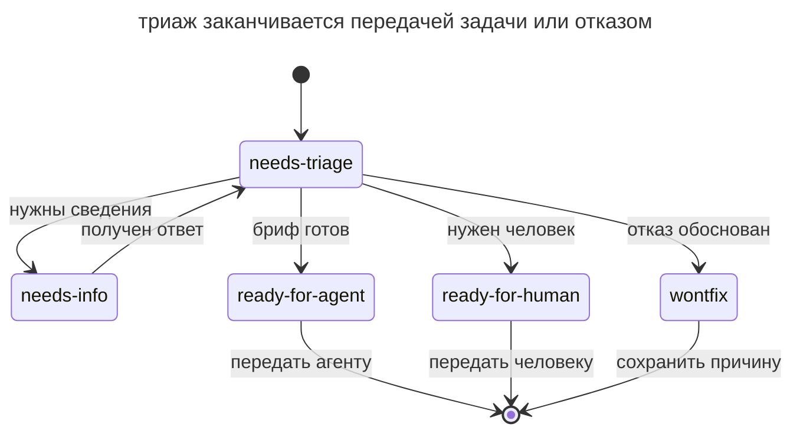

# Триаж задач

## Назначение

Подготовить входящие задачи к исполнению через явные состояния триажа. Агент проверяет запрос и составляет бриф, а мейнтейнер решает, передать ли задачу агенту, человеку или отклонить.

## Также известен как

Triage state machine, конечный автомат триажа; `/triage` в скиллах Мэтта Покока.

## Проблема

Входящий баг-репорт может содержать только фразу «поиск не работает». Исполнитель не знает ни запроса, ни локали, ни ожидаемого результата.

Если сразу поручить исправление агенту, он начнёт выбирать проблему по догадкам. Даже проходящие тесты такого исправления не подтвердят устранение исходного сбоя. Мейнтейнеру нужно собрать недостающие сведения и воспроизвести проблему. Эту часть работы можно поручить агенту. Явные состояния показывают, какой запрос уже проверен и какой ещё ждёт ответа.

## Решение

Задайте небольшой набор состояний и порядок проверки каждого тикета.

В этом варианте процесса у разобранного тикета есть одна категория (`bug` или `enhancement`) и одно состояние.

- `needs-triage` означает ожидание разбора.
- `needs-info` означает ожидание конкретных сведений от автора. После ответа тикет возвращается в `needs-triage`.
- `ready-for-agent` означает наличие проверенного брифа для автономной работы.
- `ready-for-human` указывает на необходимость участия человека и сохраняет причину этого решения.
- `wontfix` фиксирует отказ с обоснованием.

Внешний пулл-реквест проходит тот же разбор с дополнительной проверкой приложенного кода.

Агент читает описание, комментарии и код, используя [словарь домена](domain-context-file.md) и ADR. Он ищет существующую реализацию и предыдущие решения по похожим запросам. Затем проверяет заявление, например воспроизводит баг, и рекомендует состояние. Мейнтейнер утверждает результат; при нехватке сведений агент готовит конкретные вопросы.

Сохраняйте причины отклонённых запросов в _.out-of-scope/_. При похожей заявке агент сможет показать прошлое решение, а мейнтейнер проверит, осталось ли оно применимым.

В описываемом процессе агентские комментарии помечаются как сгенерированные ИИ при триаже. Мейнтейнер проверяет их содержание перед публикацией.

## Структура

Схема ограничена этапом триажа. Его окончание означает передачу подготовленной задачи исполнителю или отказ от неё.

Мейнтейнер утверждает переход после проверки заявления, уточнения контекста и подготовки брифа. При недостатке сведений тикет ждёт ответа и снова проходит разбор. Категория задачи хранится отдельно от показанного здесь состояния; готовность к передаче исполнителю ещё не означает завершения самой задачи.

## Участники / Компоненты

- **Состояния** показывают готовность тикета к следующему действию.
- **Агент** собирает сведения, проверяет заявление и готовит рекомендацию.
- **Мейнтейнер** утверждает решение по задаче.
- **Автор запроса** сообщает недостающие детали.
- **Бриф** задаёт самодостаточную постановку и критерий готовности.
- **База отказов** сохраняет причины предыдущих решений.

## Когда применять

- В проект регулярно поступают баги, предложения и внешние PR.
- Автономные агенты выбирают работу из трекера.
- Мейнтейнер тратит много времени на сбор сведений перед решением.

При нескольких тикетах в месяц полный набор состояний может быть избыточен.

## Последствия и компромиссы

- ➕ Исполнитель получает проверенную постановку.
- ➕ Предыдущие решения помогают разбирать повторные запросы.
- ➕ По меткам видно, какая задача ждёт уточнений и какая готова к работе.
- ➕ Воспроизведение даёт основу для критерия исправления.
- ➖ Метки, шаблоны и базу решений нужно поддерживать.
- ➖ Публичные комментарии требуют проверки содержания и тона.
- ➖ Процесс зависит от своевременного решения мейнтейнера.

## Реализация

1. Сопоставьте категории и состояния с метками трекера.
2. Опишите переходы, включая возврат из `needs-info` после ответа.
3. Задайте порядок сбора контекста, поиска предыдущих решений и проверки заявления.
4. Подтверждайте баг воспроизведением до подготовки брифа на исправление.
5. Подготовьте шаблоны брифа, конкретных вопросов и записи об отказе.
6. Укажите происхождение агентского комментария перед публикацией.
7. Используйте `ready-for-agent` как очередь по одному тикету за проход.

## Пример

По заявке «поиск не работает» агент проверяет обычный поиск и не находит сбоя. Он рекомендует `bug` и `needs-info`. Мейнтейнер утверждает запрос строки поиска и локали; комментарий также сообщает, какие случаи уже проверены.

Автор указывает турецкую локаль и запрос с «İ». Агент воспроизводит сбой нормализации Unicode и готовит бриф с входными данными, местом обработки и ожидаемым результатом. После проверки мейнтейнер переводит тикет в `ready-for-agent`.

При повторном запросе о настройке писем агент находит прежний отказ в _.out-of-scope/_. Мейнтейнер проверяет, не изменились ли основания, и при подтверждении закрывает запрос со ссылкой на решение.

## Антипаттерны и частые ошибки

- **Исправление без проверки.** Агент может решить придуманную проблему, если исходное заявление не воспроизведено.
- **Решение без мейнтейнера.** Рекомендация агента требует утверждения, особенно при отказе.
- **Общий запрос уточнений.** Укажите конкретные сведения, необходимые для проверки.
- **Отказ без причины.** Следующей похожей заявке снова потребуется полное обсуждение.
- **Готовность без брифа.** Метка сама по себе не даёт исполнителю требований.
- **Непроверенный публичный комментарий.** Мейнтейнер отвечает за точность и понятность опубликованного текста.

## Известные применения

- **Скиллы Мэтта Покока** реализуют состояния, брифы и базу отказов через `/triage`.
- **Классический bug triage** использует отдельную роль для подготовки входящих багов к работе.
- **Автоматизации GitHub** помогают разметить поток, но требуют дополнительных проверок для подготовки полноценного брифа.

## Связанные паттерны

- [Карта исследования](wayfinder.md) организует вопросы большой инициативы.
- [Петля обратной связи](give-agent-a-way-to-verify.md) помогает проверить заявление до исполнения.
- [Словарь домена](domain-context-file.md) позволяет искать дубликаты по смыслу понятий.
- [Одна фича за раз](one-feature-at-a-time.md) ограничивает работу над готовой очередью.
