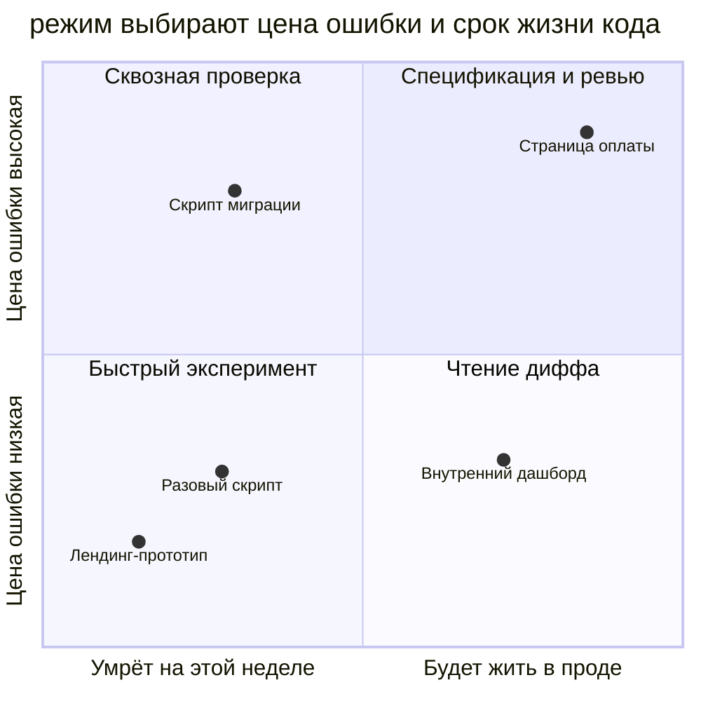

# Вайб-кодинг

## Также известен как

Vibe coding, термин Андрея Карпатого о разработке через запросы к модели без внимания к сгенерированному коду.

## Контекст

Разработчик описывает цель, агент генерирует код, а разработчик принимает результат, который запускается и выглядит рабочим. Ошибки он пересылает обратно в чат без чтения диффа. Привычка из быстрого эксперимента переходит в рабочий проект.

## Проблема

В кодовой базе появляется поведение, которого никто не сопоставил с требованиями. При следующем изменении команде трудно определить, что нужно сохранить и что было случайным результатом генерации.

## Почему так делают

- Быстрый первый результат снижает желание тратить время на ревью.
- На эксперименте с низкой ценой ошибки такой способ позволяет быстро проверить идею.
- Большой сгенерированный дифф требует усилий для чтения.
- Знание агентом фреймворка принимают за доказательство корректности результата.

## Последствия

- ➖ Команде трудно исправлять и развивать код, устройство которого она не понимает.
- ➖ Без требований нельзя восстановить исходное намерение.
- ➖ Непроверенные граничные случаи могут проявиться у пользователей.
- ➖ Новые изменения опираются на всё больший объём непроверенного поведения.

## Признаки

- Дифф смержен непрочитанным.
- Участники не могут объяснить, как работает принятый код.
- Требования восстанавливаются чтением кода, потому что больше их нигде нет.
- Качество обосновывают только успешным запуском.

## Как лучше

Выбирайте глубину проверки по цене ошибки и сроку жизни кода. Для [одноразового прототипа](prototype-to-answer.md) достаточно проверки его конкретного вопроса. Для рабочего кода зафиксируйте требования в [спецификации](spec-driven-development.md) или [плане](explore-plan-code-commit.md), проверьте поведение через [петлю обратной связи](give-agent-a-way-to-verify.md) и проведите [ревью](writer-reviewer.md).

На диаграмме учитываются срок жизни кода и цена ошибки. Прототип лендинга допускает короткую проверку, а страница оплаты требует полного процесса. Скрипт миграции тоже нуждается в тщательной проверке, хотя запускается один раз, поскольку ошибка может затронуть существующие данные.

## Пример

**Было**

> Сделай страницу оплаты подписки. Она открылась и выглядит рабочей, можно мержить.

**Стало**

> Для страницы оплаты сначала согласуем требования, затем реализуем их и проверим сценарий целиком. Перед мержем проведём ревью диффа. Этот код будет обрабатывать реальные платежи.

## Связанные паттерны и антипаттерны

- [Одноразовый прототип](prototype-to-answer.md) ограничивает эксперимент конкретным вопросом.
- [Спеко-ориентированная разработка](spec-driven-development.md) сохраняет требования для проверки реализации.
- [Преждевременный успех](premature-success.md) описывает объявление готовности без сквозной проверки.
- [Уан-шот](one-shotting.md) описывает ожидание готового продукта после одного прохода.
