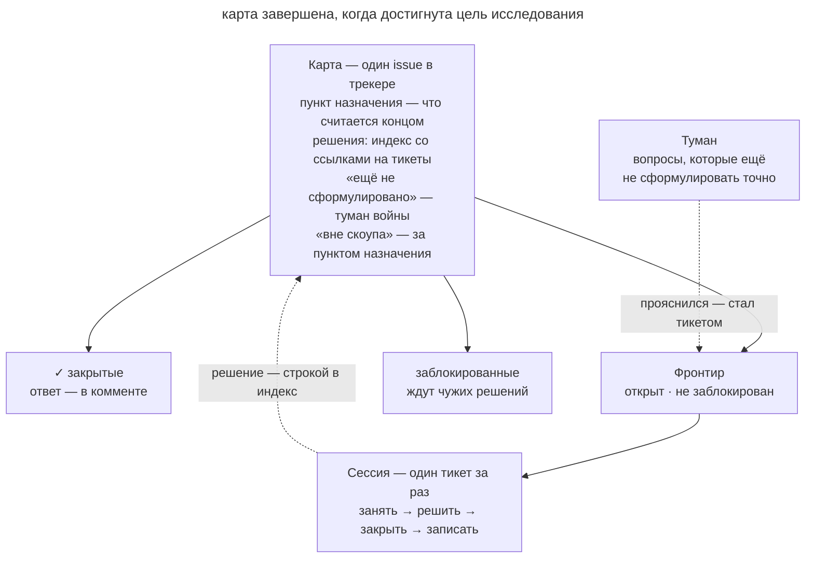

# Карта исследования

## Назначение

Организовать большую неопределённую работу как карту исследовательских вопросов в трекере. Каждый тикет даёт решение или новые сведения, которые приближают команду к согласованному плану реализации.

## Также известен как

Wayfinder, вэйфайндинг; скилл `/wayfinder` из пака Мэтта Покока.

## Проблема

Команда хочет перенести биллинг на новую платформу, но ещё не знает, как перенести активные подписки и сохранённые способы оплаты. Сначала нужно выяснить ограничения и принять несколько связанных решений.

Если сразу писать подробную спецификацию, неизвестные места заполнятся предположениями. [Список фич](feature-list-harness.md) пригодится после выбора требуемого поведения. Сейчас команде нужна очередь вопросов, от которых это поведение зависит. Длинная переписка затрудняет передачу результатов другому участнику. Общая карта сохраняет, что уже решено и какие вопросы ещё доступны для исследования.

## Решение

Определите цель исследования, сохраните карту вопросов и решайте их по одному.

**Цель** описывает условие завершения, например согласованную спецификацию миграции. Она ограничивает исследование вопросами, необходимыми для этого результата.

**Карта** хранится в отдельном issue как краткий указатель.

- _Цель_ помогает каждой сессии удерживать направление.
- _Решения_ содержат короткие выводы и ссылки на закрытые тикеты.
- _Ещё не сформулировано_ сохраняет области неопределённости, для которых пока не хватает сведений.
- _Вне задачи_ объясняет, какие вопросы исключены из исследования.

**Тикет** задаёт один вопрос с типом работы и зависимостями. Research требует чтения источников, [prototype](prototype-to-answer.md) проверяет вопрос экспериментом, grilling уточняет решение с разработчиком, а task подготавливает необходимый доступ или окружение. Открытые незанятые тикеты с закрытыми зависимостями образуют **фронтир** доступной работы.

Сессия читает карту, назначает себе доступный тикет и исследует его. Ответ сохраняется в тикете, а краткий вывод со ссылкой добавляется в карту. Новые сведения могут превратить неопределённую область в конкретные вопросы для следующих тикетов.

**Завершайте исследование записанным решением.** Когда оставшаяся работа сводится к реализации согласованного подхода, передавайте её в очередь разработки.

## Структура

На схеме карта связывает решения, открытые вопросы и границы исследования.

Сессия выбирает один доступный тикет. Его ответ обновляет карту и может открыть следующие вопросы. Цикл заканчивается, когда достигнута цель исследования.

## Участники / Компоненты

- **Карта** хранит краткое состояние исследования и ссылки.
- **Цель** задаёт условие завершения.
- **Тикет** содержит вопрос, зависимости и подробный ответ.
- **Фронтир** показывает доступные незанятые тикеты.
- **Области неопределённости** сохраняют вопросы, которые пока нельзя поставить точно.
- **Агент и разработчик** исследуют сведения и принимают решения с учётом типа тикета.

## Когда применять

- Исследование занимает несколько сессий, а способ реализации ещё неизвестен.
- Нескольким участникам нужна общая картина вопросов и зависимостей.
- Причины решений должны оставаться доступными после завершения сессий.

Если путь уже ясен, переходите к [SDD](spec-driven-development.md). Для исследования на одну сессию обычно достаточно краткого списка вопросов.

## Последствия и компромиссы

- ➕ Решения и их причины доступны всем участникам через трекер.
- ➕ Независимые вопросы можно исследовать параллельно.
- ➕ Неопределённость видна явно без преждевременной детализации.
- ➕ Обрыв сессии затрагивает текущий вопрос, а предыдущие ответы сохранены.
- ➖ Карта и зависимости требуют времени на поддержку.
- ➖ Нужно вовремя завершить исследование и перейти к реализации.
- ➖ Размытый вопрос затрудняет получение проверяемого ответа.

## Реализация

1. В отдельной сессии согласуйте цель и перечислите области неопределённости.
2. Создайте тикеты для вопросов, которые уже можно поставить точно, и укажите зависимости.
3. Выберите доступный тикет, назначьте ответственного, сохраните ответ и обновите карту.
4. После ответа пересмотрите открытые области. Создайте новые конкретные вопросы и удалите потерявшие значение.
5. Завершайте один вопрос за проход, как в паттерне [одной фичи за раз](one-feature-at-a-time.md).
6. Давайте ссылки с названиями тикетов, чтобы читатель видел смысл зависимости.
7. После достижения цели передайте решения в [процесс SDD](spec-driven-development.md) со ссылкой на карту.

## Пример

Для миграции биллинга на PayFlow команда задаёт цель получить спецификацию перехода без остановки списаний. Первые вопросы относятся к совместимости API и состоянию действующих подписок.

- Тикет типа research сравнивает API подписок PayFlow и текущего провайдера на тестовом аккаунте.
- Тикет типа task создаёт sandbox-аккаунт и блокирует это сравнение.
- Тикет типа grilling уточняет поведение активных подписок в переходный период.
- Модель возвратов и перенос сохранённых карт пока остаются областями неопределённости.

После выбора переходного периода с двойной записью появляются вопросы о фасаде шлюза и вебхуках. Команда создаёт прототип и исследует доставку событий. Редизайн кабинета оплаты исключается из задачи. Когда вопросы миграции решены, команда собирает спецификацию по ссылкам карты.

## Антипаттерны и частые ошибки

- **Реализация внутри исследования.** Если решение уже принято, создайте задачу разработки и завершите исследовательский тикет.
- **Тикеты без точного вопроса.** Сохраняйте неопределённую область в карте до появления сведений для постановки.
- **Несколько незавершённых вопросов.** Доведите текущий тикет до записанного ответа перед переходом к следующему.
- **Карта-хранилище.** Полные ответы увеличивают индекс и дублируют тикеты. Оставляйте короткие выводы со ссылками.
- **Только номера.** Добавляйте названия, чтобы смысл связей был виден без открытия каждого тикета.
- **Нет зависимостей.** Участник может начать вопрос до готовности необходимых решений.

## Известные применения

- **Скиллы Мэтта Покока** реализуют карту, типы вопросов и порядок работы через `/wayfinder`.
- **Dual-track agile** разделяет исследование решений и реализацию продукта.
- **Spike-задачи в XP** проверяют технические вопросы короткими экспериментами.

## Связанные паттерны

- [Список фич](feature-list-harness.md) организует исполнение после выбора конечного поведения.
- [Одна фича за раз](one-feature-at-a-time.md) задаёт ограничение текущего прохода.
- [Одноразовый прототип](prototype-to-answer.md) проверяет вопросы экспериментом.
- [Спеко-ориентированная разработка](spec-driven-development.md) использует принятые решения для реализации.
- [Передача сессии](handoff.md) сохраняет состояние для следующего этапа исследования.
