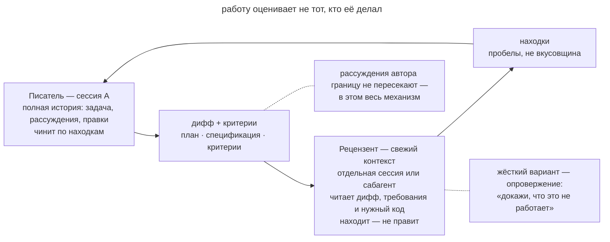

# Писатель и рецензент

## Назначение

Передать дифф агенту со свежим контекстом вместе с критериями проверки. Отдельный рецензент оценивает результат по требованиям и возвращает замечания автору для исправления.

## Также известен как

Writer/Reviewer, независимое ревью, «свежие глаза», adversarial review.

## Проблема

При проверке собственного кода агент может повторить допущение, на котором построил реализацию. Например, он считает обновление счётчика атомарным и пропускает гонку в обоих проходах.

[Рефлексия](reflection.md) помогает искать упущения, но сохраняет тот же контекст рассуждений. После долгой автономной работы таких непроверенных допущений может накопиться несколько. Отдельный рецензент помогает подготовить дифф к проверке человеком, хотя его выводы тоже требуют подтверждения.

## Решение

Разделите роли между сессиями. Автор сохраняет историю работы, а рецензент получает материалы для проверки.

- **Дифф** показывает фактическое изменение.
- **Критерии** задают требования, ограничения и ожидаемые проверки.

Дайте рецензенту доступ к нужному коду, спецификации и ADR, но оставьте историю рассуждений автора в его сессии. Рецензент сможет самостоятельно сопоставить изменение с требованиями.

Автор получает замечания, исправляет подтверждённые дефекты и передаёт результат на повторную проверку.

Для критической логики попросите искать контрпримеры. Вход, на котором требование нарушается, даёт проверяемое основание для исправления.

Не требуйте фиксированного числа замечаний. Рецензент должен обосновывать дефекты и может завершить проверку без находок. Предпочтения по стилю рассматривайте отдельно от ошибок поведения.

## Структура

На схеме автор передаёт дифф и критерии в свежий контекст и получает замечания обратно.

Дополнительная ветка задаёт поиск контрпримеров. Исправления остаются в сессии автора и проходят повторную оценку.

## Участники / Компоненты

- **Автор** реализует изменение и исправляет подтверждённые замечания.
- **Рецензент** проверяет результат в свежем контексте.
- **Дифф** задаёт объём проверки.
- **Критерии** определяют требуемое поведение и ограничения.
- **Замечания** описывают дефект, условия проявления и доказательства.

## Когда применять

- Изменение затрагивает несколько модулей или публичный контракт.
- Агент долго работал автономно до ревью.
- После [TDD](tdd-with-agent.md) нужна проверка реализации на подгонку.
- Нужно сверить полноту результата с планом.

Для небольшой правки можно начать с [рефлексии](reflection.md) и автоматических проверок.

## Последствия и компромиссы

- ➕ Рецензент самостоятельно восстанавливает решение по коду и требованиям.
- ➕ Критерии делают замечания предметными и проверяемыми.
- ➕ Часть дефектов может быть исправлена до человеческого ревью.
- ➖ Второй контекст и повторные проходы увеличивают затраты.
- ➖ Без записанных ограничений рецензент может принять осознанный компромисс за ошибку.
- ➖ Непроверенные замечания могут привести к лишним правкам.

## Реализация

1. Создайте отдельную сессию или сабагента со свежим контекстом.
2. Передайте дифф, план и спецификацию. Добавьте ссылки на ADR и [словарь домена](domain-context-file.md), которые объясняют ограничения.
3. Попросите сообщать проверяемые дефекты и нарушения требований.
4. Для критического поведения запросите контрпримеры.
5. Передайте подтверждённые замечания автору и повторите проверку исправлений.
6. Отклоняйте замечания, которые не подтверждаются кодом или требованиями.
7. Повторяемый процесс сохраните в команде или используйте `/code-review` из [пака Мэтта Покока](matt-pocock-skills.md).

## Пример

Сессия A реализовала ограничитель частоты запросов. Разработчик передаёт результат на независимое ревью.

> Проверь дифф ограничителя в свежем контексте по PLAN.md. Найди нарушения требований и ошибки поведения. Для каждой находки покажи условия проявления и код, который её вызывает.

Рецензент находит гонку при пополнении токенов из двух воркеров. Он показывает последовательность операций, при которой оба читают старый счётчик и допускают превышение лимита. Дополнительно он замечает отсутствие проверки `Retry-After` и переименование соседнего middleware вне задачи.

Автор исправляет гонку, добавляет тест заголовка и убирает постороннее переименование. Повторное ревью проверяет эти изменения. Свежий контекст помог поставить под сомнение предположение об атомарности счётчика.

## Антипаттерны и частые ошибки

- **Проверка в том же окне.** Это [рефлексия](reflection.md), которая может сохранить исходные допущения автора.
- **Вся история рецензенту.** Полное обсуждение может направить проверку по уже выбранному ходу мысли. Передавайте требования и доказательства решений.
- **Нет критериев.** Без требований замечания могут свестись к предпочтениям по стилю.
- **Любая находка становится правкой.** Сначала подтвердите дефект и оцените необходимость исправления.
- **Рецензент меняет код.** Его правки тоже потребуют независимой проверки.

## Известные применения

- **Claude Code best practices** описывают разделение Writer/Reviewer и поиск контрпримеров в отдельной сессии.
- **Скиллы ревью** автоматизируют передачу диффа и возврат замечаний автору.
- **Скиллы Мэтта Покока** проверяют стандарты проекта и спецификацию через `/code-review`.
- **Superpowers** использует `requesting-code-review` перед завершением ветки.
- **Раздельные авторы тестов и кода** применяют сходный принцип к критериям и реализации.

## Связанные паттерны

- [Рефлексия](reflection.md) помогает подготовить результат в текущей сессии.
- [Петля обратной связи](give-agent-a-way-to-verify.md) дополняет ревью воспроизводимыми проверками.
- [TDD с агентом](tdd-with-agent.md) даёт критерии для поиска подгонки реализации.
- [Спеко-ориентированная разработка](spec-driven-development.md) сохраняет требования для независимого рецензента.
